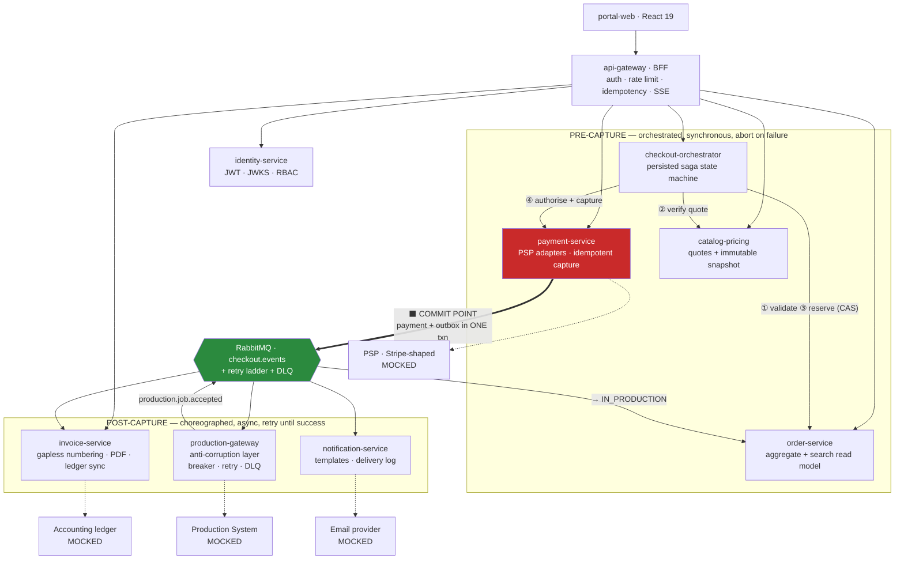

# Checkout Platform — System Design

**Order checkout, payment, invoicing, and Production hand-off for an AI-powered ecommerce retouching studio.**
MERN-based microservices · Node 22 · TypeScript · MongoDB · RabbitMQ · React
Deployed as Docker containers to **Azure Container Apps** via **Azure DevOps Pipelines**

---

## The problem in one paragraph

The business sells AI-assisted retouching to ecommerce studios, and its commercial promise is *beating deadlines*. That single fact determines the architecture. When an Art Director checks out an order, five things must happen across systems that share no database and two of which we do not control: the order must be locked so it cannot be double-charged, a third-party PSP must take the money, an invoice must exist for finance, the internal Production system must accept the job so retouching actually starts, and the client must be told. The scenario is small; the fault line underneath it is not.

The design is organised around one asymmetry:

> **Payment is the commit point. Before it, any failure aborts cleanly and nothing is charged. After it, every remaining step is a durable obligation that retries until it succeeds or a human is paged — because the worst outcome in this business is a client who paid, believes their deadline is safe, and whose work never started.**

That is why checkout uses an **orchestrated saga before capture** and **event-driven choreography after it**. Those two styles are usually presented as competing options; here they solve opposite problems, and mixing them deliberately is the point.

---

## Where to start

**If you have 10 minutes** — read [ARCHITECTURE §1–3](docs/ARCHITECTURE.md) for the reasoning and the C4 views, then [CHECKOUT-SAGA §2](docs/CHECKOUT-SAGA.md#2-happy-path) for the end-to-end sequence diagram.

**If you have 30 minutes** — add [CHECKOUT-SAGA §4](docs/CHECKOUT-SAGA.md#4-failure-scenarios) (seven failure branches, each with a diagram), [DATA-INTEGRITY §3](docs/DATA-INTEGRITY.md#3-the-transactional-outbox) (the mechanism the whole design rests on), and [ASSUMPTIONS](docs/ASSUMPTIONS.md) (including the ambiguity in the brief I chose to hedge against rather than guess at).

**If you want to assess engineering judgement specifically** — [ADR-0004](docs/adr/0004-saga-over-two-phase-commit.md), [ADR-0003](docs/adr/0003-transactional-outbox-with-rabbitmq.md), and [ADR-0009](docs/adr/0009-money-as-integer-minor-units.md) are the three decisions that carry the design, each with its rejected alternatives and honest costs.

---

## Submission checklist

Every bullet the brief asked for, and where it is answered.

| The brief asked for | Where |
|---|---|
| **System design meeting the requirements** | [ARCHITECTURE](docs/ARCHITECTURE.md) — C4 context/container/component views, service catalogue, sync-vs-async rule, tech choices with trade-offs |
| **Appropriate data models and schemas** | [DATA-MODEL](docs/DATA-MODEL.md) — every collection, JSON schemas, state machines, indexes with justification, money handling, tenancy keys, schema evolution |
| **Relevant HTTP endpoints (REST, gRPC, GraphQL…)** | [API](docs/API.md) — REST catalogue with payloads and the full error model, gRPC contracts for the two hot internal paths, one scoped GraphQL read endpoint, mock third-party APIs, and **Swagger/OpenAPI generated from the zod schemas** with a per-environment exposure policy |
| **Components and their interactions** | [ARCHITECTURE §3–4](docs/ARCHITECTURE.md), [EVENTS](docs/EVENTS.md) (messaging topology, event catalogue, consumer pattern), [CHECKOUT-SAGA](docs/CHECKOUT-SAGA.md) (every interaction sequence) |
| **Assumptions, and how you'd validate them** | [ASSUMPTIONS](docs/ASSUMPTIONS.md) — 13 assumptions ranked by risk, each with impact, cost-to-reverse, and a concrete validation method |
| **Plan for delivery** | [DELIVERY-PLAN](docs/DELIVERY-PLAN.md) — five phases, 16 weeks, team shape, risk register, definition of done |
| **Time spent** | [TIME-LOG](docs/TIME-LOG.md) — 14 h 20 m, broken down by session with what each produced |
| **How do you structure the codebase for 10–20 engineers?** | [CODEBASE-STRUCTURE](docs/CODEBASE-STRUCTURE.md) — monorepo with independent deploys, hexagonal layering enforced by lint, CODEOWNERS, affected-graph CI |
| **How do you manage the integrity of data?** | [DATA-INTEGRITY](docs/DATA-INTEGRITY.md) — seven named threats, each with its mechanism: outbox, inbox, idempotency, optimistic concurrency, reservation CAS, integer money, reconciliation |
| **How do you manage performance?** | [PERFORMANCE](docs/PERFORMANCE.md) — load model, SLOs, the search hot path in detail, caching policy, async throughput, degradation ladder |
| **How does it build and ship?** | [DEPLOYMENT](docs/DEPLOYMENT.md) — Dockerfile strategy, Azure service mapping, four environments, the Azure DevOps multi-stage pipeline, canary revisions with an SLO gate, secrets, scaling rules, cost model, DR, and the AKS exit |

Supporting: [SECURITY](docs/SECURITY.md) · [OBSERVABILITY](docs/OBSERVABILITY.md) · [TESTING](docs/TESTING.md) · [FRONTEND](docs/FRONTEND.md) · [ADRs](docs/adr/) (twelve)

---

## The functional requirements, traced

| Requirement | Mechanism | Behaviour when it fails |
|---|---|---|
| Orders searchable / filterable by name | `GET /orders?q=` against a dedicated read model with normalised, pre-tokenised names, anchored prefix matching, and keyset pagination — p95 47 ms at 50k orders ([PERFORMANCE §3](docs/PERFORMANCE.md#3-order-search-the-hot-read-path)) | Degrades to the Mongo token index; never blocks checkout |
| Successful checkout → push to Production | `checkout.completed.v1` → production-gateway (an anti-corruption layer) → `POST /v1/jobs` | Transient: retry ladder + circuit breaker + DLQ + P1 page. Permanent: automatic refund saga |
| Production system updates the order state | `production.job.accepted.v1` → order-service → `IN_PRODUCTION` | Order sits visibly in `PAID_AWAITING_PRODUCTION`; SLO alert at 15 minutes |
| Invoice created in the invoice system | `checkout.completed.v1` → invoice-service, gapless per-tenant numbering allocated inside the insert transaction | Accounting-ledger sync failure is isolated; the invoice is still valid and visible to the client |
| Client emailed if payment succeeds | `checkout.completed.v1` → notification-service, enriched with the invoice number if it has landed, sent without it if not | Retry ladder; hard bounce → suppression list + in-app fallback |
| No double charge, ever | Three independent database-enforced guards — the reservation compare-and-swap, `uq_one_live_session_per_order`, `uq_one_live_payment_per_order` — plus deterministically derived PSP idempotency keys ([DATA-INTEGRITY §5–7](docs/DATA-INTEGRITY.md#5-http-idempotency)) | Concurrent attempt → `409` with a useful message; retried request → the original response, byte-identical |

---

## Architecture at a glance

Ten services, each a bounded context with a genuinely different reason to fail and a single owning team. Four mocked externals, as the brief allows. The full reasoning for every boundary — including what I deliberately did *not* split — is in [ARCHITECTURE §3.1](docs/ARCHITECTURE.md#31-why-these-service-boundaries).

---

## Five decisions worth arguing about

**The saga is hybrid, not orchestrated or choreographed.** Pre-capture failures are cheap to abort; post-capture failures are obligations. Those need opposite mechanisms, and forcing one on both is what makes most checkout implementations fragile. ([ADR-0004](docs/adr/0004-saga-over-two-phase-commit.md))

**The search read model is updated *transactionally*, not from events.** Textbook CQRS says project asynchronously. Because the projection lives in the same database, a transaction costs ~3 ms on a write path that is outnumbered 200:1 by reads — and it buys read-your-own-writes search, removing an entire category of support ticket. ([ADR-0007](docs/adr/0007-transactional-search-read-model.md))

**A transient Production failure never triggers a refund; a permanent rejection always does.** That transient-vs-permanent classification is explicit, unit-tested code in the anti-corruption layer, not a retry library's default — because it decides between "wait and retry" and "give the customer their money back". ([CHECKOUT-SAGA §4.4–4.5](docs/CHECKOUT-SAGA.md#44-production-push-fails-transiently-money-kept-work-retried))

**Money is an integer, rounded exactly once, frozen in an immutable snapshot** that is simultaneously what the client sees, what the PSP charges, and what the invoice copies — the same stored object, so price drift between review and charge is structurally impossible rather than tested for. ([ADR-0009](docs/adr/0009-money-as-integer-minor-units.md))

**The platform declines a default.** Ten stateless Node containers with managed data services do not need Kubernetes, so they run on Azure Container Apps — where the KEDA queue-depth scaling the architecture actually requires is a native scale rule rather than an add-on, and consumers scale to zero overnight. AKS is recorded as an exit with six explicit triggers and a costed two-to-three-week migration path, not as an aspiration. ([ADR-0010](docs/adr/0010-container-apps-now-aks-as-the-exit.md))

**Tenant isolation is structural, not disciplined.** `tenantId` comes only from the verified token, is injected by a repository base class from ambient request context, and raw model access is a lint error. Twenty engineers writing thousands of queries will eventually forget a predicate; the design makes forgetting impossible rather than unlikely. ([SECURITY §3](docs/SECURITY.md#3-multi-tenant-isolation))

---

## The uncomfortable bit, stated plainly

This design **accepts** that an order can be paid for and not yet in Production. That is an unavoidable consequence of refusing to put a system we do not control on the critical path of a customer's payment. Accepting it is only defensible because of what surrounds it:

`PAID_AWAITING_PRODUCTION` is an explicit, indexed state rather than something inferred by joining three services. Two independent alarms fire from two different signals — order age and DLQ depth — so a single monitoring gap cannot hide it. The retry ladder gives ~75 minutes of patience with a circuit breaker so we stop hammering a system that is already struggling. There is a written runbook with a one-click replay that is safe because every consumer is idempotent. A nightly reconciliation job independently re-checks that every paid order has a job, on the assumption that every mechanism above has failed. And the whole thing is asserted by a parameterised chaos test that kills the orchestrator at each of the six saga steps and requires convergence to a correct terminal state.

The design goal was never "nothing fails". It was **"nothing fails silently"**.

---

## Document map

| Document | What it covers |
|---|---|
| [ARCHITECTURE](docs/ARCHITECTURE.md) | The central decision, C4 views, service boundaries and why, sync/async rule, tech choices, scaling limits |
| [DATA-MODEL](docs/DATA-MODEL.md) | Modelling principles, every collection and schema, state machines, indexes, schema evolution |
| [API](docs/API.md) | Protocol strategy, conventions, error model, full REST catalogue, gRPC contracts, GraphQL, mock APIs, Swagger generation and exposure |
| [EVENTS](docs/EVENTS.md) | Why events carry the obligations, envelope design, topology, event catalogue, consumer pattern, retries and DLQs |
| [CHECKOUT-SAGA](docs/CHECKOUT-SAGA.md) | Happy path plus seven failure branches with diagrams, the saga state machine, rejected alternatives, runbooks |
| [DATA-INTEGRITY](docs/DATA-INTEGRITY.md) | Seven threats and their mechanisms, consistency boundaries, outbox, inbox, idempotency, gapless numbering, reconciliation |
| [PERFORMANCE](docs/PERFORMANCE.md) | Load model, SLOs, the search hot path, checkout write path, database tuning, caching, async throughput, degradation ladder |
| [DEPLOYMENT](docs/DEPLOYMENT.md) | Containerisation, Azure service mapping, environments and topology, Azure DevOps pipeline, canary and draining, scaling rules, observability wiring, cost, DR, the AKS exit |
| [CODEBASE-STRUCTURE](docs/CODEBASE-STRUCTURE.md) | Monorepo rationale, layout, hexagonal layering, lint-enforced boundaries, ownership, CI/CD, developer experience |
| [FRONTEND](docs/FRONTEND.md) | Portal structure, search UX, order detail, the checkout flow and its four states, error phrasing, accessibility |
| [SECURITY](docs/SECURITY.md) | Threat model, auth, tenant isolation, protecting the money path, PCI scope, audit logging, privacy |
| [OBSERVABILITY](docs/OBSERVABILITY.md) | The questions worth answering, metrics, tracing through AMQP, the four alerts that matter, logging, operations |
| [TESTING](docs/TESTING.md) | Where the risk is, the pyramid, concurrency and chaos tests, contract tests, CI gates, requirement traceability |
| [ASSUMPTIONS](docs/ASSUMPTIONS.md) | 13 assumptions ranked by risk, with cost-to-reverse and validation method |
| [DELIVERY-PLAN](docs/DELIVERY-PLAN.md) | Five phases, team shape, risk register, definition of done |
| [TIME-LOG](docs/TIME-LOG.md) | 14 h 20 m, by session |
| [ADRs](docs/adr/) | Nine decision records with rejected alternatives and honest costs |

---

## Scope note

This is the **design** half of the brief's two deliverables. Code samples embedded throughout are the real implementations of the mechanisms they describe — the outbox unit of work, the reservation compare-and-swap, the inbox claim, the idempotency middleware, the saga definition — extracted rather than illustrative, so the intended implementation is unambiguous. The service skeletons and running stack are sequenced as phase 1 of [DELIVERY-PLAN](docs/DELIVERY-PLAN.md), and I would build the outbox and reservation CAS with their concurrency tests first, since those are the two mechanisms everything else depends on.
