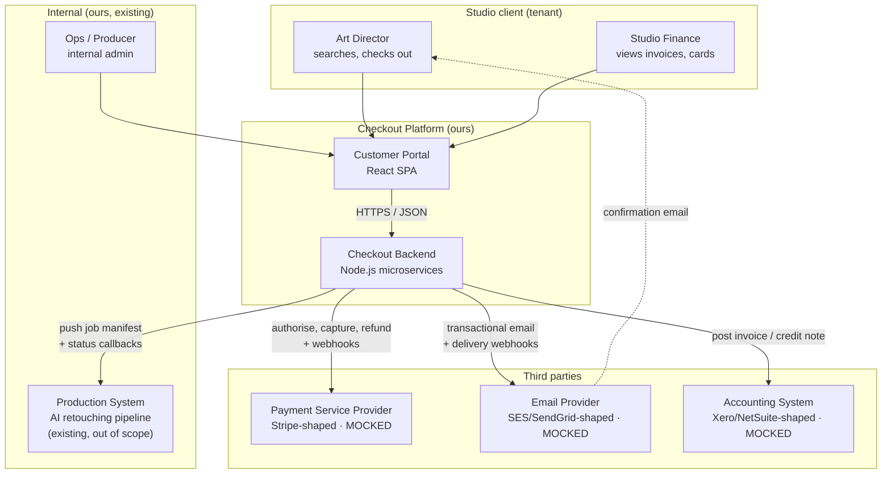
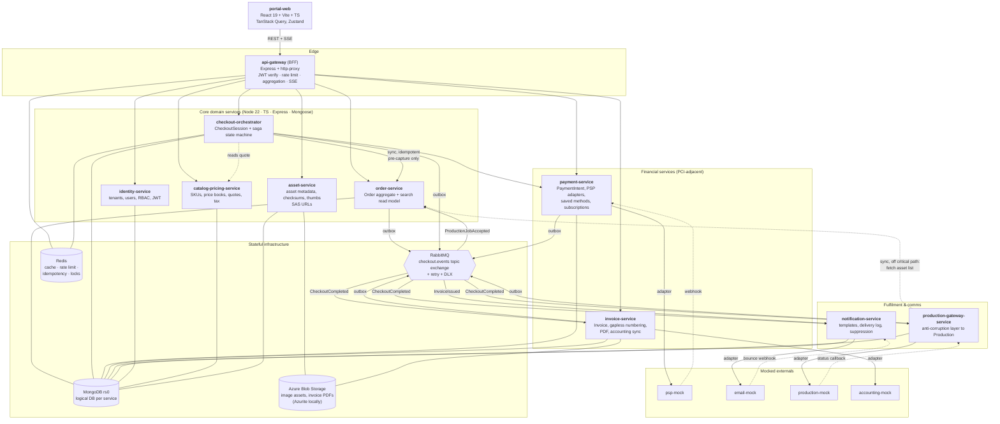
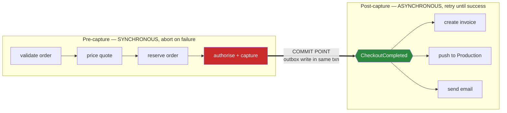
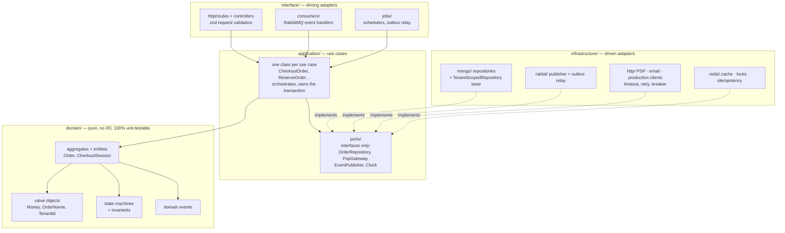

# Architecture — Checkout Platform

> Audience: engineers and architects reviewing the submission. Read [`../README.md`](../README.md) first for the requirement-to-document map.
> Sibling documents: [DATA-MODEL](DATA-MODEL.md) · [API](API.md) · [EVENTS](EVENTS.md) · [CHECKOUT-SAGA](CHECKOUT-SAGA.md) · [DATA-INTEGRITY](DATA-INTEGRITY.md) · [PERFORMANCE](PERFORMANCE.md)

---

## 1. The problem, restated

The business sells AI-assisted retouching to ecommerce studios. Its commercial promise is *beating deadlines*, which makes one property of this system more important than any other: **once a client's money has been taken, the work must reach Production.** Everything downstream of a successful payment is an obligation, not a best-effort attempt.

The scenario we are asked to design is small on the surface — search an order, check it out, pay, push to Production, email the client — but it sits on a fault line that most ecommerce backends get wrong. A single checkout spans five things that can each fail independently:

1. the order must be locked so it cannot be double-charged or edited mid-payment,
2. a third-party Payment Service Provider must authorise and capture funds,
3. an invoice must exist in the invoicing/accounting system for finance and audit,
4. the internal Production system must accept the job so retouching actually starts,
5. the client must be told it worked.

None of these share a database. Two of them are outside our trust boundary. One of them (Production) is the *reason the customer paid us*, so failing it silently is the worst outcome in the system — worse than failing the payment, because the client believes their deadline is safe when it is not.

The architecture below is organised entirely around that asymmetry.

### 1.1 The central design decision

> **Payment is the commit point. Everything after it is a durable obligation that retries until it succeeds or a human intervenes. Everything before it is cheap to abort.**

Concretely:

- Before capture, any failure results in a clean abort. We release the order back to `READY_FOR_CHECKOUT`, the client sees an error, nothing is charged, no email goes out. Compensation is trivial because no external state changed.
- After capture, we never roll a payment back automatically. Invoicing, the Production push, and the confirmation email become guaranteed-delivery obligations driven by durably persisted events. If the Production system is down for twenty minutes, the messages wait twenty minutes and then succeed. If it is down for longer than the retry budget — six attempts over roughly 75 minutes — they land in a dead-letter queue and an on-call engineer gets paged against an SLO, because at that point a human commercial decision (refund, expedite, apologise) is required and no amount of retrying substitutes for it.

This is why the design uses an **orchestrated saga for the synchronous pre-capture phase** and **event-driven choreography for the post-capture phase**. Those two styles are usually presented as competing options; here they solve different problems, and mixing them deliberately is the point. [CHECKOUT-SAGA](CHECKOUT-SAGA.md) works through every branch.

### 1.2 Quality attributes that drove the design

| Attribute | Target | Architectural consequence |
|---|---|---|
| Correctness of money | Zero double-charges, zero silent charge-without-work | Idempotency keys on every mutating call; transactional outbox; unique partial index enforcing one capture per order |
| Production delivery | 99% of paid orders reach Production within 60 s; any order still unpushed at 15 min pages on-call | At-least-once eventing, retry with backoff, DLQ + alert + replay runbook |
| Search responsiveness | p95 < 200 ms for order search at 10k orders/tenant | Dedicated denormalised read model, compound indexes, keyset pagination — never a cross-service fan-out |
| Team scalability | 10–20 engineers shipping independently | Service-per-bounded-context, contract-first APIs, monorepo with affected-graph CI, CODEOWNERS |
| Auditability | Finance can reconstruct any charge | Append-only domain event log, gapless invoice numbering, immutable pricing snapshot on the order |
| Tenant isolation | No cross-tenant data leak, ever | `tenantId` in every document, every index, every query — enforced in a repository base class, not by convention |

---

## 2. C4 Level 1 — System context

Three integrations are mocked, as the brief allows: the PSP, the email provider, and the Production system. The Production system is treated as **an existing internal service we do not own** — that framing matters, because it means we cannot assume it is transactional with us, cannot assume it is always up, and must design for its API being both slow and occasionally wrong. The accounting system is a fourth mock; the brief mentions "our invoice system", and I have split that into an invoice *domain service* we own plus an external *accounting system* of record we sync to. See [ASSUMPTIONS §A4](ASSUMPTIONS.md#a4-invoice-system-means-a-service-we-own-plus-an-external-ledger-medium).

---

## 3. C4 Level 2 — Containers

### 3.1 Why these service boundaries

Boundaries follow **bounded contexts with genuinely different rates of change, different failure semantics, and different owning teams** — not layers and not entities. Two tests were applied to every candidate split: *would a change here normally require a coordinated change elsewhere?* and *does this thing have a different reason to be unavailable?*

| Service | Owns (source of truth) | Why it is separate |
|---|---|---|
| **api-gateway** | Nothing | Cross-cutting concerns (auth, rate limiting, CORS, response shaping, SSE) belong at the edge so ten services do not each reimplement them. It is deliberately dumb: no business rules, no database. |
| **identity-service** | Tenants, users, roles, sessions, API keys | Auth changes on a security cadence, not a product cadence. It is also the one service every other service depends on, so it must be independently scalable and cacheable (JWKS + short-lived JWTs mean the hot path never calls it). |
| **catalog-pricing-service** | Service SKUs, price books, contract rates, volume tiers, tax rules | Pricing is the most volatile business logic in the company and is edited by commercial staff, not engineers. Isolating it means a rate-card change is a data change, not a deploy. Critically, it produces an immutable **quote** that the order snapshots — prices can never move under a live checkout. |
| **order-service** | Order aggregate, order items, lifecycle, **search read model** | The core aggregate and the highest-read-volume surface. It owns search because search must not fan out to other services (see [PERFORMANCE §3](PERFORMANCE.md#3-order-search-the-hot-read-path)). |
| **checkout-orchestrator** | CheckoutSession, saga instances | The only service that knows the *sequence*. Extracting it keeps order-service free of payment knowledge and payment-service free of order knowledge, and it gives the saga its own persistent state, its own timeout scheduler, and its own admin surface for stuck instances. |
| **payment-service** | PaymentIntent, transactions, saved payment methods, subscriptions | Different compliance posture (PCI SAQ-A), different deploy risk, and needs a hard blast-radius boundary. It is the only service that talks to the PSP and the only one that ever sees a PSP token. |
| **invoice-service** | Invoice, credit notes, invoice numbers, PDFs | Legally significant, append-only, retention-bound data with rules (gapless numbering, immutability after issue) that would pollute the order model. Also the integration point for the external accounting ledger. |
| **notification-service** | Message templates, delivery log, suppression list | Fan-in from everywhere; must never block a business transaction. Owning a delivery log with retries and bounce handling is a real domain, not a `sendMail()` helper. |
| **production-gateway-service** | Production job mapping, push attempts | A textbook **anti-corruption layer**. The Production system's API is not ours to change; this service absorbs its quirks, its downtime, its error semantics, and its vocabulary so that no other service ever imports a `ProductionJobDto`. Their job id does cross the boundary, but only as an opaque `externalJobId` alongside our own `prj_…` — useful in a support conversation, never something another service branches on. It holds the circuit breaker, the retry policy, and the DLQ. |
| **asset-service** | Asset metadata, checksums, derivatives | Bytes must never flow through Node. This service only mints short-lived SAS URLs and records metadata, so image volume never becomes an application-tier scaling problem. |

**What I deliberately did *not* split.** Order and OrderItem stay in one service because they are one consistency boundary — an order's total must agree with its items transactionally. Search stays inside order-service rather than becoming a "search-service", because at this scale a second service buys nothing but an extra hop and an extra thing to keep in sync; the read model is a collection, not a deployment. And there is no "email-service" separate from notification-service, because channel (email, in-app, webhook) is a strategy inside one domain.

### 3.2 Synchronous vs asynchronous — the rule

Getting this wrong is the usual cause of distributed-monolith pain, so the rule is explicit and enforced in review:

> **Synchronous (HTTP) is allowed only when the caller cannot produce a correct response to the user without the answer, and only in the pre-capture phase. Everything else is an event.**

That yields exactly five synchronous internal dependencies — four on the checkout critical path (orchestrator → order for validate and reserve, orchestrator → catalog for the quote, orchestrator → payment for authorise and capture, gateway → any service serving a user request) plus one off it (production-gateway → order to fetch the asset list when building a manifest, which happens inside a consumer and is retryable on that consumer's own ladder). Every other interaction in the diagram above is an event. Notably, **invoicing, the Production push, and the email are all asynchronous**, which is what lets checkout return to the Art Director in under a second while still guaranteeing all three eventually happen.

---

## 4. C4 Level 3 — Inside a service

Every service has the same internal shape so an engineer moving between teams is immediately productive. This is ports-and-adapters (hexagonal), with the dependency rule pointing strictly inward: `domain` knows nothing, `application` knows `domain`, `infrastructure` and `interface` know both and are the only places allowed to import a driver, an SDK, or Express.

The practical payoffs: business rules are testable with zero infrastructure (no Docker, no Mongo, millisecond unit tests); swapping the PSP from mock to Stripe is a new class in `infrastructure/http/` and a config value, with no change above it; and the `TenantScopedRepository` base class makes cross-tenant leakage a compile-time and runtime impossibility rather than a code-review hope. Directory layout and the lint rules that enforce the dependency direction are in [CODEBASE-STRUCTURE](CODEBASE-STRUCTURE.md).

---

## 5. The scenario, end to end

The brief's three-step scenario, mapped onto the architecture. Full sequence diagrams with every failure branch are in [CHECKOUT-SAGA](CHECKOUT-SAGA.md); this is the narrative version.

**Step 1 — The Art Director searches their orders.** The portal calls `GET /api/v1/orders?q=nike-ss26&status=READY_FOR_CHECKOUT` through the gateway. The gateway verifies the JWT locally against cached JWKS (no network hop to identity), extracts `tenantId` from the token — never from the request body — and forwards to order-service. Order-service queries `order_search_view`, a denormalised collection carrying everything the results list renders: name, status, item count, thumbnail key, total, dates. One indexed query, no joins, no fan-out, keyset-paginated. Requirement *"orders could be searched/filtered by name"* is satisfied by a case- and diacritic-insensitive prefix-and-token match (typo tolerance arrives with the Atlas Search cutover); the query design, index choice, and the Atlas Search upgrade path are in [PERFORMANCE §3](PERFORMANCE.md#3-order-search-the-hot-read-path).

**Step 2 — They open the order and confirm the total.** Order detail is served from the Order aggregate itself, including the immutable `pricingSnapshot` taken when the order was finalised. The portal shows exactly the amount that will be charged, because the amount the client sees and the amount the orchestrator charges are literally the same stored object — a class of bug (price drift between review and charge) designed out rather than tested for.

**Step 3 — They check out.** `POST /api/v1/checkout-sessions` with an `Idempotency-Key` the portal generates once per attempt and reuses across retries. The orchestrator creates a `CheckoutSession`, starts a saga, and:

- re-validates the order server-side (right tenant, `READY_FOR_CHECKOUT`, non-empty, not already paid) — the client's view is never trusted;
- re-verifies the quote against catalog-pricing, comparing against the snapshot and refusing if they diverge;
- **reserves** the order via a compare-and-swap on `{_id, tenantId, version}`, moving it to `CHECKOUT_PENDING`. This CAS is the concurrency control for the entire feature: two Art Directors clicking checkout on the same order at the same moment produce one winner and one `409 CONFLICT`;
- authorises and captures with the PSP through payment-service, passing a derived idempotency key so a network retry can never double-charge.

On capture, payment-service writes the transaction **and** an outbox record in one MongoDB transaction. That single atomic write is the commit point of the whole system: after it, the obligation to invoice, produce, and notify is durable, and it is impossible for the money to be captured without the follow-on events existing.

**Then, concurrently and independently:** invoice-service issues an invoice with a gapless number and syncs it to the accounting ledger; production-gateway-service translates the order into a Production job manifest and pushes it, retrying through a circuit breaker, and on acceptance emits `ProductionJobAccepted`, which moves the order to `IN_PRODUCTION` — satisfying *"we need to call our internal system to update the state of the order"*; notification-service renders and sends the confirmation email, satisfying *"client has to receive the email if the payment is successful"*. The email is deliberately triggered by `CheckoutCompleted` (payment success) and not by the Production push, because the requirement ties it to payment. It is enriched with the invoice number when `InvoiceIssued` arrives in time, and sent without it otherwise, rather than being blocked. The Art Director watches all three land in real time over SSE.

**When things fail.** Pre-capture failure aborts cleanly: the order is released to `READY_FOR_CHECKOUT`, the session ends `FAILED` with a mapped, human-readable decline reason, nothing is charged and no email is sent. Post-capture failure never touches the payment: the Production push retries with exponential backoff and jitter, trips a circuit breaker if the Production system is unhealthy so we stop hammering it, and after the retry budget expires lands in a DLQ that pages on-call with a replay runbook. The order sits in `PAID_AWAITING_PRODUCTION` — a state that exists precisely so this situation is *visible* rather than inferred, and it is alerted on as an SLO breach at 15 minutes. The one case where we do compensate a payment automatically is a hard, permanent rejection from Production (the job is structurally unprocessable), which triggers an automatic refund saga and a different email; a transient failure never does. That distinction — permanent vs transient — is the single most important classification in the error handling, and it is made explicit in the anti-corruption layer's error mapping rather than left to a retry library's defaults.

---

## 6. Technology choices

MERN was the requested stack; these are the specific picks and the honest trade-offs.

| Concern | Choice | Rationale and trade-off |
|---|---|---|
| Runtime | **Node 22 LTS, TypeScript 5.6, ESM** | Requested; excellent for I/O-bound orchestration. `strict` plus `noUncheckedIndexedAccess` and `exactOptionalPropertyTypes` because money code should not have `undefined` surprises. Trade-off: unsuitable for CPU-bound work, which is exactly why image processing stays in the Production system. |
| HTTP framework | **Express 5** | Requested (the "E"), universally known — a real advantage for a 20-engineer team. Fastify is ~2× faster on synthetic benchmarks, but our latency budget is dominated by Mongo and the PSP, so framework overhead is noise. Documented in [ADR-0008](adr/0008-express-over-fastify.md). |
| Database | **MongoDB Atlas on Azure** (replica set), logical DB per service | Requested (the "M"); the document model genuinely fits order-with-items as one aggregate, and flexible schemas suit an evolving pricing model. A replica set is **mandatory, not optional** — multi-document transactions are what make the transactional outbox atomic. Trade-off: no cross-service joins and weaker relational guarantees for finance, mitigated by keeping money as integer minor units, enforcing invariants inside aggregates, and adding a nightly reconciliation job. See [ADR-0002](adr/0002-database-per-service.md). |
| ODM | **Mongoose 8** | Schema validation at the app layer, discriminators for polymorphic order items, plus JSON Schema validators at the collection level as defence in depth. Trade-off: overhead versus the raw driver; acceptable, and the repository layer hides it so it is replaceable. |
| Broker | **RabbitMQ 3.13** — topic exchange, per-consumer queues, delayed-retry queues, DLX | Chosen over Kafka: our need is reliable per-entity task delivery with per-message retry and DLQ, which is Rabbit's core competence, not a high-throughput replayable log. Per-message nack/requeue and a delay plugin give the retry ladder almost for free. Trade-off: no long-term replay and weaker ordering guarantees, addressed by making every consumer idempotent and every event carry enough state to be processed out of order. Kafka becomes correct when we want an analytics log or event sourcing; migration path in [ADR-0003](adr/0003-transactional-outbox-with-rabbitmq.md). |
| Cache / locks | **Redis 7** | Idempotency records, rate-limit counters, hot-query cache, short-lived advisory locks for the outbox relay and scheduler leader election. Never a source of truth — every Redis value is reconstructible from Mongo. |
| Object storage | **Azure Blob Storage** (Azurite locally) | User-delegation SAS for uploads and for invoice PDFs, so image bytes never traverse the application tier. A time-based immutability policy gives invoices WORM retention. |
| Frontend | **React 19 + Vite + TS**, TanStack Query for server state, Zustand for the small amount of true client state, TanStack Virtual for large lists, Tailwind + Radix for accessible primitives | Requested (the "R"). Query gives us caching, deduplication, and background refetch for free, which is most of what an order-search UI needs. Details and the checkout UX in [FRONTEND](FRONTEND.md). |
| Realtime | **SSE** for saga progress | One-directional server→client updates over plain HTTP/2: no WebSocket upgrade at the load balancer, no sticky sessions, trivially proxied. WebSockets would be over-engineering for a progress bar. |
| Contracts | **OpenAPI 3.1** per service plus one aggregated spec at the gateway, **AsyncAPI 3** for events, `.proto` for the two gRPC paths, **zod** as the single runtime source of truth with types and specs generated from it at build time | Contract-first is what makes 20 engineers on ten services tractable; validating with the same zod schema that generated the published spec removes spec-vs-code drift as a category of bug. **Swagger UI** is served from the generated spec in every environment except production, where the console is disabled and the partner surface is Azure API Management ([API §6](API.md#6-swagger-generated-specs-and-interactive-documentation)). |
| Observability | **OpenTelemetry** SDK unchanged; exported via an OTel Collector to **Azure Monitor / Application Insights**, with Log Analytics for logs and **Azure Managed Grafana** for dashboards-as-code | Trace context propagates through HTTP headers *and* AMQP message headers, so one `traceId` covers the whole checkout including asynchronous tails. Non-negotiable in a distributed system. See [OBSERVABILITY](OBSERVABILITY.md). |
| Deployment | **Docker Compose** locally; **Azure Container Apps** in real environments, provisioned by **Bicep** and deployed by **Azure DevOps Pipelines** | Compose keeps the local loop to one command. Container Apps has KEDA queue-depth scaling as a native scale rule rather than an add-on, which is precisely the signal consumer load needs — CPU is a poor proxy for it. AKS is a documented exit with explicit triggers ([ADR-0010](adr/0010-container-apps-now-aks-as-the-exit.md)); see [DEPLOYMENT](DEPLOYMENT.md). |

---

## 7. Cross-cutting concerns

**Authentication and authorisation.** Short-lived RS256 access tokens (15 min) plus rotating refresh tokens; the gateway verifies signatures against cached JWKS so the hot path never calls identity-service. `tenantId` and roles come *only* from token claims. Authorisation is enforced twice on purpose: coarse role checks at the gateway for fast rejection, and the real resource-level decision inside each service, because a gateway-only model means one misrouted internal call becomes a data breach. East-west calls carry a short-lived service token plus the original user context in a propagated header, so an internal service can still make tenant-correct decisions. Full model, including PCI scope and the threat model, in [SECURITY](SECURITY.md).

**Multi-tenancy.** Shared database, shared collections, `tenantId` as the leading field of every compound index and the mandatory first predicate of every query. Enforced structurally by `TenantScopedRepository`, which takes tenant from an AsyncLocalStorage request context and injects it into every filter — a developer literally cannot write an unscoped query through the repository, and a lint rule bans raw model access outside it. Noisy-neighbour protection is per-tenant rate limits at the gateway and per-tenant queue sharding for large batch pushes.

**Resilience.** Every outbound HTTP call has a timeout — 3 s by default, overridden per dependency where the work genuinely takes longer (the PSP gets 8 s, because card authorisation is seconds-scale and a 3 s cut-off would abort successful charges) — bounded retries with exponential backoff and full jitter on idempotent operations only, and a circuit breaker per dependency. Bulkheads separate connection pools per dependency so a slow Production system cannot exhaust the pool used for PSP calls. All consumers are idempotent via an inbox table. Every queue has a retry ladder (six attempts over ~75 minutes) and a DLQ; a *production* DLQ with depth > 0 for 15 minutes pages someone, and the lower-severity DLQs raise tickets. Graceful shutdown drains in-flight work and stops prefetching before the container dies, so a rolling deploy never orphans a saga.

**Configuration.** Twelve-factor: config from environment, validated by a zod schema at boot, and the process **refuses to start** on invalid config rather than failing mysteriously at 3 a.m. Secrets are Azure Key Vault references resolved by each service's own managed identity, so a secret value never appears in Bicep, in a pipeline log, or in `az containerapp show`; there is no `.env` on a real environment ([DEPLOYMENT §6](DEPLOYMENT.md#6-configuration-and-secrets)). Feature flags (OpenFeature) gate the saga v2 rollout and the Atlas Search cutover so risky changes ship dark and are enabled per tenant.

---

## 8. Scaling path and known limits

The design is deliberately sized for *today's* load — roughly 200 studio tenants, 50k orders/month, peaks of ~20 checkouts/minute around end-of-month deadlines — with clear next moves rather than premature machinery. Order-service and the gateway scale horizontally on request rate; consumers scale on queue depth via a native KEDA scale rule; Atlas scales first by reading the search view from secondaries, then by sharding on `tenantId` when a single tenant's working set outgrows RAM. Known limits I would not pretend away: RabbitMQ gives no long-term replay, so a bug that corrupts a projection needs a rebuild-from-aggregate job rather than a topic rewind (that job is in the plan, not implied); the saga's timeout scheduler is a single leader-elected process, adequate to thousands of instances but a rewrite to a partitioned scheduler beyond that; and the nightly reconciliation job is O(orders/day), which is fine now and becomes a windowed incremental job later. Sequencing of all of this is in [DELIVERY-PLAN](DELIVERY-PLAN.md), and the assumptions this whole design rests on — with how I would validate each one — are in [ASSUMPTIONS](ASSUMPTIONS.md).
