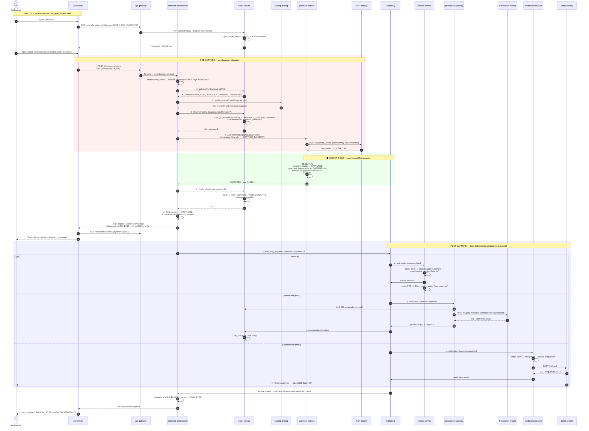
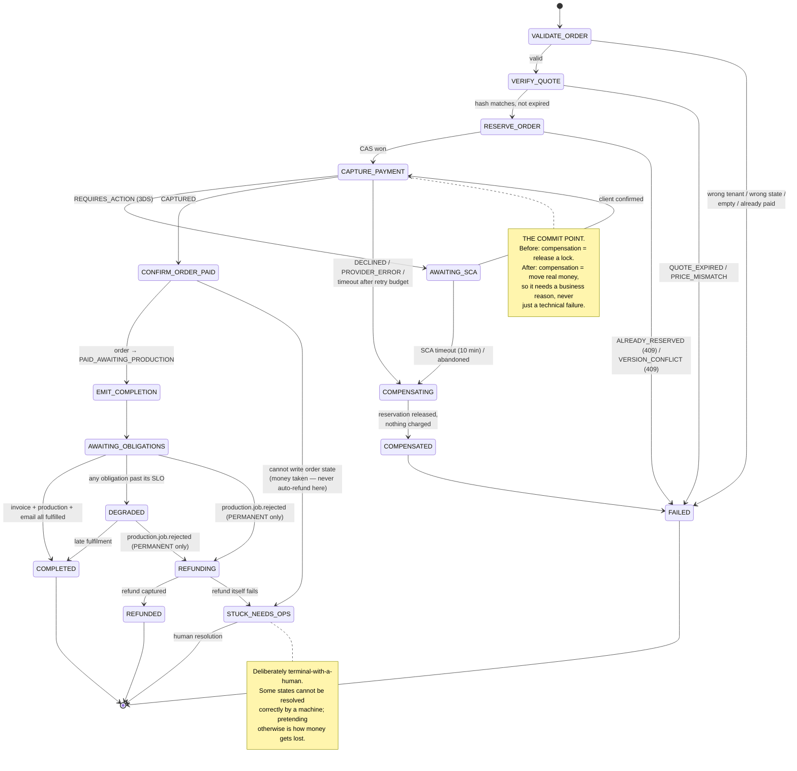
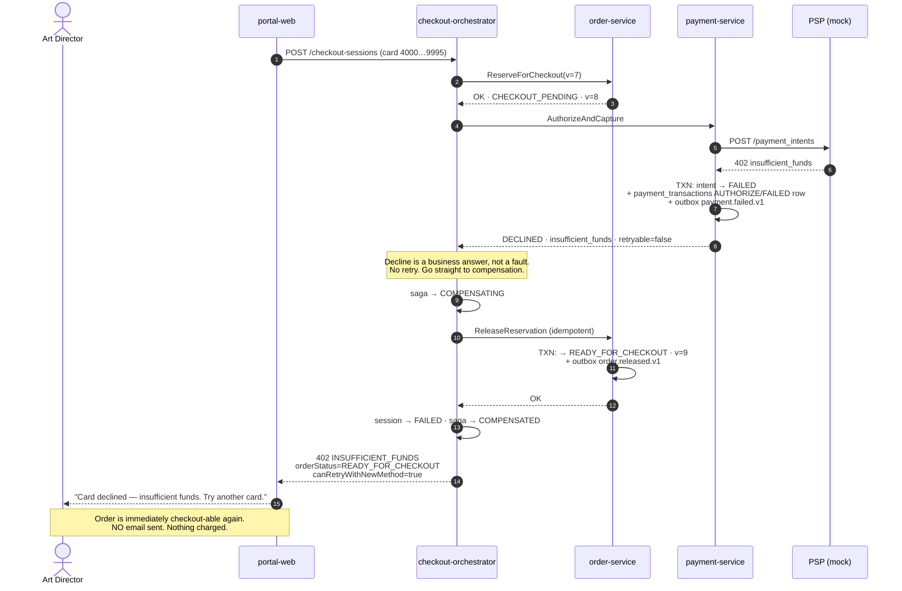
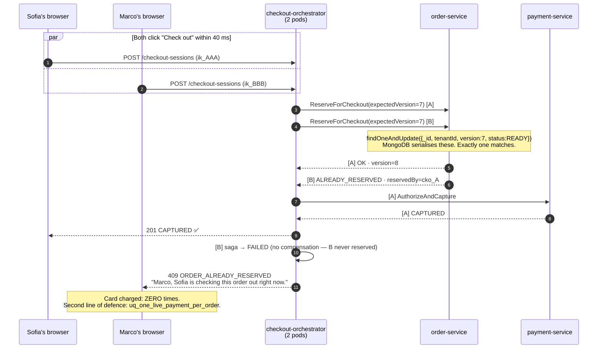
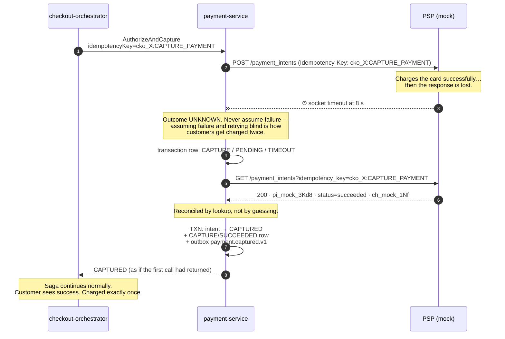
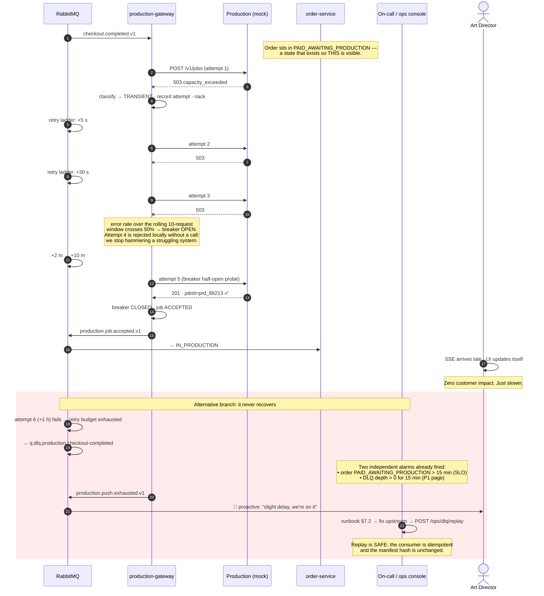
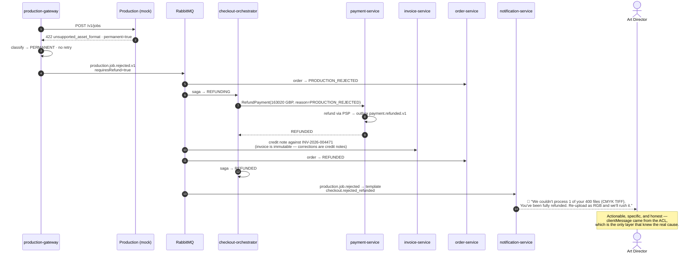

# The Checkout Saga

> This is the heart of the submission. [ARCHITECTURE](ARCHITECTURE.md) explains why the design splits at the commit point; this document works through every branch of it. Event payloads are in [EVENTS](EVENTS.md); the mechanisms that make each step safe are in [DATA-INTEGRITY](DATA-INTEGRITY.md).

---

## 1. Why a saga, and why a hybrid one

Checkout spans five systems with no shared transaction: order-service, catalog-pricing, payment-service (and behind it a third-party PSP), invoice-service (and behind it an accounting ledger), and the internal Production system. Two-phase commit is not available across an HTTP boundary to Stripe, and would be a poor idea even if it were — it converts every participant's outage into everyone's outage. So we need a saga: a sequence of local transactions, each with a compensating action.

The interesting question is not *whether* a saga, but *which kind*. The two textbook options each fail half of this problem.

**Pure orchestration** — one coordinator calling every step, including invoice, production, and email — gives beautiful traceability and a single place to reason about failure. But it makes the coordinator the availability floor for everything: if the Production system is down, either the customer waits, or the coordinator has to persist a retry loop that is really just a queue with extra steps.

**Pure choreography** — every service reacting to events with no coordinator — gives excellent decoupling and independent failure. But nobody owns the sequence. "Was this order's payment authorised before the order was reserved?" becomes unanswerable without reading six services' logs, and there is no single place to put a timeout or a compensation policy.

The decision this design makes is that the two phases of a checkout have genuinely different requirements, so they get different styles:

| | Pre-capture | Post-capture |
|---|---|---|
| Steps | validate → quote → reserve → capture | invoice · production push · email |
| Style | **Orchestrated**, synchronous | **Choreographed**, event-driven |
| User is waiting? | Yes — must finish in < 1 s | No — response already sent |
| On failure | **Abort and compensate.** Nothing external changed, so rollback is cheap and complete | **Retry until success.** Money has moved; the obligation is real |
| Ordering | Strictly sequential; each step depends on the last | Fully parallel; independent of each other |
| Who owns it | checkout-orchestrator | each consumer owns its own obligation |

The dividing line is the moment the PSP confirms capture. Before it, a failure means the customer is not charged and we can safely pretend the attempt never happened. After it, the customer *has paid*, and every remaining step is something we owe them. Those are opposite failure philosophies, and forcing one mechanism to serve both is what makes most checkout implementations fragile.

```mermaid
graph LR
    subgraph A["Pre-capture — ORCHESTRATED · SYNCHRONOUS · abort on failure"]
        direction LR
        S1["1 · VALIDATE_ORDER"] --> S2["2 · VERIFY_QUOTE"] --> S3["3 · RESERVE_ORDER<br/><i>CAS on version</i>"] --> S4["4 · CAPTURE_PAYMENT"]
    end
    S4 ==>|"⬛ COMMIT POINT<br/>payment + outbox in ONE txn"| S5
    S5["5 · CONFIRM_ORDER_PAID<br/>6 · EMIT checkout.completed"] ==> B
    subgraph B["Post-capture — CHOREOGRAPHED · ASYNC · retry until success"]
        direction TB
        O1["invoice-service<br/>→ invoice.issued"]
        O2["production-gateway<br/>→ production.job.accepted"]
        O3["notification-service<br/>→ notification.sent"]
    end
    style S4 fill:#c92a2a,color:#fff
    style S5 fill:#2b8a3e,color:#fff
```



---

## 2. Happy path

Timings are the p50 budget from [PERFORMANCE §2](PERFORMANCE.md#2-service-level-objectives).



The Art Director gets their `201` in around 780 ms, then watches three checkmarks appear over the next few seconds. All three obligations are guaranteed by the durable event, not by the request staying open.

---

## 3. The saga state machine

Persisted in `saga_instances` ([DATA-MODEL §4.2](DATA-MODEL.md#42-saga_instances)), so a pod restart mid-checkout resumes instead of abandoning a customer's transaction.



`STUCK_NEEDS_OPS` is a design statement. When the customer has been charged and we then cannot write our own order state, the honest options are "retry forever" or "escalate to a human" — and refunding would be wrong, because the customer's work may already be in Production. So the saga stops, pages someone, and hands them a console with the exact step, error, and replay button.

### 3.1 Step definitions

```ts
// services/checkout-orchestrator/src/domain/saga/checkout-saga.definition.ts
export const CHECKOUT_SAGA_V2 = defineSaga({
  name: 'CHECKOUT_V2',
  // Two budgets, because they measure different things. The pre-capture steps
  // must finish fast (a user is waiting); the AWAITING_SCA branch is a human
  // completing a bank challenge and needs the full 3-DS window. A single 2 m
  // guard would kill every 3-DS checkout 8 minutes early.
  stepBudget: '2m',                  // sum of automated pre-capture steps
  timeout: '15m',                    // whole-saga guard, incl. the 10 m SCA wait
                                     // timeoutAt is persisted per instance
  steps: [
    {
      name: 'VALIDATE_ORDER',
      // Read-only, so retrying is free.
      retry: { attempts: 3, backoff: 'exponential', base: 100 },
      compensation: null,            // nothing changed ⇒ nothing to undo
      run: (ctx) => ctx.orders.validateForCheckout(ctx.orderId, ctx.tenantId),
    },
    {
      name: 'VERIFY_QUOTE',
      retry: { attempts: 3, backoff: 'exponential', base: 100 },
      compensation: null,
      // Re-derives the total server-side and compares against BOTH the order's
      // pricingSnapshot and the client's expectedTotal. Any disagreement is a
      // hard stop, never a silent "charge our number".
      run: (ctx) => ctx.pricing.verify(ctx.orderId, ctx.snapshotHash, ctx.expectedTotal),
    },
    {
      name: 'RESERVE_ORDER',
      // NOT retried on conflict: a 409 is a real answer ("someone else won"),
      // not a transient fault. Retrying would just lose more slowly.
      retry: { attempts: 1 },
      compensation: 'RELEASE_ORDER',
      run: (ctx) => ctx.orders.reserve(ctx.orderId, ctx.expectedVersion, ctx.sessionId),
    },
    {
      name: 'CAPTURE_PAYMENT',
      // Retried ONLY on network/5xx/timeout, and always with the same derived
      // idempotency key, so a retry cannot double-charge. A decline is a
      // terminal business answer and is never retried.
      retry: { attempts: 3, backoff: 'exponential-jitter', base: 500, retryOn: ['TIMEOUT', 'PROVIDER_5XX'] },
      idempotencyKey: (ctx) => `${ctx.sessionId}:CAPTURE_PAYMENT`,
      compensation: 'REFUND_PAYMENT',
      run: (ctx) => ctx.payments.authorizeAndCapture({ /* … */ }),
    },
    {
      name: 'CONFIRM_ORDER_PAID',
      // Generous retry budget: money has moved, so giving up here is worse than
      // trying for 30 seconds. If it still fails → STUCK_NEEDS_OPS, not a refund.
      retry: { attempts: 5, backoff: 'exponential-jitter', base: 200 },
      compensation: null,
      onExhausted: 'STUCK_NEEDS_OPS',
      run: (ctx) => ctx.orders.confirmPaid(ctx.orderId, ctx.paymentId),
    },
    {
      name: 'EMIT_COMPLETION',
      // A local outbox write in the orchestrator's own DB — it cannot fail for
      // external reasons, which is exactly why it is the last synchronous step.
      retry: { attempts: 5, backoff: 'exponential', base: 100 },
      compensation: null,
      onExhausted: 'STUCK_NEEDS_OPS',
      run: (ctx) => ctx.outbox.append(checkoutCompletedV1(ctx)),
    },
  ],
  compensations: {
    // Compensations MUST be idempotent — they are retried aggressively and may
    // run against already-compensated state. A compensation that can fail is
    // not a compensation.
    RELEASE_ORDER:  { retry: { attempts: 10, backoff: 'exponential-jitter' },
                      run: (ctx) => ctx.orders.releaseReservation(ctx.orderId, ctx.sessionId) },
    REFUND_PAYMENT: { retry: { attempts: 10, backoff: 'exponential-jitter' },
                      run: (ctx) => ctx.payments.refund(ctx.paymentId, ctx.amount, 'SAGA_COMPENSATION'),
                      onExhausted: 'STUCK_NEEDS_OPS' },
  },
});
```

---

## 4. Failure scenarios

### 4.1 Payment declined — clean abort

The common case, and the one that must be flawless: the customer's card is declined, the order goes straight back to checkout-ready, nothing is charged, and **no confirmation email is sent** (the requirement ties the email to payment success).



The order is usable again within milliseconds, and the UI can offer a different card without a page reload because the response says so explicitly.

### 4.2 Concurrent checkout — two Art Directors, one order

A real failure mode in studios where several people work the same batch. The compare-and-swap in `ReserveForCheckout` is the entire defence, and it is a single atomic database operation rather than a distributed lock.



Two independent guards, both enforced by the database rather than application logic: the CAS on `{_id, tenantId, version, status}`, and the unique partial index `uq_one_live_payment_per_order` in payment-service. Belt and braces is proportionate when the failure mode is charging a customer twice.

### 4.3 Ambiguous PSP timeout — the case idempotency exists for

The hardest failure in payments: the request times out, and we genuinely do not know whether the money moved. Test card `4000 0000 0000 0077` reproduces it on demand.



Three things make this safe. The idempotency key is **derived deterministically** from the session and step, so a retry is byte-identical rather than a new request. On timeout we **query before we retry**, so we never gamble. And if the lookup itself is unavailable, the payment sits in `PENDING` and a reconciliation job resolves it within a minute — the customer sees "we're confirming your payment" rather than a false failure or a double charge.

If the client retries the whole `POST /checkout-sessions` with the same `Idempotency-Key`, the HTTP idempotency layer returns the original in-flight or completed session instead of starting a second saga ([DATA-INTEGRITY §5](DATA-INTEGRITY.md#5-http-idempotency)).

### 4.4 Production push fails transiently — money kept, work retried

**The most important failure scenario in the system.** The customer has paid. The Production system is down. We do not refund, we do not lose the job, and we do not pretend everything is fine.



Note what is deliberately absent: at no point does a transient Production failure trigger a refund. The customer paid for retouching; the correct response to "the render farm is busy" is to wait and try again, not to cancel their order. And note what is deliberately present: two independent alarms from two different signals, so a single monitoring gap cannot hide a paid order that is not moving.

### 4.5 Production rejects permanently — the one automatic refund

Structurally unprocessable job (wrong colour space, unsupported format). Retrying is futile, so we refund and tell the truth.



The email tells the customer exactly which file and exactly what to do, because the anti-corruption layer produced that message where the domain knowledge lives, rather than the notification template guessing.

### 4.6 Invoice or email fails — never blocks the customer

Neither of these is on the critical path, and neither is allowed to hold up anything else.

If the accounting ledger rejects or times out, the invoice **still exists** in our system, is visible to the client, and the PDF is downloadable. Only `accountingSync.status` is `FAILED`, retried by a background job on its own schedule. A finance integration being down is not a customer-facing problem, and treating it as one would be the wrong priority.

If the email provider fails, the notification retries on the ladder; a hard bounce adds the address to the suppression list and raises an in-app notification plus a P3 alert instead of retrying pointlessly. The order proceeds to Production regardless — a customer whose work is being retouched but whose confirmation email bounced is in a far better position than the reverse.

### 4.7 Orchestrator crashes mid-saga

Persisted state is what makes this a non-event, and the recovery *direction* depends on which side of the reservation the crash happened.

A crash during `VALIDATE_ORDER` or `VERIFY_QUOTE` leaves nothing to undo — no reservation, no money — so the session expires and the client retries immediately. Nothing was charged, and the order was never locked.

A crash at or after `RESERVE_ORDER` **recovers forward.** The saga document survives with `state: RUNNING`, `currentStep: CAPTURE_PAYMENT`, and `timeoutAt` set. The leader-elected scheduler picks it up within 30 seconds, resumes from the persisted step, and — because `CAPTURE_PAYMENT` carries a derived idempotency key — re-running it is safe whether or not the original attempt reached the PSP. Forward is the right direction here because the user is still waiting on the order they reserved: abandoning it would turn a 30-second blip into a failed checkout for no benefit.

Meanwhile the order-reservation reaper is an independent safety net. Any order stuck in `CHECKOUT_PENDING` for 15 minutes is released regardless of what the saga thinks — but only after checking that no payment was captured, because releasing a paid order would let it be sold twice ([DATA-INTEGRITY §7](DATA-INTEGRITY.md#7-the-reservation-lock)). Two mechanisms, neither depending on the other, and the parameterised chaos test in [TESTING §4.5](TESTING.md#45-chaos-tests-on-the-saga) asserts convergence from a kill at every step.

---

## 5. Requirement traceability

| Requirement | Where it is satisfied | Failure behaviour |
|---|---|---|
| Orders searched/filtered by name | `GET /orders?q=` → `order_search_view` ([API §2.1](API.md#21-order-search-the-primary-requirement)) | Degrades to the Mongo token index if Atlas Search is off; never fails checkout |
| Checkout order + payment | Pre-capture orchestrated saga, steps ①–④ | Declined → clean abort, order released, nothing charged, no email |
| Push to Production on success | `checkout.completed.v1` → production-gateway → `POST /v1/jobs` | Transient → retry ladder + breaker + DLQ + page. Permanent → refund saga |
| Update order state in internal system | `production.job.accepted.v1` → order-service → `IN_PRODUCTION` | Order visibly stuck in `PAID_AWAITING_PRODUCTION`; SLO alert at 15 min |
| Create invoice | `checkout.completed.v1` → invoice-service, gapless numbering | Ledger sync failure is isolated; invoice still valid and visible |
| Email on payment success | `checkout.completed.v1` → notification-service | Retry ladder; bounce → suppression + in-app fallback |
| No double charge | Derived idempotency keys, `uq_one_live_payment_per_order`, CAS reservation | Concurrent attempt → `409`; retried POST → original response |
| Money never taken without work | Outbox in the capture transaction | Obligation is durable before the HTTP response is sent |

---

## 6. Why not the alternatives

**Do everything synchronously in one request.** Simplest to read, and wrong. Checkout latency becomes the sum of the PSP, the accounting ledger, and the Production system — comfortably 8–15 s at p95, with a p99 that depends on the least reliable of them. Worse, a Production failure *after* capture leaves the request with no good option: fail the response and the customer thinks nothing happened while their card is charged, or succeed and silently drop the job.

**Choreograph everything, including pre-capture.** Removes the coordinator but loses the sequence. Reserve-then-capture has a strict order and a hard timeout; expressing that as events means each service holds a fragment of the protocol, and the *only* place the full flow exists is in a diagram that will rot.

**Event sourcing the order aggregate.** Genuinely attractive here — a perfect audit trail, free temporal queries, natural projections. Rejected for now on team-cost grounds: it is a significant conceptual load for 10–20 engineers of mixed seniority, and the audit requirement is met more cheaply by `statusHistory` plus the append-only transaction log. The design does not preclude it: the outbox already emits a complete domain event stream, so adopting event sourcing later means treating that stream as the source of truth rather than rewriting the model. [ADR-0004](adr/0004-saga-over-two-phase-commit.md) records this.

**Two-phase commit / XA.** Not available across the PSP or the Production system, and a coordinator failure holds locks across services — turning any single outage into a total one. Sagas trade atomicity for availability, which is the correct trade when the participants are third parties.

---

## 7. Operational runbooks

The design deliberately accepts states that need human resolution, so those states need tooling and instructions rather than tribal knowledge.

### 7.1 Order stuck in `PAID_AWAITING_PRODUCTION` (P1)

Triggered by `platform_orders_awaiting_production_seconds > 900`. Confirm the money moved (`GET /ops/orders/{id}` shows `payment.capturedAt`). Check whether the push is still retrying (`GET /ops/production-jobs?orderId=`) — if `nextRetryAt` is in the future, the system is working and the alert is informational; verify Production-system health before intervening. If the message is in the DLQ, fix the upstream cause first, then `POST /ops/dlq/replay` — safe because the consumer is idempotent and the manifest hash is unchanged. If Production has actually accepted the job but our callback was lost, `POST /ops/production-jobs/{id}/reconcile` queries their API and repairs our state. Never refund without commercial sign-off: the work may be in progress.

### 7.2 DLQ depth > 0 (P1 production · P2 invoice · P3 notification)

Inspect with `GET /ops/dlq?queue=`, which returns the original envelope and full error chain. Group by `error.code` — one poison message and a systemic outage look identical on a depth graph and need opposite responses. Schema-validation failures mean a publisher shipped a breaking change: roll it back, then replay. After fixing the cause, replay in batches of 50 and watch the consumer's error rate.

### 7.3 Saga stuck in `RUNNING` beyond 5 minutes (P2)

`GET /ops/sagas?state=RUNNING&stuckLongerThan=PT5M` shows the exact step and error. `POST /ops/sagas/{id}/resume` re-runs from the persisted step and is safe because every step is idempotent. `force-compensate` requires a written reason and is audited — it is the last resort, not the first button.

### 7.4 Suspected double charge (P1, always)

Query `payment_transactions` by `orderId` for `type: CAPTURE, outcome: SUCCEEDED`; more than one row is a genuine incident. Verify against the PSP by idempotency key. Refund the duplicate immediately, notify the customer proactively before they notice, then write an incident report — a double charge means one of the three guards failed, and finding out which is more important than the refund itself.

### 7.5 Reconciliation drift (P2, nightly)

The nightly job compares captured payments against issued invoices, `PAID_*` orders against production jobs, and our payment totals against the PSP's settlement report. Any non-zero drift is investigated the same day. This job is the backstop that catches whatever the mechanisms above missed — its value is proportional to how boring its output is.
