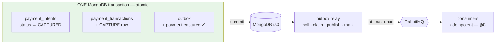
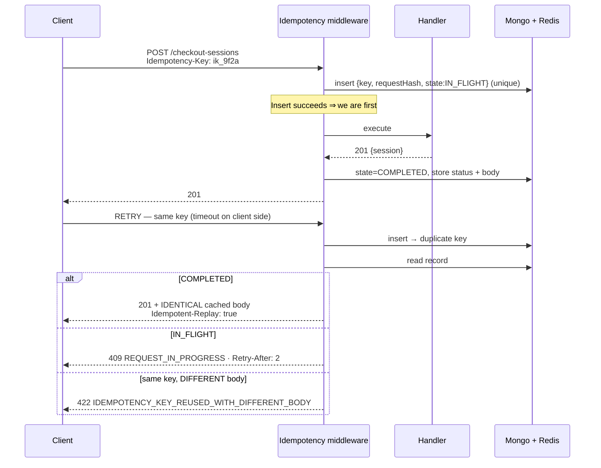
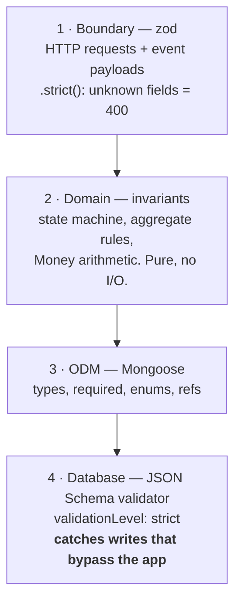

# Data Integrity

> *"How will you manage the integrity of data?"* — one of the brief's explicit questions. This document is the answer.
> Schemas and indexes referenced here are in [DATA-MODEL](DATA-MODEL.md); the flows they protect are in [CHECKOUT-SAGA](CHECKOUT-SAGA.md).

---

## 1. The threat model

Integrity is not one problem, it is seven. Naming them separately matters, because each needs a different mechanism and a design that only addresses "we use transactions" will fail the other six.

| # | Threat | Concrete failure | Mechanism | §|
|---|---|---|---|---|
| 1 | **Dual write** | Payment captured but no event published → order never reaches Production | Transactional outbox | [§3](#3-the-transactional-outbox) |
| 2 | **Duplicate delivery** | `checkout.completed` redelivered → two invoices, two emails | Inbox / idempotent consumers | [§4](#4-idempotent-consumers-the-inbox) |
| 3 | **Duplicate request** | User double-clicks or client retries a timeout → double charge | HTTP idempotency keys | [§5](#5-http-idempotency) |
| 4 | **Lost update** | Two writers, last-write-wins → an item silently disappears | Optimistic concurrency (CAS on `version`) | [§6](#6-optimistic-concurrency) |
| 5 | **Concurrent state race** | Two people check out the same order → two charges | Reservation CAS + unique partial index | [§7](#7-the-reservation-lock) |
| 6 | **Arithmetic / rounding** | £0.01 drift compounds across hundreds of priced units; invoice ≠ charge | Integer minor units; one rounding point; integrity hash | [§8](#8-monetary-correctness) |
| 7 | **Silent divergence** | Order says `PAID`, payment says `FAILED`, and nobody notices for a month | Nightly reconciliation + drift metrics | [§11](#11-reconciliation-the-backstop) |

A guiding principle runs through all of them: **prefer guarantees the database enforces over guarantees the application remembers to enforce.** A unique index cannot be forgotten during a refactor by a new engineer at 4 p.m. on a Friday; a validation function can.

---

## 2. Consistency boundaries — being explicit about what is strong and what is eventual

Distributed systems go wrong when nobody wrote down which invariants are transactional. Ours:

**Strongly consistent (single MongoDB transaction, ACID):** an order and its items and its total; an order's status change and the outbox record describing it; a payment intent, its transaction row, and its outbox record; an invoice, its allocated number, and its outbox record; an inbox record and the work it represents; an order aggregate and its `order_search_view` projection.

That last one is a deliberate and slightly unusual choice. Most CQRS designs accept an eventually-consistent read model, and then engineers spend years explaining to users why a renamed order does not appear in search for two seconds. Because the projection lives in the same database as the aggregate, we can update both in one transaction for a few extra milliseconds on write — and search becomes read-your-own-writes correct. Write volume here is far lower than read volume, so paying on the write side is the right trade.

**Eventually consistent (event-driven, seconds):** order ↔ invoice, order ↔ production job, order ↔ notification, anything ↔ the external accounting ledger, and analytics.

**Never consistent, by design:** the client's browser state. The portal always re-fetches after a mutation and treats its cache as a hint. Optimistic UI is used for latency, never for correctness, and any optimistic update is rolled back on conflict.

The invariants that must *never* be violated, stated plainly so they can be tested: an order has at most one `CAPTURED` payment; a captured payment has exactly one invoice; a paid order eventually has exactly one production job; each addressed recipient receives exactly one confirmation email per successful checkout (the canonical order has two — the Art Director and the studio's accounts-payable address); invoice numbers are gapless per tenant per year; and the amount charged always equals `order.pricingSnapshot.total`. Each has a mechanism below and a property-based or integration test asserting it.

---

## 3. The transactional outbox

### 3.1 The problem

A service must change its state *and* tell the world. Those are two different systems, so there are two orderings and both are broken:

```ts
// ❌ Publish first: broker accepts, then the DB write fails.
// Consumers act on an event describing state that does not exist.
// An invoice for a payment that never happened.
await rabbit.publish('payment.captured', evt);
await db.paymentIntents.update(...);   // crash here

// ❌ Write first: DB commits, then the process dies before publishing.
// Money is captured. No invoice. No production push. No email.
// The customer paid and nothing happens, forever, silently.
await db.paymentIntents.update(...);
await rabbit.publish('payment.captured', evt);   // crash here
```

The second is the one that ends careers, because it fails silently in the direction of "customer paid, work never started".

### 3.2 The solution

Write the event **into the same database, in the same transaction** as the state change. Now there is one atomic commit, and a separate relay process forwards outbox rows to RabbitMQ.



```ts
// packages/kernel/src/outbox/unit-of-work.ts
export async function withOutbox<T>(
  mongo: MongoClient,
  fn: (uow: UnitOfWork) => Promise<{ result: T; events: DomainEvent[] }>,
): Promise<T> {
  const session = mongo.startSession();
  try {
    // MongoDB retries transient transaction errors (write conflicts, primary
    // step-down) automatically. The callback MUST therefore be idempotent —
    // enforced by keeping it free of side effects other than DB writes.
    return await session.withTransaction(async () => {
      const uow = new UnitOfWork(session);
      const { result, events } = await fn(uow);

      // Events are appended INSIDE the transaction. If the business write rolls
      // back, so do the events — there is no window where one exists without
      // the other. This single property is the foundation of the whole design.
      if (events.length > 0) {
        await uow.collection('outbox').insertMany(
          events.map((e) => ({
            messageId: e.messageId,               // ULID; unique index
            aggregateType: e.aggregateType,
            aggregateId: e.aggregateId,
            eventType: e.type,
            eventVersion: e.version,
            routingKey: `${e.type}.v${e.version}`,
            payload: e.payload,
            headers: {
              tenantId: e.tenantId,
              correlationId: ctx.correlationId(),
              causationId: ctx.causationId(),
              traceparent: ctx.traceparent(),     // async tail joins the same trace
            },
            status: 'PENDING',
            attempts: 0,
            availableAt: new Date(),
            occurredAt: e.occurredAt,
          })),
          { session, ordered: true },
        );
      }
      return result;
    }, {
      readConcern:  { level: 'snapshot' },
      writeConcern: { w: 'majority', j: true },   // survives a primary loss —
                                                  // anything less can lose a
                                                  // committed payment on failover
      readPreference: 'primary',
    });
  } finally {
    await session.endSession();
  }
}
```

Usage is unremarkable, which is the point — a developer writing a use case does not think about messaging at all:

```ts
// services/payment-service/src/application/capture-payment.usecase.ts
await withOutbox(this.mongo, async (uow) => {
  const intent = await uow.payments.findByIdempotencyKey(cmd.idempotencyKey);
  intent.markCaptured(pspResult);                        // pure domain logic
  await uow.payments.save(intent);
  await uow.transactions.append(intent.lastTransaction());
  return { result: intent, events: intent.pullEvents() }; // ← published atomically
});
```

### 3.3 The relay

```ts
// packages/kernel/src/outbox/relay.ts — runs as a sidecar loop in every service
async function tick() {
  // Claim a batch atomically so multiple pods never publish the same row.
  // findOneAndUpdate is the claim; there is no separate lock to leak.
  const batch = await outbox.claimBatch({
    limit: Number(env.OUTBOX_BATCH_SIZE),          // 100
    claimedBy: `${SERVICE}-${POD}-${WORKER}`,
    leaseFor: 30_000,                              // expired leases are reclaimed
  });

  for (const row of batch) {
    try {
      await channel.publish('checkout.events', row.routingKey, row.payload, {
        messageId: row.messageId,                  // consumers dedupe on this
        persistent: true,                          // survives a broker restart
        headers: row.headers,
        contentType: 'application/json',
        timestamp: row.occurredAt.getTime(),
      });
      // Publisher confirms: only mark PUBLISHED once the broker has fsynced.
      // Without confirms, "published" means "handed to a socket", which is not
      // a guarantee of anything.
      await channel.waitForConfirms();
      await outbox.markPublished(row._id);
    } catch (err) {
      // Backoff and retry forever. This row cannot be dropped — it represents
      // a paid customer's order. The 7-day TTL applies only to PUBLISHED rows.
      await outbox.markFailed(row._id, err, backoff(row.attempts));
      metrics.outboxPublishFailures.inc({ eventType: row.eventType });
    }
  }
  metrics.outboxLag.set(await outbox.oldestPendingAgeMs());
}
```

Ordering within an aggregate is preserved by claiming in `occurredAt` order and publishing sequentially per `aggregateId`. Because publish-then-mark is not atomic, a crash between them republishes the row — **at-least-once, never at-most-once**, which is exactly the trade we want, and is safe because every consumer is idempotent ([§4](#4-idempotent-consumers-the-inbox)).

`platform_outbox_lag_seconds` is one of the four SLO alerts: a rising outbox lag is the earliest possible signal that events have stopped flowing, ahead of any customer noticing.

**Why polling rather than MongoDB change streams.** Change streams would be more elegant and lower-latency, and they were the first choice. Polling won on two grounds: a change stream consumer must persist a resume token and correctly handle `ChangeStreamHistoryLost` after an outage longer than the oplog window, which is a subtle failure mode with a nasty payload (silently skipped events); and polling with an indexed `{status, availableAt}` query at 250 ms costs a few hundred trivial queries per second and gives us a lag metric for free. At 250 ms poll interval the latency difference is imperceptible against a multi-second obligation. Revisit if outbox volume grows an order of magnitude.

---

## 4. Idempotent consumers (the inbox)

At-least-once delivery means every consumer *will* see duplicates — after a relay crash, a broker redelivery, a consumer nack, or an ops DLQ replay. Without dedupe, a redelivered `checkout.completed` produces a second invoice with a second sequential number, a second confirmation email, and a second Production job. All three are visible to the customer.

The mechanism is a unique index, used so that **the insert itself is the check**. A read-then-write (`if (await seen(id)) return;`) has a race window between the read and the write that two concurrent deliveries will find.

```ts
// packages/kernel/src/inbox/inbox.ts
export class Inbox {
  /** Returns the previous record if this message was already handled, else null
   *  and the claim is ours. Concurrency-safe with NO distributed lock. */
  async claim(messageId: string): Promise<InboxRecord | null> {
    try {
      await this.col.insertOne({
        consumerGroup: this.group,
        messageId,
        state: 'IN_PROGRESS',
        claimedAt: new Date(),
        claimedBy: POD_ID,
      });
      return null;                                  // first delivery — proceed
    } catch (err) {
      if (!isDuplicateKeyError(err)) throw err;
      const existing = await this.col.findOne({ consumerGroup: this.group, messageId });

      if (existing?.state === 'SUCCEEDED') return existing;   // ack; return original result

      // A crashed consumer can leave an IN_PROGRESS record forever. Reclaim
      // after the lease expires, otherwise one bad pod poisons a message
      // permanently — a real outage we have seen in the wild.
      if (existing?.state === 'IN_PROGRESS' && isLeaseExpired(existing)) {
        const reclaimed = await this.col.findOneAndUpdate(
          { _id: existing._id, claimedBy: existing.claimedBy },
          { $set: { claimedBy: POD_ID, claimedAt: new Date() } },
        );
        if (reclaimed) return null;                 // we now own it
      }
      throw new ConcurrentDeliveryError(messageId); // nack → retry ladder
    }
  }

  /** Completes the inbox record in the SAME transaction as the business write,
   *  so "work done" and "work recorded" cannot diverge. */
  async complete(session: ClientSession, messageId: string, r: { resultRef: string }) {
    await this.col.updateOne(
      { consumerGroup: this.group, messageId },
      { $set: { state: 'SUCCEEDED', resultRef: r.resultRef, processedAt: new Date() } },
      { session },
    );
  }
}
```

```js
db.processed_messages.createIndex({ consumerGroup: 1, messageId: 1 }, { unique: true });
db.processed_messages.createIndex({ processedAt: 1 }, { expireAfterSeconds: 2592000 });
```

`consumerGroup` is part of the key so that three services consuming the same `checkout.completed` each get their own dedupe scope — invoice-service processing it must not mark it processed for notification-service.

Thirty days of retention is chosen against the realistic worst case: a message dead-lettered during an incident and replayed a week later must still be recognised as a duplicate. TTL indexes make this free.

**Business-level dedupe as a second layer.** The inbox protects against the same *message* twice. Unique business constraints protect against the same *outcome* twice, whatever the cause — a bug, a manual script, a different event:

```js
db.invoices.createIndex({ tenantId: 1, orderId: 1 }, { unique: true });        // one invoice per order
db.production_jobs.createIndex({ tenantId: 1, orderId: 1 }, { unique: true }); // one job per order
db.notifications.createIndex({ dedupeKey: 1 }, { unique: true });              // one email per (event, template, recipient)
```

Two independent layers, and the second is enforced by the database.

---

## 5. HTTP idempotency

Protects against the client side of the same problem: a double-clicked button, a mobile network retry, or — most importantly — a retry after an ambiguous 504 where the client cannot know whether the first request succeeded.



```ts
// packages/kernel/src/http/idempotency.middleware.ts
export const idempotency = (): RequestHandler => async (req, res, next) => {
  if (!['POST', 'PATCH', 'DELETE'].includes(req.method)) return next();

  const key = req.header('Idempotency-Key');
  // Required, not optional. An optional safety mechanism is one that is missing
  // in exactly the code path that needed it.
  if (!key) return problem(res, 400, 'IDEMPOTENCY_KEY_REQUIRED');

  const id = `${req.tenantId}:${req.method}:${req.path}:${key}`;
  const requestHash = sha256(canonicalJson(req.body));

  const existing = await store.claim(id, requestHash, ttl(env.IDEMPOTENCY_TTL_SECONDS));

  // ⭐ The body check comes FIRST, before any state branch. Same key + different
  // payload is a client bug in every state, and refusing loudly beats replaying
  // a response that does not describe what was just asked for.
  if (existing && existing.requestHash !== requestHash) {
    return problem(res, 422, 'IDEMPOTENCY_KEY_REUSED_WITH_DIFFERENT_BODY');
  }

  if (existing?.state === 'COMPLETED') {
    // Byte-identical replay. The client cannot tell the difference, which is
    // exactly the guarantee: N identical requests ⇒ 1 effect, N identical responses.
    res.setHeader('Idempotent-Replay', 'true');
    return res.status(existing.responseStatus).json(existing.responseBody);
  }
  if (existing?.state === 'IN_FLIGHT') {
    res.setHeader('Retry-After', '2');
    return problem(res, 409, 'REQUEST_IN_PROGRESS');
  }

  captureResponse(res, async (status, body) => {
    // 5xx is NOT cached: the client should be able to retry a server error and
    // get a real attempt, not a cached failure.
    if (status < 500) await store.complete(id, status, body);
    else await store.release(id);
  });
  next();
};
```

The record lives in Redis with a Mongo fallback: Redis for speed on the hot path, Mongo as the durable copy so a Redis eviction cannot silently disable idempotency for a checkout. TTL is 24 hours, comfortably longer than any client's retry window.

**The key is derived, not random, further down the stack.** The client generates a random `Idempotency-Key` per attempt, but internal steps derive theirs deterministically: `${sessionId}:CAPTURE_PAYMENT`. This means a saga retry of the capture step reaches the PSP with the identical key even across a pod restart, which is the property that makes [CHECKOUT-SAGA §4.3](CHECKOUT-SAGA.md#43-ambiguous-psp-timeout-the-case-idempotency-exists-for) safe.

---

## 6. Optimistic concurrency

Every mutable aggregate carries `version`, and every write is a compare-and-swap. Pessimistic locking was rejected: it needs a distributed lock manager, it does not survive a pod death without lease expiry logic, and conflicts here are rare — which is precisely when optimistic wins.

```ts
// packages/kernel/src/mongo/tenant-scoped.repository.ts
async save(aggregate: A): Promise<A> {
  const res = await this.col.findOneAndUpdate(
    {
      _id: aggregate.id,
      tenantId: this.ctx.tenantId,     // injected from AsyncLocalStorage — a
                                       // developer CANNOT write an unscoped query
      version: aggregate.version,      // the CAS guard
    },
    {
      $set: { ...toDocument(aggregate), updatedAt: new Date() },
      $inc: { version: 1 },
    },
    { returnDocument: 'after' },
  );

  if (!res) {
    // Distinguish "someone else wrote it" from "it does not exist" — otherwise
    // a 404 and a 409 look identical to the caller and the UI cannot respond well.
    const exists = await this.col.findOne(
      { _id: aggregate.id, tenantId: this.ctx.tenantId },
      { projection: { version: 1 } },
    );
    if (!exists) throw new NotFoundError(aggregate.id);
    throw new VersionConflictError(aggregate.id, aggregate.version, exists.version);
  }
  return fromDocument(res);
}
```

`VersionConflictError` maps to `409 ORDER_VERSION_CONFLICT` with the current version in the response, so the portal can refetch and re-present rather than guessing. Exposed to clients as an `ETag` and `If-Match`, giving standard HTTP semantics rather than a bespoke convention.

**Where retry is appropriate and where it is not.** Internal, non-user-visible writes (a projection update, a counter) retry the read-modify-write up to three times, because the conflict is incidental. User-visible mutations do **not** auto-retry: if two people edited the same order, silently applying the second edit destroys the first person's change. A `409` and "this order changed, here's the new version" is the correct behaviour, and the retry-everything reflex is how collaborative apps lose data.

---

## 7. The reservation lock

The specific race the scenario invites: two Art Directors in the same studio click *Check out* on the same order within milliseconds.

```ts
// services/order-service/src/application/reserve-for-checkout.usecase.ts
async execute(cmd: ReserveCommand): Promise<ReserveResult> {
  return withOutbox(this.mongo, async (uow) => {
    // ONE atomic operation. MongoDB serialises concurrent findOneAndUpdate on
    // the same document, so exactly one caller can match this filter.
    const reserved = await uow.raw('orders').findOneAndUpdate(
      {
        _id: cmd.orderId,
        tenantId: cmd.tenantId,
        version: cmd.expectedVersion,
        status: 'READY_FOR_CHECKOUT',    // status in the FILTER, not checked in JS.
                                          // A read-then-check has a race window;
                                          // this does not.
      },
      {
        $set: {
          status: 'CHECKOUT_PENDING',
          'checkout.sessionId': cmd.checkoutSessionId,
          'checkout.reservedAt': new Date(),
          'checkout.expiresAt': new Date(Date.now() + cmd.holdTtlMs),
        },
        $inc: { version: 1 },
        $push: { statusHistory: { $each: [historyEntry(cmd)], $slice: -200 } },
      },
      { returnDocument: 'after' },
    );

    if (!reserved) {
      // Diagnose precisely — the loser deserves an accurate message, not a
      // generic conflict. "Sofia is checking this out" vs "already paid" vs
      // "someone renamed it" are three different user experiences.
      const current = await uow.raw('orders').findOne({ _id: cmd.orderId, tenantId: cmd.tenantId });
      if (!current)                                   return { result: 'NOT_FOUND', events: [] };
      if (current.status === 'CHECKOUT_PENDING')      return { result: 'ALREADY_RESERVED',
                                                                reservedBySession: current.checkout.sessionId, events: [] };
      if (PAID_STATES.includes(current.status))       return { result: 'ALREADY_PAID', events: [] };
      if (current.version !== cmd.expectedVersion)    return { result: 'VERSION_CONFLICT',
                                                                currentVersion: current.version, events: [] };
      return { result: 'INVALID_STATE', currentStatus: current.status, events: [] };
    }

    await uow.searchView.sync(reserved);              // same transaction ⇒ search stays correct
    return { result: 'OK', newVersion: reserved.version,
             events: [OrderReserved.from(reserved, cmd)] };
  });
}
```

Three independent guards protect against a double charge, and they fail independently, which is the point:

1. the reservation CAS above — one winner per order;
2. `uq_one_live_session_per_order` in checkout-orchestrator — at most one live session per order;
3. `uq_one_live_payment_per_order` in payment-service — at most one captured payment per order, enforced by the database even if a bug bypassed the first two.

**A lock nobody releases is a bug, so it expires.** If a pod dies mid-checkout, the order would sit in `CHECKOUT_PENDING` forever and become permanently unsellable. A reaper releases any reservation older than 15 minutes:

```ts
// Runs every 60 s, leader-elected via a Redis lease. Idempotent by construction.
const stale = await orders.find({
  status: 'CHECKOUT_PENDING',
  'checkout.expiresAt': { $lt: new Date() },   // served by ix_stale_reservations
}).limit(200);

for (const order of stale) {
  // Never release an order whose payment actually succeeded — check the payment
  // side first. Releasing a paid order would let it be sold twice.
  const payment = await paymentClient.findByOrderId(order._id);
  if (payment?.status === 'CAPTURED') {
    await this.recoverPaidOrder(order, payment);   // repair forward, don't roll back
    metrics.reaperRecoveredPaid.inc();
    continue;
  }
  await this.releaseReservation(order._id, 'RESERVATION_EXPIRED');
  metrics.reaperReleased.inc();
}
```

The `CAPTURED` check is the subtle part. A naive reaper that blindly releases anything older than 15 minutes will, on the day a saga stalls right after capture, release a paid order and let someone buy it again. Repairing forward instead of rolling back is the correct instinct whenever money has moved.

---

## 8. Monetary correctness

**Integers, always.** Every amount is `{ amount: <integer minor units>, currency: <ISO 4217> }`. There is no float money anywhere in the system. Because `Money` is an object rather than a number, `total = a + b` does not type-check — arithmetic has to go through helpers, and those helpers reject a currency mismatch instead of guessing:

```ts
// packages/contracts/src/money.ts
export function addMoney(a: Money, b: Money): Money {
  // Adding GBP to EUR is a bug, not a conversion. Throwing beats guessing.
  if (a.currency !== b.currency) throw new CurrencyMismatchError(a.currency, b.currency);
  return { amount: a.amount + b.amount, currency: a.currency };
}

/** The ONLY place rounding happens. Called once per line at quote time; the
 *  result is then frozen into the snapshot and never recomputed. */
export function applyRate(base: Money, rate: number): Money {
  // Banker's rounding (half-to-even): unbiased across many lines, unlike
  // half-up which drifts systematically upward and shows up as pennies of
  // unexplained revenue that finance will eventually ask about.
  return { amount: roundHalfEven(base.amount * rate), currency: base.currency };
}
```

**Rounding happens exactly once, at quote time, and the result is frozen.** Because `order.pricingSnapshot` is immutable and is the input to the charge, the invoice, and the customer's screen, the three cannot disagree. Any bug that recomputes a total is caught by the `integrityHash`, which is verified before every capture:

```ts
// Hashed over the lines and the three derived totals only. There is no separate
// `discount` field to hash, because a discount IS a line (see below).
const expected = sha256(canonicalJson({ lines, subtotal, tax, total, priceBookVersion }));
if (expected !== snapshot.integrityHash) {
  // Fail loudly. A silent recompute here means charging an amount the customer
  // never agreed to, which is worse than a failed checkout by a wide margin.
  throw new PricingIntegrityError(orderId, snapshot.integrityHash, expected);
}
```

**Tax is computed per line, not on the total**, because per-line is what tax authorities expect and what produces sums that reconcile. Discounts are lines with negative amounts rather than a separate field, so the invoice arithmetic is a single sum over lines with no special cases — and special cases in money code are where the bugs live. Multi-currency is per-tenant single-currency for now: a tenant's price book, order, payment, and invoice all share one currency, and cross-currency conversion is explicitly out of scope with a captured FX rate on the invoice if it is ever added.

---

## 9. Validation in depth

Four layers, arranged so each catches what the previous one cannot. The point of the fourth is the case where the first three are bypassed — a migration script, a mongosh session, a fix applied during an incident.



```js
// The last line of defence. Applies to mongosh, migrations, and any tool.
db.runCommand({
  collMod: 'invoices',
  validator: { $jsonSchema: {
    bsonType: 'object',
    required: ['tenantId', 'orderId', 'number', 'status', 'total', 'lines', 'version'],
    properties: {
      status: { enum: ['DRAFT', 'ISSUED', 'PAID', 'VOID', 'CREDITED'] },
      number: { bsonType: 'string', pattern: '^INV-[0-9]{4}-[0-9]{6}$' },
      total: { bsonType: 'object', required: ['amount', 'currency'],
               properties: { amount: { bsonType: 'int' },   // int, NOT double —
                                                            // rejects float money
                             currency: { enum: ['USD','GBP','EUR','AUD','VND'] } } },
      lines: { bsonType: 'array', minItems: 1 },
    },
  } },
  validationLevel: 'strict',
  validationAction: 'error',
});
```

Immutability after issue is enforced in the repository *and* at the database level, because "never edit an issued invoice" is a legal requirement and code alone is not a strong enough guarantee:

```ts
async update(invoice: Invoice) {
  if (invoice.isIssued() && invoice.hasChangesOtherThan(MUTABLE_AFTER_ISSUE)) {
    throw new ImmutableInvoiceError(invoice.id);   // corrections are credit notes
  }
  // MUTABLE_AFTER_ISSUE = ['accountingSync', 'pdf', 'updatedAt', 'version']
  return super.update(invoice);
}
```

---

## 10. Gapless invoice numbering

Sequential invoice numbers with no gaps are a legal requirement in most jurisdictions, and the obvious implementations are all wrong. `count() + 1` loses to concurrency; a UUID is not sequential; a timestamp is not gapless; and allocating the number *before* the transaction leaves a hole whenever the transaction rolls back.

```ts
// services/invoice-service/src/application/issue-invoice.usecase.ts
await withOutbox(this.mongo, async (uow) => {
  // Atomic $inc inside the SAME transaction as the insert. Two properties:
  //  • N concurrent allocators get N distinct consecutive numbers ($inc is atomic)
  //  • a rollback after allocation also rolls back the increment ⇒ NO GAP
  const seq = await uow.raw('invoice_number_sequences').findOneAndUpdate(
    { _id: `${tenantId}:${year}` },
    { $inc: { sequence: 1 }, $setOnInsert: { tenantId, year, prefix: 'INV', padding: 6 } },
    { upsert: true, returnDocument: 'after' },
  );

  const number = `${seq.prefix}-${year}-${String(seq.sequence).padStart(seq.padding, '0')}`;
  const invoice = Invoice.issue({ tenantId, orderId, number, lines, ... });

  // Unique on {tenantId, orderId} → a duplicated checkout.completed cannot
  // create a second invoice; the insert fails and the consumer acks as duplicate.
  await uow.invoices.insert(invoice);
  return { result: invoice, events: [InvoiceIssued.from(invoice)] };
});
```

A nightly audit job proves the property rather than assuming it, and alerts on any gap — because a legal requirement deserves a test that runs in production, not just in CI:

```ts
const numbers = await invoices.distinct('numberSeries.sequence', { tenantId, 'numberSeries.year': year });
const gaps = findGaps(numbers.sort((a, b) => a - b));
if (gaps.length) alert.p2('INVOICE_NUMBER_GAP', { tenantId, year, gaps });
```

---

## 11. Reconciliation — the backstop

Every mechanism above can fail: an index could be dropped by a bad migration, a consumer could ack without doing its work because of a coding error, an operator could edit a document during an incident. So the last layer assumes all of them failed and checks the outcomes directly. Its value is measured by how boring its output is.

This job is the **one sanctioned exception** to the no-cross-database rule in [DATA-MODEL §1](DATA-MODEL.md#1-modelling-principles). It runs with read-only credentials against secondaries, has no write access to any service's data, and cannot be called from application code. The exception is deliberate: the whole point is to see what no single service can see.

```ts
// jobs/reconciliation/nightly.ts — 02:00 UTC, read-only, secondaryPreferred
export async function reconcile(date: Date) {
  const drift: Drift[] = [];

  // 1. Every captured payment has exactly one invoice.
  //    A miss here means a customer paid and finance has no record.
  for await (const p of payments.captured(date)) {
    const inv = await invoices.findByOrderId(p.orderId);
    if (!inv)                                    drift.push({ type: 'PAYMENT_WITHOUT_INVOICE', severity: 'P2', ...p });
    else if (!moneyEquals(inv.total, p.amountCaptured))
                                                 drift.push({ type: 'INVOICE_AMOUNT_MISMATCH', severity: 'P1', ...p });
  }

  // 2. Every paid order has a production job. THE most important check —
  //    a miss means a customer paid and no work was ever started.
  for await (const o of orders.paidOn(date)) {
    const job = await productionJobs.findByOrderId(o._id);
    if (!job)                                    drift.push({ type: 'PAID_ORDER_WITHOUT_JOB', severity: 'P1', ...o });
    else if (job.status === 'FAILED_EXHAUSTED')  drift.push({ type: 'JOB_PERMANENTLY_FAILED', severity: 'P1', ...o });
  }

  // 3. Every successful checkout sent exactly one confirmation email PER
  //    RECIPIENT — compared against the recipient count on the event, not
  //    against 1, because to+cc is the normal case.
  for await (const s of sessions.completedOn(date)) {
    const expected = s.recipientCount;                       // 2 on the canonical order
    const n = await notifications.countByDedupePrefix(`checkout.confirmation:${s._id}`);
    if (n < expected)                            drift.push({ type: 'MISSING_CONFIRMATION_EMAIL', severity: 'P3', expected, actual: n, ...s });
    if (n > expected)                            drift.push({ type: 'DUPLICATE_CONFIRMATION_EMAIL', severity: 'P2', expected, actual: n, ...s });
  }

  // 4. Our ledger vs the PSP's settlement report — the external cross-check.
  //    This is the one that catches errors in OUR bookkeeping, because it
  //    compares against a system we do not control.
  const settlement = await psp.fetchSettlement(date);
  const ours = await payments.sumCaptured(date, settlement.currency);
  if (!moneyEquals(ours, settlement.grossVolume))
    drift.push({ type: 'PSP_SETTLEMENT_MISMATCH', severity: 'P1',
                 ours, theirs: settlement.grossVolume });

  // 5. Invoice-number gaps per tenant per year (§10).
  // 6. order_search_view row count and checksum vs orders.

  await driftReport.save(date, drift);

  // Set the gauge WITH ITS LABELS, and reset every known (type, severity)
  // combination to zero first. An unlabelled `.set(drift.length)` would produce
  // a series the P1 alert in OBSERVABILITY §4 can never match — and an alert
  // that silently matches nothing is worse than no alert at all.
  metrics.reconciliationDrift.resetAll();
  for (const [key, group] of groupBy(drift, d => `${d.type}|${d.severity}`)) {
    const [drift_type, severity] = key.split('|');
    metrics.reconciliationDrift.set({ drift_type, severity }, group.length);
  }

  if (drift.some(d => d.severity === 'P1')) await pager.page('RECONCILIATION_P1', drift);
  return drift;
}
```

`platform_reconciliation_drift_total` is graphed on the main dashboard with an expected value of zero. An alert fires on *any* non-zero value rather than a threshold, because the correct number of unexplained financial discrepancies is none, and tolerating "a few" is how a small bug becomes a six-figure surprise.

---

## 12. Testing the guarantees

Integrity claims are worthless unless they are asserted, and specifically asserted *under concurrency and failure* — the conditions where they matter. The suites that do this:

Concurrency tests fire 50 simultaneous checkouts at one order against real MongoDB (Testcontainers) and assert exactly one success, exactly one captured payment, and 49 clean `409`s. Idempotency tests replay the same request 20 times and assert one effect and 20 identical responses. Chaos tests kill the orchestrator pod after each of the six saga steps and assert the system converges to a correct terminal state from every one of them. Outbox tests crash the process after the transaction commits but before the relay publishes, then assert the event is published on restart. Property-based tests (fast-check) generate thousands of random line-item sets and assert that the sum of lines always equals the total and that tax equals the sum of per-line tax, with no rounding drift. Contract tests assert every consumer tolerates an unknown extra field, so an additive event change can never break a consumer in production.

Full strategy, including the mutation-testing threshold on the money and saga modules, is in [TESTING](TESTING.md).
