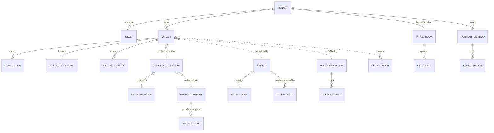
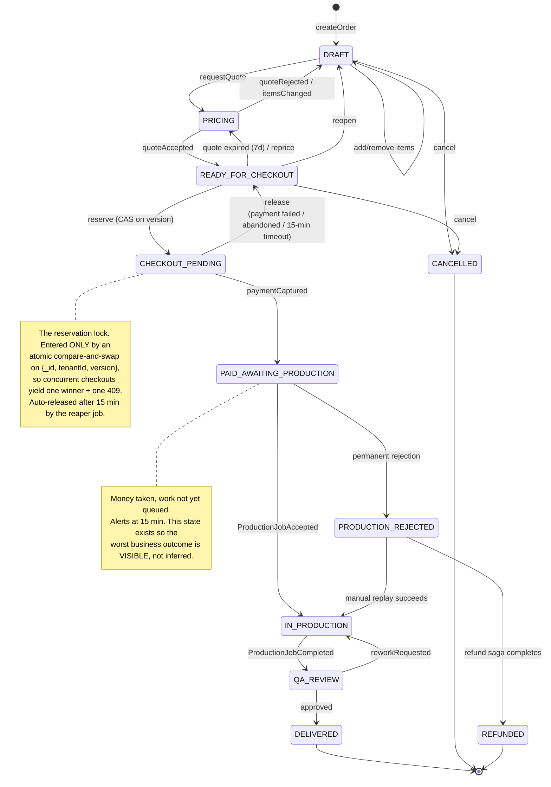

# Data Model & Schemas

> Companion to [ARCHITECTURE](ARCHITECTURE.md). Integrity mechanisms that these schemas enable are in [DATA-INTEGRITY](DATA-INTEGRITY.md); index/query performance reasoning is in [PERFORMANCE](PERFORMANCE.md).

---

## 1. Modelling principles

Nine rules were applied to every collection below. They are listed first because most of the schema decisions are consequences of them rather than independent choices.

**1. One logical database per service; no cross-database queries in application code.** Physically one MongoDB replica set, logically nine databases (one per stateful service; api-gateway holds only the shared idempotency store). A service reads and writes only its own. Anything it needs from elsewhere arrives as an event and is stored as a locally-owned copy, which is a deliberate denormalisation, not an accident. This is what allows six teams to change schemas without coordinating. The one sanctioned exception is the nightly reconciliation job, which holds read-only credentials against secondaries precisely so it can cross-check what no single service can see ([DATA-INTEGRITY §11](DATA-INTEGRITY.md#11-reconciliation-the-backstop)). ([ADR-0002](adr/0002-database-per-service.md))

**2. Aggregate boundaries define transaction boundaries.** `Order` with its embedded items is one aggregate and therefore one atomic write. `Order` and `Invoice` are two aggregates and are therefore *never* written in one transaction — they are reconciled by events.

**3. Money is always an integer in minor units, always with a currency.** Every monetary field is `{ amount: <int>, currency: <ISO-4217> }` where `amount` is cents/pence. There is no `Number` money field anywhere, no `Decimal128` for transactional amounts, and no float arithmetic. `1999` and `"GBP"`, never `19.99`. Rounding happens once, at quote time, using banker's rounding, and the result is frozen. This single rule eliminates the entire class of penny-drift bugs that finance teams find six months later.

**4. `tenantId` is the first field of every document and the leading field of every *tenant-scoped* index.** It is also the mandatory first predicate of every tenant-scoped query, enforced by `TenantScopedRepository` rather than by discipline. The documented exceptions are deliberately global infrastructure indexes — the outbox relay claim and the inbox dedupe key (§3.4), the reservation reaper `ix_stale_reservations` and the paid-but-unpushed alert `ix_awaiting_production` (§3.4), the saga timeout scheduler (§4.2), and provider-webhook lookups keyed on the provider's own id (`providerIntentId` in §5.1, `externalJobId` in §7) — each marked in place. They are all scanned by background workers across every tenant, which is why a tenant-led key would defeat them. Nothing a user request can reach is unscoped.

**5. Immutable snapshots over live lookups for anything the customer has seen.** `Order.pricingSnapshot`, `Invoice.lines`, and `Payment.amount` are copies taken at a point in time. If a rate card changes tomorrow, historical orders and invoices are unaffected, and the amount displayed at review is provably the amount charged.

**6. Explicit state machines, never boolean soup.** No `isPaid`, `isPushed`, `hasInvoice` triplets that can contradict each other. One `status` enum per aggregate, with legal transitions declared in code and asserted on write.

**7. Optimistic concurrency on every mutable aggregate.** A `version` field, incremented on write, with updates expressed as `findOneAndUpdate({ _id, tenantId, version }, ...)`. A mismatch is a `409`, not a lost update.

**8. Append-only for anything financial or audit-bearing.** Issued invoices are never edited — corrections are credit notes. Payment transactions are never updated in place — each attempt is a new document. Status *history* is appended alongside current status.

**9. Every collection carries the operational quartet.** `createdAt`, `updatedAt`, `createdBy`, `correlationId` — the last one meaning any document can be traced back to the request or event that produced it, which is the difference between a five-minute and a five-hour incident.

### 1.1 Shared value objects

```ts
// packages/contracts/src/value-objects.ts — the single source of truth.
// zod schemas generate both TS types and the published OpenAPI/AsyncAPI specs.

export const Currency = z.enum(['USD', 'GBP', 'EUR', 'AUD', 'VND']);

/** Integer minor units + currency. The ONLY representation of money in the system. */
export const Money = z.object({
  amount:   z.number().int(),          // 1999 === $19.99 ; negative allowed for credits
  currency: Currency,
});

/** Client-visible identifiers are prefixed ULIDs: sortable, opaque, and self-describing
 *  in logs and support tickets. Mongo _id remains the ULID string, not an ObjectId,
 *  so an id is stable across export/import and readable in a URL. */
export const OrderId    = z.string().regex(/^ord_[0-9A-HJKMNP-TV-Z]{26}$/);
export const TenantId   = z.string().regex(/^ten_[0-9A-HJKMNP-TV-Z]{26}$/);
export const CheckoutId = z.string().regex(/^cko_[0-9A-HJKMNP-TV-Z]{26}$/);
export const PaymentId  = z.string().regex(/^pay_[0-9A-HJKMNP-TV-Z]{26}$/);
export const InvoiceId  = z.string().regex(/^inv_[0-9A-HJKMNP-TV-Z]{26}$/);

export const AuditFields = z.object({
  createdAt:     z.coerce.date(),
  updatedAt:     z.coerce.date(),
  createdBy:     z.string(),   // userId, or 'system:<service>' for machine writes
  correlationId: z.string(),   // ties the document to the originating request/event
});
```

---

## 2. Entity relationships across services

Dashed lines cross a service boundary, which means they are *eventually consistent references by id*, not foreign keys, and are never joined in a query.



Two relationships deserve comment. `ORDER }o..|| CHECKOUT_SESSION` is many-to-one over *time*: an order may be attempted many times (each failure creates a new session), but only ever one session may hold it in `CHECKOUT_PENDING`, and only ever one may reach `COMPLETED`. And `ORDER }o..|| INVOICE` is enforced as one-per-order by a unique index in invoice-service on `{ tenantId, orderId }`, so a duplicated `CheckoutCompleted` event cannot produce two invoices.

---

## 3. order-service — `app_order`

The core aggregate and the highest-traffic service.

### 3.1 `orders`

```ts
{
  _id: 'ord_01JBQ7X8K3ZP4Y6M2N9V5TWDFH',
  tenantId: 'ten_01JBQ0000000000000000000',

  // --- Identity & search -------------------------------------------------
  name: 'Nike SS26 Apparel — Batch 04',
  // Normalised form used for ALL matching: lowercased, diacritics stripped,
  // punctuation collapsed to single spaces. Written by the domain layer, never
  // by callers, so search behaviour cannot drift from storage.
  nameNormalized: 'nike ss26 apparel batch 04',
  // Pre-split tokens; enables an indexed prefix match per token without regex
  // scans. ['nike','ss26','apparel','batch','04']
  nameTokens: ['nike', 'ss26', 'apparel', 'batch', '04'],
  reference: 'PO-4471',              // client's own PO / job number, also searchable
  tags: ['apparel', 'ss26', 'rush'],

  // --- Lifecycle ---------------------------------------------------------
  // Shown mid-flight: this order has been paid for and accepted by Production.
  status: 'IN_PRODUCTION',
  statusHistory: [                    // append-only; who/what/when for every move
    { from: null, to: 'DRAFT', at: ISODate('2026-08-01T09:12:03Z'),
      by: 'usr_01JB…', reason: 'created', correlationId: 'req_01JB…' },
    { from: 'DRAFT', to: 'PRICING', at: ISODate('2026-08-03T13:58:11Z'),
      by: 'usr_01JB…', reason: 'quote_requested', correlationId: 'req_01JB…' },
    { from: 'PRICING', to: 'READY_FOR_CHECKOUT', at: ISODate('2026-08-03T14:02:55Z'),
      by: 'usr_01JB…', reason: 'quote_accepted', correlationId: 'req_01JB…' },
    { from: 'READY_FOR_CHECKOUT', to: 'CHECKOUT_PENDING', at: ISODate('2026-08-07T10:31:00Z'),
      by: 'usr_01JB…', reason: 'reserved_for_checkout', correlationId: 'req_01JBQ…' },
    { from: 'CHECKOUT_PENDING', to: 'PAID_AWAITING_PRODUCTION', at: ISODate('2026-08-07T10:31:01Z'),
      by: 'system:checkout-orchestrator', reason: 'payment_captured', correlationId: 'req_01JBQ…' },
    { from: 'PAID_AWAITING_PRODUCTION', to: 'IN_PRODUCTION', at: ISODate('2026-08-07T10:31:09Z'),
      by: 'system:production-gateway', reason: 'production_job_accepted', correlationId: 'req_01JBQ…' },
  ],                                  // capped with $slice: -200 (see §3.4)

  // --- Contents ----------------------------------------------------------
  // Embedded because items are only ever read with their order and the total
  // must be transactionally consistent with them. Bounded: >500 items is a
  // validation error and the client is directed to split the batch, which keeps
  // us far away from the 16 MB document ceiling. Real image bytes live in Blob Storage;
  // this holds metadata only.
  items: [
    {
      _id: 'oit_01JBQ…',
      assetId: 'ast_01JBQ…',
      filename: 'NK-SS26-0417.tif',
      s3Key: 'ten_01JBQ…/ord_01JBQ…/NK-SS26-0417.tif',
      checksumSha256: 'e3b0c442…',    // dedupe + integrity verification
      bytes: 48_213_004,
      dimensions: { width: 6000, height: 4000 },
      skuCode: 'GHOST_MANNEQUIN_V2',
      quantity: 1,
      instructions: 'Remove mannequin, keep collar shape, white BG #FFFFFF',
      unitPrice:  { amount: 320, currency: 'GBP' },
      lineTotal:  { amount: 320, currency: 'GBP' },
      thumbnailKey: 'ten_01JBQ…/thumbs/NK-SS26-0417.webp',
    },
  ],
  itemCount: 400,                      // maintained on write; avoids $size in queries
  totalAssetBytes: 19_847_612_004,

  // --- Immutable pricing snapshot ---------------------------------------
  // Taken when the order became READY_FOR_CHECKOUT. This is the amount shown
  // to the Art Director AND the amount charged AND the amount the invoice
  // copies — the same object, so drift between review and charge is
  // structurally impossible.
  pricingSnapshot: {
    quoteId: 'quo_01JBQ…',
    priceBookId: 'pbk_01JBQ…',
    priceBookVersion: 7,
    capturedAt: ISODate('2026-08-03T14:02:55Z'),
    // Discounts are LINES with negative amounts, never a separate field, so the
    // arithmetic is one sum over lines with no special cases (see
    // DATA-INTEGRITY §8). Tax is per line, never on the total.
    lines: [
      { skuCode: 'GHOST_MANNEQUIN_V2', description: 'Ghost mannequin (v2)',
        quantity: 400, unitPrice: { amount: 320, currency: 'GBP' },
        lineTotal: { amount: 128_000, currency: 'GBP' },
        taxCode: 'GB-VAT-STD', taxRate: 0.20,
        taxAmount: { amount: 25_600, currency: 'GBP' } },
      { skuCode: 'RUSH_24H', description: '24-hour turnaround surcharge',
        quantity: 1, unitPrice: { amount: 15_000, currency: 'GBP' },
        lineTotal: { amount: 15_000, currency: 'GBP' },
        taxCode: 'GB-VAT-STD', taxRate: 0.20,
        taxAmount: { amount: 3_000, currency: 'GBP' } },
      { skuCode: 'VOLUME_DISCOUNT', description: 'Volume discount (≥400 units)',
        quantity: 1, unitPrice: { amount: -7_150, currency: 'GBP' },
        lineTotal: { amount: -7_150, currency: 'GBP' },
        taxCode: 'GB-VAT-STD', taxRate: 0.20,
        taxAmount: { amount: -1_430, currency: 'GBP' } },
    ],
    // subtotal == Σ lineTotal == 128,000 + 15,000 − 7,150
    subtotal: { amount: 135_850, currency: 'GBP' },
    // tax == Σ taxAmount == 25,600 + 3,000 − 1,430
    tax:      { amount: 27_170,  currency: 'GBP' },
    // total == subtotal + tax
    total:    { amount: 163_020, currency: 'GBP' },
    // sha256 over { lines, subtotal, tax, total, priceBookVersion }. Guards
    // against a bug or a tampered client silently changing the amount:
    // recomputed and compared before every capture.
    integrityHash: 'sha256:9f2a…',
  },

  // --- Eventually-consistent references (owned elsewhere) ---------------
  // Locally-stored copies updated from events. Denormalised on purpose: order
  // detail must render without calling four services.
  checkout: { sessionId: 'cko_01JBQ…', completedAt: ISODate('2026-08-07T10:31:02Z') },
  payment:  { paymentId: 'pay_01JBQ…', capturedAt: ISODate('2026-08-07T10:31:01Z'),
              last4: '4242', brand: 'visa' },
  invoice:  { invoiceId: 'inv_01JBQ…', number: 'INV-2026-004471',
              pdfKey: 'invoices/…', issuedAt: ISODate('2026-08-07T10:31:14Z') },
  // slaDueAt is set at CAPTURE, not at production acceptance — the client's
  // deadline starts when they pay, and it must not stretch because our push
  // retried. externalJobId is THEIR id, carried only as a support reference.
  production: { productionJobId: 'prj_01JBQ…', externalJobId: 'prd_88213',
                acceptedAt: ISODate('2026-08-07T10:31:09Z'),
                slaDueAt: ISODate('2026-08-08T10:31:01Z'), progress: 34 },

  // --- Concurrency & audit ----------------------------------------------
  version: 10,                         // optimistic lock; CAS on every mutation
  ...AuditFields,
  deletedAt: null,                     // soft delete; hard delete only via GDPR job
}
```

### 3.2 Order state machine

Statuses exist so that **every situation an operator cares about is directly observable**, rather than inferred by joining three services. `PAID_AWAITING_PRODUCTION` is the clearest example: it is the state "the client has paid but Production has not accepted yet", and its mere existence is what makes the most dangerous condition in the business alertable.



Transitions are declared as data and asserted on every write, so an illegal move is a domain error rather than a corrupted document:

```ts
const LEGAL: Record<OrderStatus, OrderStatus[]> = {
  DRAFT: ['PRICING', 'CANCELLED'],
  PRICING: ['READY_FOR_CHECKOUT', 'DRAFT'],
  READY_FOR_CHECKOUT: ['CHECKOUT_PENDING', 'PRICING', 'DRAFT', 'CANCELLED'],
  CHECKOUT_PENDING: ['READY_FOR_CHECKOUT', 'PAID_AWAITING_PRODUCTION'],
  PAID_AWAITING_PRODUCTION: ['IN_PRODUCTION', 'PRODUCTION_REJECTED'],
  PRODUCTION_REJECTED: ['REFUNDED', 'IN_PRODUCTION'],
  IN_PRODUCTION: ['QA_REVIEW'],
  QA_REVIEW: ['DELIVERED', 'IN_PRODUCTION'],
  DELIVERED: [], CANCELLED: [], REFUNDED: [],
};
// Order.transitionTo() throws IllegalTransitionError unless the move is listed.
```

### 3.3 `order_search_view` — the read model

Search is the hottest path in the product, so it gets its own purpose-built projection rather than querying the aggregate. It is small (~1 KB versus a potentially multi-hundred-KB order), so far more of it fits in RAM; it contains exactly the fields the results list renders and nothing else; and it is updated in the same transaction as the aggregate, making it strongly consistent with it despite being a separate collection. Rationale and alternatives in [PERFORMANCE §3](PERFORMANCE.md#3-order-search-the-hot-read-path).

```ts
{
  _id: 'ord_01JBQ…',
  tenantId: 'ten_01JBQ…',
  name: 'Nike SS26 Apparel — Batch 04',
  nameNormalized: 'nike ss26 apparel batch 04',
  nameTokens: ['nike', 'ss26', 'apparel', 'batch', '04'],
  reference: 'PO-4471',
  tags: ['apparel', 'ss26', 'rush'],
  status: 'IN_PRODUCTION',      // mirrors the aggregate above, same transaction
  itemCount: 400,
  total: { amount: 163_020, currency: 'GBP' },   // VAT-inclusive, as displayed
  thumbnailKey: 'ten_01JBQ…/thumbs/NK-SS26-0417.webp',
  createdBy: { userId: 'usr_01JBQ…', name: 'Sofia Marin' },
  createdAt: ISODate('2026-08-01T09:12:03Z'),
  updatedAt: ISODate('2026-08-07T10:31:09Z'),
  slaDueAt:  ISODate('2026-08-08T10:31:01Z'),
  // Rendered as a progress bar on in-production rows. Present here rather than
  // fetched per row, because a list view must never fan out to another service.
  progressPercent: 34,
  projectionVersion: 3,   // bumped on shape change to trigger a rebuild
}
```

### 3.4 Indexes

```js
// --- orders -----------------------------------------------------------------
db.orders.createIndex({ tenantId: 1, _id: 1 }, { name: 'pk_tenant' });
// Requirement: order names are unique per tenant, so an Art Director searching
// by name gets one unambiguous result. Case-insensitive via the normalised field.
db.orders.createIndex({ tenantId: 1, nameNormalized: 1 },
  { unique: true, partialFilterExpression: { deletedAt: null },
    name: 'uq_tenant_name' });
db.orders.createIndex({ tenantId: 1, status: 1, createdAt: -1 }, { name: 'ix_tenant_status_recency' });
// Powers the reaper that releases abandoned CHECKOUT_PENDING reservations.
// Deliberately NOT tenant-led: a background worker sweeps across all tenants.
// Keyed on expiresAt because that is the field the reaper range-scans.
db.orders.createIndex({ status: 1, 'checkout.expiresAt': 1 },
  { partialFilterExpression: { status: 'CHECKOUT_PENDING' }, name: 'ix_stale_reservations' });
// Powers the SLO alert on paid-but-not-in-production. Also cross-tenant.
db.orders.createIndex({ status: 1, 'payment.capturedAt': 1 },
  { partialFilterExpression: { status: 'PAID_AWAITING_PRODUCTION' }, name: 'ix_awaiting_production' });
db.orders.createIndex({ tenantId: 1, 'items.checksumSha256': 1 }, { name: 'ix_asset_dedupe' });

// --- order_search_view ------------------------------------------------------
// Primary search index. Multikey on nameTokens gives indexed per-token prefix
// matching; tenantId leads so every scan is confined to one tenant.
db.order_search_view.createIndex({ tenantId: 1, nameTokens: 1, status: 1, createdAt: -1 },
  { name: 'ix_search_tokens' });
// Keyset (cursor) pagination — see PERFORMANCE §3.4 for why not skip/limit.
db.order_search_view.createIndex({ tenantId: 1, createdAt: -1, _id: -1 }, { name: 'ix_keyset' });
db.order_search_view.createIndex({ tenantId: 1, status: 1, slaDueAt: 1 }, { name: 'ix_sla_board' });
// Fallback relevance search for free-text across name + reference + tags.
// Weighted so a name hit outranks a tag hit. Replaced by Atlas Search
// (fuzzy + autocomplete analysers) behind FEATURE_ATLAS_SEARCH.
db.order_search_view.createIndex(
  { name: 'text', reference: 'text', tags: 'text' },
  { weights: { name: 10, reference: 5, tags: 1 }, default_language: 'english',
    name: 'ix_fulltext' });

// --- outbox (present in EVERY service, identical shape) --------------------
db.outbox.createIndex({ status: 1, availableAt: 1 }, { name: 'ix_relay_claim' });
db.outbox.createIndex({ messageId: 1 }, { unique: true, name: 'uq_message' });
db.outbox.createIndex({ publishedAt: 1 },
  { expireAfterSeconds: 604800, partialFilterExpression: { status: 'PUBLISHED' },
    name: 'ttl_published' });   // 7-day retention for replay/debug, then reaped

// --- inbox / processed_messages (present in EVERY consumer) ---------------
// Cross-tenant by design: dedupe is per consumer group, not per tenant.
db.processed_messages.createIndex({ consumerGroup: 1, messageId: 1 },
  { unique: true, name: 'uq_dedupe' });   // THE idempotent-consumer guarantee
// 30 days: long enough that a message dead-lettered during an incident and
// replayed a week later is still recognised as a duplicate.
db.processed_messages.createIndex({ processedAt: 1 },
  { expireAfterSeconds: 2592000, partialFilterExpression: { state: 'SUCCEEDED' } });
// Abandoned claims never set processedAt, so they need their own TTL — without
// this, a crashed consumer leaves rows that never expire.
db.processed_messages.createIndex({ claimedAt: 1 },
  { expireAfterSeconds: 2592000, partialFilterExpression: { state: 'IN_PROGRESS' } });
```

---

## 4. checkout-orchestrator — `app_checkout`

### 4.1 `checkout_sessions`

```ts
{
  _id: 'cko_01JBQ…',
  tenantId: 'ten_01JBQ…',
  orderId:  'ord_01JBQ…',
  initiatedBy: 'usr_01JBQ…',           // the Art Director

  // Client-supplied, unique per attempt. A retried POST with the same key
  // returns the SAME session instead of charging twice. Unique index below.
  idempotencyKey: 'ik_9f2a4c…',

  status: 'COMPLETED',   // PENDING | REQUIRES_ACTION | AUTHORIZING | CAPTURED
                         // | COMPLETED | FAILED | COMPENSATING | COMPENSATED
                         // | EXPIRED
  // Amount is re-derived server-side from the order's pricingSnapshot.
  // The client CANNOT supply an amount — it is not in the request schema.
  amount: { amount: 163_020, currency: 'GBP' },
  quoteVerification: { verifiedAt: ISODate(...), matchedSnapshot: true },

  paymentMethodRef: 'pm_01JBQ…',       // opaque token; NO card data ever stored here
  paymentId: 'pay_01JBQ…',

  failure: null,  // { code:'CARD_DECLINED', pspCode:'insufficient_funds',
                  //   clientMessage:'Your card was declined…', retryable:false, at:… }

  expiresAt: ISODate('2026-08-07T10:46:00Z'),   // 15 min; reaper releases the order
  version: 5,                                   // PENDING→CAPTURED→COMPLETED
  ...AuditFields,
}
```

```js
db.checkout_sessions.createIndex({ tenantId: 1, idempotencyKey: 1 },
  { unique: true, name: 'uq_idempotency' });
// At most ONE live session may hold a given order. This unique partial index is
// the second line of defence behind the order-service CAS — belt and braces,
// because a double charge is unacceptable.
// REQUIRES_ACTION is included deliberately: a session parked on a 3-DS
// challenge holds the order for up to 10 minutes, and omitting it would leave
// exactly that window uncovered by this guard.
db.checkout_sessions.createIndex({ orderId: 1 },
  { unique: true, partialFilterExpression:
      { status: { $in: ['PENDING', 'REQUIRES_ACTION', 'AUTHORIZING', 'CAPTURED'] } },
    name: 'uq_one_live_session_per_order' });
db.checkout_sessions.createIndex({ status: 1, expiresAt: 1 }, { name: 'ix_expiry_reaper' });
```

### 4.2 `saga_instances`

The saga's state is persisted, not held in memory, so a pod restart mid-checkout resumes rather than losing the transaction. Each step records its own status, attempt count, and compensation state, which makes a stuck saga fully diagnosable from one document.

```ts
{
  _id: 'sag_01JBQ…',
  tenantId: 'ten_01JBQ…',
  sagaType: 'CHECKOUT_V2',
  correlationId: 'req_01JBQ…',         // ties into the distributed trace
  subjectId: 'cko_01JBQ…',
  // `state` is the saga's own lifecycle; `currentStep` is where in the step
  // sequence it sits. The diagram in CHECKOUT-SAGA §3 interleaves both, because
  // that is how it is actually reasoned about — these two fields are how it is
  // stored.
  //   state:       RUNNING | AWAITING_SCA | AWAITING_OBLIGATIONS | DEGRADED
  //                | COMPENSATING | COMPENSATED | REFUNDING
  //                | COMPLETED | FAILED | REFUNDED | STUCK_NEEDS_OPS
  //   currentStep: one of the six step names below, or DONE (terminal sentinel)
  state: 'COMPLETED',
  currentStep: 'DONE',

  steps: [
    { name: 'VALIDATE_ORDER',   status: 'SUCCEEDED', attempts: 1,
      startedAt: …, endedAt: …, durationMs: 21, compensation: null },
    { name: 'VERIFY_QUOTE',     status: 'SUCCEEDED', attempts: 1, durationMs: 34, compensation: null },
    { name: 'RESERVE_ORDER',    status: 'SUCCEEDED', attempts: 1, durationMs: 18,
      compensation: { name: 'RELEASE_ORDER', status: 'NOT_REQUIRED' } },
    { name: 'CAPTURE_PAYMENT',  status: 'SUCCEEDED', attempts: 1, durationMs: 642,
      // Derived deterministically from the session, so a retry of this step
      // hits the SAME PSP idempotency key and cannot double-charge.
      idempotencyKey: 'cko_01JBQ…:CAPTURE_PAYMENT',
      compensation: { name: 'REFUND_PAYMENT', status: 'NOT_REQUIRED' } },
    { name: 'CONFIRM_ORDER_PAID', status: 'SUCCEEDED', attempts: 1, durationMs: 27, compensation: null },
    { name: 'EMIT_COMPLETION',    status: 'SUCCEEDED', attempts: 1, durationMs: 19, compensation: null },
  ],   // 21+34+18+642+27+19 = 761 ms; +14 ms session/saga creation and +5 ms
       // gateway auth & idempotency = the 780 ms budget in PERFORMANCE §2 and the
       // waterfall in OBSERVABILITY §3

  // Post-capture obligations. Tracked for observability and the ops console,
  // but their delivery is guaranteed by the event log, NOT by this document.
  obligations: {
    invoice:    { status: 'FULFILLED', ref: 'inv_01JBQ…', at: … },
    production: { status: 'FULFILLED', ref: 'prj_01JBQ…',  at: … },
    email:      { status: 'FULFILLED', ref: 'ntf_01JBQ…', at: … },
  },

  timeoutAt: ISODate('2026-08-07T10:46:00Z'),   // whole-saga 15 min guard,
                                               // sized for the SCA branch
  version: 12,
  ...AuditFields,
}
```

```js
db.saga_instances.createIndex({ state: 1, timeoutAt: 1 }, { name: 'ix_timeout_scheduler' });
db.saga_instances.createIndex({ subjectId: 1 }, { unique: true, name: 'uq_subject' });
db.saga_instances.createIndex({ tenantId: 1, state: 1, createdAt: -1 }, { name: 'ix_ops_console' });
```

---

## 5. payment-service — `app_payment`

**PCI scope note.** Card data never touches our servers. The portal tokenises directly with the PSP's JS SDK; we store only opaque references and display metadata (brand, last4, expiry). This keeps us at SAQ-A. See [SECURITY §5](SECURITY.md#5-pci-dss-scope).

### 5.1 `payment_intents`

```ts
{
  _id: 'pay_01JBQ…',
  tenantId: 'ten_01JBQ…',
  checkoutSessionId: 'cko_01JBQ…',
  orderId: 'ord_01JBQ…',

  amount:          { amount: 163_020, currency: 'GBP' },
  amountCaptured:  { amount: 163_020, currency: 'GBP' },
  amountRefunded:  { amount: 0,       currency: 'GBP' },

  status: 'CAPTURED',   // REQUIRES_ACTION | AUTHORIZING | AUTHORIZED
                        // | CAPTURED | FAILED | CANCELLED
                        // | PARTIALLY_REFUNDED | REFUNDED
  provider: 'mock',                    // 'mock' | 'stripe' | 'adyen'
  providerIntentId: 'pi_mock_3Kd8…',
  providerCustomerId: 'cus_mock_9x…',
  paymentMethod: { ref: 'pm_01JBQ…', brand: 'visa', last4: '4242',
                   expMonth: 11, expYear: 2029, country: 'GB' },

  // Derived from checkoutSessionId + step. Unique index → PSP-level and
  // storage-level protection against double capture.
  idempotencyKey: 'cko_01JBQ…:CAPTURE_PAYMENT',

  // SCA / 3-D Secure. Modelled explicitly because "requires action" is a normal
  // outcome in Europe, not an error, and the UI must handle it.
  // Frictionless on this example — a 780 ms checkout cannot contain a human
  // completing a bank challenge. required:true is the REQUIRES_ACTION path in
  // API §2.3, which parks the session and resumes via POST /confirm-sca.
  sca: { required: false, exemption: 'low_risk_tra',
         status: 'NOT_REQUIRED', redirectUrl: null, completedAt: null },

  riskAssessment: { score: 12, decision: 'ALLOW', rules: [] },
  version: 5,
  ...AuditFields,
}
```

### 5.2 `payment_transactions` — append-only attempt log

Never updated. Every authorise, capture, refund, and failure is a new immutable row. This is the audit trail finance reconciles against and the artefact that makes "why was this card charged twice?" answerable in one query.

```ts
{
  _id: 'ptx_01JBQ…',
  tenantId: 'ten_01JBQ…',
  paymentIntentId: 'pay_01JBQ…',
  sequence: 2,                          // monotonic per intent
  type: 'CAPTURE',                      // AUTHORIZE|CAPTURE|VOID|REFUND|CHARGEBACK
  outcome: 'SUCCEEDED',                 // SUCCEEDED|FAILED|PENDING
  amount: { amount: 163_020, currency: 'GBP' },
  provider: 'mock',
  providerTransactionId: 'ch_mock_1Nf…',
  providerRawResponse: { /* redacted, retained 90 days for dispute evidence */ },
  errorCode: null, errorMessage: null, declineCode: null,
  networkTraceId: 'MCC1234567890',      // for bank-level dispute tracing
  latencyMs: 598,
  occurredAt: ISODate('2026-08-07T10:31:01.204Z'),
  ...AuditFields,
}
```

### 5.3 `payment_methods` and `subscriptions`

Recurring billing is in the brief's background ("recurring billing"), so it is modelled even though it is outside the checkout scenario.

```ts
// payment_methods
{ _id: 'pm_01JBQ…', tenantId: 'ten_01JBQ…',
  provider: 'mock', providerMethodId: 'pm_mock_1Lx…',
  type: 'card', brand: 'visa', last4: '4242', expMonth: 11, expYear: 2029,
  isDefault: true,
  // Off-session reuse requires a stored mandate for SCA compliance.
  mandate: { acceptedAt: …, ip: '…', userAgent: '…',
             text: 'I authorise the supplier to charge this card for future orders' },
  billingAddress: { line1: '…', city: 'London', postalCode: 'EC1A 1BB', country: 'GB' },
  status: 'ACTIVE',  // ACTIVE | EXPIRED | DETACHED | REQUIRES_REAUTH
  ...AuditFields }

// subscriptions — retainer plans (e.g. 500 images/month committed)
{ _id: 'sub_01JBQ…', tenantId: 'ten_01JBQ…',
  planCode: 'STUDIO_PRO_500', status: 'ACTIVE',   // ACTIVE|PAST_DUE|PAUSED|CANCELLED
  interval: 'MONTHLY', currency: 'GBP',
  basePrice: { amount: 120_000, currency: 'GBP' },
  includedUnits: 500, overageUnitPrice: { amount: 280, currency: 'GBP' },
  currentPeriod: { start: …, end: …, unitsConsumed: 318 },
  nextBillingAt: ISODate('2026-09-01T00:00:00Z'),
  paymentMethodRef: 'pm_01JBQ…',
  dunning: { attempt: 0, nextAttemptAt: null, strategy: 'SMART_RETRY_3' },
  ...AuditFields }
```

```js
db.payment_intents.createIndex({ tenantId: 1, idempotencyKey: 1 }, { unique: true });
// THE structural guarantee against double-charging an order: at most one
// captured intent per order, enforced by the database rather than by code.
db.payment_intents.createIndex({ orderId: 1 },
  { unique: true,
    partialFilterExpression: { status: { $in: ['AUTHORIZED', 'CAPTURED', 'PARTIALLY_REFUNDED', 'REFUNDED'] } },
    name: 'uq_one_live_payment_per_order' });
db.payment_intents.createIndex({ providerIntentId: 1 }, { unique: true, sparse: true }); // webhook lookup
db.payment_transactions.createIndex({ paymentIntentId: 1, sequence: 1 }, { unique: true });
db.payment_transactions.createIndex({ tenantId: 1, occurredAt: -1 });          // finance reporting
db.subscriptions.createIndex({ status: 1, nextBillingAt: 1 });                 // billing cron
db.payment_methods.createIndex({ tenantId: 1, isDefault: -1, status: 1 });
```

---

## 6. invoice-service — `app_invoice`

### 6.1 `invoices`

```ts
{
  _id: 'inv_01JBQ…',
  tenantId: 'ten_01JBQ…',
  orderId: 'ord_01JBQ…',              // unique → one invoice per order
  paymentId: 'pay_01JBQ…',

  // Gapless, sequential, per tenant per year — a legal requirement in most
  // jurisdictions. Allocated from an atomic counter, never from count()+1.
  number: 'INV-2026-004471',
  numberSeries: { tenant: 'ten_01JBQ…', year: 2026, sequence: 4471 },

  status: 'PAID',   // DRAFT | ISSUED | PAID | VOID | CREDITED
  // Once ISSUED the document is immutable. Enforced in the repository AND by a
  // collection-level JSON Schema validator. Corrections are credit notes.
  issuedAt: ISODate('2026-08-07T10:31:14Z'),
  dueAt:    ISODate('2026-08-07T10:31:14Z'),   // paid on checkout ⇒ due immediately
  paidAt:   ISODate('2026-08-07T10:31:01Z'),

  // Billing details COPIED at issue time. If the client renames their company
  // next year, this invoice still shows who was billed.
  // Seller identity is a placeholder for our own legal entity; an invoice
  // legally requires one, so the field cannot simply be omitted.
  seller: { legalName: 'Retouch Co. Ltd', address: {…}, vatNumber: 'GB123456789',
            companyNumber: '12345678' },
  buyer:  { tenantId: 'ten_01JBQ…', legalName: 'Nike Studio UK Ltd',
            address: {…}, vatNumber: 'GB556677889', contactEmail: 'ap@…' },

  lines: [
    { lineNumber: 1, skuCode: 'GHOST_MANNEQUIN_V2',
      description: 'Ghost mannequin retouching (v2) — Nike SS26 Batch 04',
      quantity: 400, unitPrice: { amount: 320, currency: 'GBP' },
      netAmount: { amount: 128_000, currency: 'GBP' },
      taxCode: 'GB-VAT-STD', taxRate: 0.20,
      taxAmount: { amount: 25_600, currency: 'GBP' } },
    { lineNumber: 2, skuCode: 'RUSH_24H', description: '24-hour turnaround surcharge',
      quantity: 1, unitPrice: { amount: 15_000, currency: 'GBP' },
      netAmount: { amount: 15_000, currency: 'GBP' },
      taxCode: 'GB-VAT-STD', taxRate: 0.20,
      taxAmount: { amount: 3_000, currency: 'GBP' } },
    { lineNumber: 3, skuCode: 'VOLUME_DISCOUNT', description: 'Volume discount (≥400 units)',
      quantity: 1, unitPrice: { amount: -7_150, currency: 'GBP' },
      netAmount: { amount: -7_150, currency: 'GBP' },
      taxCode: 'GB-VAT-STD', taxRate: 0.20,
      taxAmount: { amount: -1_430, currency: 'GBP' } },
  ],
  subtotal: { amount: 135_850, currency: 'GBP' },
  taxTotal: { amount: 27_170,  currency: 'GBP' },
  total:    { amount: 163_020, currency: 'GBP' },
  amountPaid: { amount: 163_020, currency: 'GBP' },
  balanceDue: { amount: 0,       currency: 'GBP' },

  pdf: { s3Key: 'invoices/ten_01JBQ…/INV-2026-004471.pdf',
         sha256: 'a1b2…', bytes: 84_112, generatedAt: … },

  // Sync to the external ledger is a separate, retryable concern. The invoice
  // is valid and visible to the client whether or not the ledger has accepted it.
  accountingSync: { provider: 'mock', status: 'SYNCED',
                    externalId: 'XERO-INV-99812', attempts: 1, lastAttemptAt: …,
                    lastError: null },
  version: 3,
  ...AuditFields,
}
```

### 6.2 `invoice_number_sequences` — gapless allocation

Counting existing invoices is wrong under concurrency (two concurrent issues both read 4470 and both write 4471). A single atomic `$inc` is correct:

```ts
// One document per (tenant, year). findOneAndUpdate with $inc is atomic within
// MongoDB, so N concurrent allocators receive N distinct, consecutive numbers.
{ _id: 'ten_01JBQ…:2026', tenantId: 'ten_01JBQ…', year: 2026,
  prefix: 'INV', sequence: 4471, padding: 6, updatedAt: … }
```

Because a number is allocated *inside* the same transaction that inserts the invoice, a crash between allocation and insert rolls both back and leaves no gap. Full treatment, including the audited-gap case, in [DATA-INTEGRITY §10](DATA-INTEGRITY.md#10-gapless-invoice-numbering).

```js
db.invoices.createIndex({ tenantId: 1, orderId: 1 }, { unique: true, name: 'uq_one_per_order' });
db.invoices.createIndex({ tenantId: 1, number: 1 },  { unique: true, name: 'uq_number' });
db.invoices.createIndex({ tenantId: 1, status: 1, issuedAt: -1 });
db.invoices.createIndex({ 'accountingSync.status': 1, 'accountingSync.lastAttemptAt': 1 },
  { partialFilterExpression: { 'accountingSync.status': { $in: ['PENDING', 'FAILED'] } },
    name: 'ix_sync_retry' });
db.credit_notes.createIndex({ tenantId: 1, invoiceId: 1 });
```

---

## 7. production-gateway-service — `app_production`

The anti-corruption layer's own state: our identifier mapped to theirs, plus a full attempt log. The push attempts are recorded rather than merely retried, because "why did this order take 40 minutes to reach Production?" is a question the business will ask.

```ts
// production_jobs
{ _id: 'prj_01JBQ…',
  tenantId: 'ten_01JBQ…',
  orderId:  'ord_01JBQ…',            // unique → one job per order
  checkoutSessionId: 'cko_01JBQ…',

  status: 'IN_PROGRESS',   // PENDING_PUSH | PUSHING | ACCEPTED | IN_PROGRESS
                           // | COMPLETED | REJECTED_PERMANENT | FAILED_EXHAUSTED
  externalJobId: 'prd_88213',        // THEIR id — the mapping is the ACL's job
  externalStatus: 'processing',      // THEIR vocabulary, never leaked upstream

  // The translated manifest we sent. Stored so a replay is byte-identical and
  // so we can diff what we sent against what they claim they received.
  manifest: { jobRef: 'ord_01JBQ…', priority: 'RUSH', slaHours: 24,
              assetCount: 400, totalBytes: 19_847_612_004,
              serviceProfile: 'ghost-mannequin-v2',
              assets: [ { ref: 'oit_01JBQ…', uri: 's3://…', sha256: '…',
                          instructions: '…' } ] },
  manifestSha256: 'c4f1…',

  // Attempts are RECORDED, not merely retried: "why did this order take 40
  // minutes to reach Production?" is a question the business will ask.
  // The happy path here is a single attempt; the retry ladder and a worked
  // multi-attempt example are in CHECKOUT-SAGA §4.4.
  attempts: [
    { n: 1, at: ISODate('2026-08-07T10:31:08.739Z'), outcome: 'ACCEPTED',
      httpStatus: 201, latencyMs: 812, externalJobId: 'prd_88213' },
  ],
  attemptCount: 1,
  nextRetryAt: null,
  progress: { percent: 34, assetsCompleted: 136, updatedAt: … },
  slaDueAt: ISODate('2026-08-08T10:31:01Z'),
  version: 6,
  ...AuditFields }
```

```js
db.production_jobs.createIndex({ tenantId: 1, orderId: 1 }, { unique: true, name: 'uq_one_per_order' });
db.production_jobs.createIndex({ externalJobId: 1 }, { unique: true, sparse: true }); // callback lookup
db.production_jobs.createIndex({ status: 1, nextRetryAt: 1 },
  { partialFilterExpression: { status: { $in: ['PENDING_PUSH', 'PUSHING'] } },
    name: 'ix_retry_scheduler' });
db.production_jobs.createIndex({ status: 1, slaDueAt: 1 }, { name: 'ix_sla_breach_alert' });
```

---

## 8. notification-service — `app_notification`

```ts
// notifications — one row per attempted delivery; the audit answer to
// "did the client actually get the email?"
{ _id: 'ntf_01JBQ…',
  tenantId: 'ten_01JBQ…',
  templateKey: 'checkout.confirmation',
  templateVersion: 4,
  channel: 'EMAIL',                    // EMAIL | IN_APP | WEBHOOK | SMS
  to: [{ email: 'sofia@nikestudio.example', name: 'Sofia Marin', role: 'to' }],
  // Rendering context is stored so we can reproduce the exact email a client
  // received during a dispute, even after templates change.
  context: { orderName: 'Nike SS26 Apparel — Batch 04', orderId: 'ord_01JBQ…',
             total: '£1,630.20', itemCount: 400,
             // Present because this send happened AFTER invoice.issued landed
             // (16.120Z vs 14.002Z). Had it not, this would be null and the
             // email would go out anyway — see EVENTS §6.
             invoiceNumber: 'INV-2026-004471',
             invoiceUrl: 'https://portal…/invoices/inv_01JBQ…',
             slaDueAt: '2026-08-08T10:31:01Z' },
  renderedSubject: 'Order confirmed — Nike SS26 Apparel — Batch 04',
  bodyHash: 'sha256:7d1e…',            // hash, not body: PII minimisation
  status: 'DELIVERED',                 // QUEUED|SENDING|SENT|DELIVERED|BOUNCED|FAILED|SUPPRESSED
  provider: 'mock', providerMessageId: 'msg_mock_4471',
  attempts: [{ n: 1, at: ISODate('2026-08-07T10:31:16.120Z'),
               outcome: 'SENT', latencyMs: 240 }],
  events: [{ type: 'delivered', at: ISODate('2026-08-07T10:31:18.004Z') },
           { type: 'opened',    at: ISODate('2026-08-07T11:02:41.550Z') }],
  // Dedupe key: the SAME (event, template, recipient) can never send twice,
  // even if checkout.completed is redelivered. ONE ROW PER RECIPIENT — a cc
  // recipient gets its own document with its own key, so a partial failure
  // retries only the address that failed.
  dedupeKey: 'checkout.confirmation:cko_01JBQ…:sofia@nikestudio.example',
  ...AuditFields }

// email_suppressions — hard bounces and unsubscribes; checked before every send
{ _id: 'sup_01JBQ…', email: 'gone@old.example', reason: 'HARD_BOUNCE',
  source: 'provider_webhook', suppressedAt: …, expiresAt: null }
```

```js
db.notifications.createIndex({ dedupeKey: 1 }, { unique: true, name: 'uq_dedupe' });
db.notifications.createIndex({ tenantId: 1, createdAt: -1 });
db.notifications.createIndex({ status: 1, 'attempts.n': 1 },
  { partialFilterExpression: { status: { $in: ['QUEUED', 'FAILED'] } }, name: 'ix_retry' });
db.email_suppressions.createIndex({ email: 1 }, { unique: true });
```

---

## 9. identity-service and catalog-pricing-service (abridged)

```ts
// tenants
{ _id: 'ten_01JBQ…', legalName: 'Nike Studio UK Ltd', displayName: 'Nike Studio',
  status: 'ACTIVE', country: 'GB', currency: 'GBP', locale: 'en-GB', timezone: 'Europe/London',
  priceBookId: 'pbk_01JBQ…',
  billing: { vatNumber: 'GB556677889', address: {…}, apEmail: 'ap@…',
             paymentTerms: 'IMMEDIATE' },          // or NET_30 for invoiced accounts
  settings: { requireApprovalOverMinor: 500_000,   // >£5,000 needs a second approver
              autoPushToProduction: true, defaultSlaHours: 48 },
  limits: { maxOrderItems: 500, monthlyOrderQuota: 2_000 },
  ...AuditFields }

// users — RBAC. Roles map to permission sets; permissions, not roles, are checked.
{ _id: 'usr_01JBQ…', tenantId: 'ten_01JBQ…',
  email: 'sofia@nikestudio.example', emailVerifiedAt: …,
  name: 'Sofia Marin',
  passwordHash: '$argon2id$…',                     // argon2id, never bcrypt-with-low-cost
  roles: ['ART_DIRECTOR'],   // ART_DIRECTOR | PRODUCER | FINANCE | TENANT_ADMIN
                             // + internal: PLATFORM_OPS | PLATFORM_ADMIN
  mfa: { enabled: true, type: 'TOTP', secretRef: 'keyvault://…', backupCodesRemaining: 8 },
  status: 'ACTIVE', lastLoginAt: …, failedLoginCount: 0, lockedUntil: null,
  ...AuditFields }

// price_books — versioned so a rate-card change never mutates history
{ _id: 'pbk_01JBQ…', tenantId: 'ten_01JBQ…', name: 'Nike UK 2026 Contract',
  version: 7, currency: 'GBP', effectiveFrom: …, effectiveTo: null,
  status: 'ACTIVE',
  prices: [
    { skuCode: 'GHOST_MANNEQUIN_V2', unitPrice: { amount: 320, currency: 'GBP' } },
    { skuCode: 'RUSH_24H',           unitPrice: { amount: 15_000, currency: 'GBP' } },
  ],
  // Volume tiers are ORDER-LEVEL, not per-SKU: the commercial agreement rewards
  // batch size, so the tier is selected on total retouching units and applied to
  // the whole line subtotal (including surcharges). 400 units ⇒ 500 bps ⇒ 5% of
  // 143,000 = 7,150, which is the VOLUME_DISCOUNT line in the snapshot above.
  // Modelling it per-SKU would give 5% of 128,000 and a different total, so this
  // is stated explicitly rather than left implicit.
  orderVolumeTiers: [ { minUnits: 200,  discountBps: 250 },
                      { minUnits: 400,  discountBps: 500 },
                      { minUnits: 1000, discountBps: 800 } ],
  taxProfile: { code: 'GB-VAT-STD', rate: 0.20, reverseCharge: false },
  ...AuditFields }

// quotes — immutable once issued; short TTL so stale prices can't be replayed
{ _id: 'quo_01JBQ…', tenantId: 'ten_01JBQ…', orderId: 'ord_01JBQ…',
  priceBookId: 'pbk_01JBQ…', priceBookVersion: 7,
  lines: [ /* … */ ], subtotal: {…}, discount: {…}, tax: {…}, total: {…},
  integrityHash: 'sha256:9f2a…',
  expiresAt: ISODate('2026-08-10T14:02:55Z'),   // 7 days
  ...AuditFields }
```

```js
db.users.createIndex({ email: 1 }, { unique: true });
db.users.createIndex({ tenantId: 1, status: 1 });
db.price_books.createIndex({ tenantId: 1, status: 1, effectiveFrom: -1 });
db.quotes.createIndex({ tenantId: 1, orderId: 1, createdAt: -1 });
db.quotes.createIndex({ expiresAt: 1 }, { expireAfterSeconds: 0 });
```

---

## 10. Infrastructure collections

Present in **every** service, with identical shape, provided by `@platform/kernel` so no team reimplements them.

```ts
// outbox — written in the SAME transaction as the aggregate it describes.
// This is what makes "state changed" and "event published" atomic.
{ _id: ObjectId(),
  messageId: 'msg_01JBQ…',             // becomes the AMQP message-id; unique
  aggregateType: 'Order', aggregateId: 'ord_01JBQ…',
  eventType: 'order.paid', eventVersion: 1,
  routingKey: 'order.paid.v1',
  payload: { /* full event body — see EVENTS.md */ },
  headers: { tenantId: 'ten_01JBQ…', correlationId: 'req_01JBQ…',
             causationId: 'msg_01JBQ…', traceparent: '00-4bf9…-01' },
  status: 'PUBLISHED',                 // PENDING | CLAIMED | PUBLISHED | FAILED
  attempts: 1, availableAt: ISODate(…), claimedBy: 'order-service-7f9c-1',
  publishedAt: ISODate(…), lastError: null,
  occurredAt: ISODate(…) }

// processed_messages — the inbox. A unique insert IS the dedupe check, so
// idempotency is enforced by the database rather than by a read-then-write race.
{ _id: ObjectId(),
  consumerGroup: 'invoice-service.checkout-completed',
  messageId: 'msg_01JBQ…',
  // IN_PROGRESS is the claim; a lease lets a crashed consumer's claim be
  // reclaimed rather than poisoning the message forever.
  state: 'SUCCEEDED',                  // IN_PROGRESS | SUCCEEDED
                                       // | SKIPPED | FAILED_PERMANENT
  claimedAt: ISODate(…), claimedBy: 'invoice-service-7f9c-2',
  resultRef: 'inv_01JBQ…',             // lets a redelivery return the ORIGINAL result
  processedAt: ISODate(…) }            // set on completion only

// idempotency_records — HTTP-level. Caches the response so a retried POST
// returns the identical body and status instead of re-executing.
{ _id: 'ten_01JBQ…:POST:/v1/checkout-sessions:ik_9f2a4c…',
  tenantId: 'ten_01JBQ…',
  requestHash: 'sha256:…',             // mismatch on same key ⇒ 422, not silent overwrite
  state: 'COMPLETED',                  // IN_FLIGHT | COMPLETED | FAILED
  responseStatus: 201,
  responseBody: { /* verbatim original response */ },
  lockedUntil: ISODate(…),
  expiresAt: ISODate(…) }              // TTL 24 h
```

---

## 11. Schema evolution

Ten services on independent deploy cadences means schema changes must never require a synchronised release. Three rules cover it.

**Expand–migrate–contract, always.** Add the new optional field and dual-write; backfill with an idempotent, resumable, batched job that logs progress; switch reads once the backfill verifies; only then remove the old field, at least one release later. No migration ever blocks a deploy, and every one is safe to run twice.

**Events are versioned in the routing key, never edited.** `order.paid.v1` and `order.paid.v2` coexist; consumers subscribe to the versions they understand. Additive changes are permitted within a version (consumers must ignore unknown fields — validated in contract tests); anything removed or retyped requires a new version. Deprecation is measured, not guessed: we publish both versions, watch per-version consumer metrics until v1 traffic is zero, then stop publishing it.

**Validation at three layers.** zod at the API and consumer boundary rejects malformed input before it reaches the domain; Mongoose schemas guard application writes; MongoDB JSON Schema validators (`validationLevel: 'strict'`) are the last line, catching writes from a mongosh session or a buggy migration script — which is exactly the case where the first two layers are bypassed.
