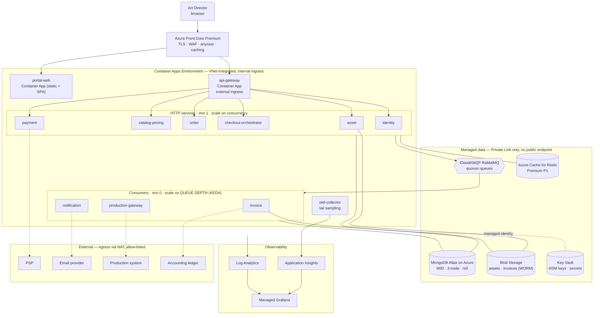

# Deployment — Docker, Azure DevOps, Azure Container Apps

> How the ten services in [ARCHITECTURE](ARCHITECTURE.md) are containerised, built, and run on Azure.
> Platform decisions are recorded in [ADR-0010](adr/0010-container-apps-now-aks-as-the-exit.md) (compute), [ADR-0011](adr/0011-azure-devops-pipelines.md) (CI/CD), and [ADR-0012](adr/0012-mongodb-atlas-on-azure.md) (data).

---

## 1. What the deployment has to achieve

The architecture makes three demands that a hosting choice either supports or fights.

**Consumers scale on queue depth, not CPU.** An invoice consumer waiting on a slow accounting API shows near-zero CPU while its queue grows without bound, so a CPU-triggered autoscaler does nothing at exactly the moment scaling is needed ([PERFORMANCE §7](PERFORMANCE.md#7-asynchronous-throughput)). Whatever runs these containers must scale on broker depth as a first-class signal.

**Peak is 15× the mean.** Month-end deadline crunch takes checkouts from 20/min to 90/min ([PERFORMANCE §1](PERFORMANCE.md#1-load-model-sizing-for-reality-not-for-a-resume)). The platform needs to absorb a burst in minutes and give the capacity back afterwards, because paying for peak all month to serve it for two days is the most common way a cloud bill gets away from a team.

**Graceful shutdown is a correctness requirement, not a nicety.** A checkout saga interrupted mid-flight recovers from persisted state ([CHECKOUT-SAGA §4.7](CHECKOUT-SAGA.md#47-orchestrator-crashes-mid-saga)) — but recovering from a self-inflicted problem thirty times a week is tolerating a system, not operating one. Deployments must drain in-flight HTTP requests and stop broker prefetch before a container dies.

Against those, the deciding factor is what we are *not* trying to achieve. There is no need for custom CNI, service-mesh traffic policy, DaemonSets, GPU scheduling, or operators. Ten stateless Node containers plus managed data services is a workload Kubernetes can run but does not need to.

That is why the platform is **Azure Container Apps now, with Azure Kubernetes Service as a documented exit** rather than an aspiration. Container Apps has KEDA built into its scaling model, scales to zero, and has no control plane to patch. The containers, the pipeline, and the Bicep module boundaries are all written so the switch is an infrastructure change rather than an application one — [§12](#12-the-aks-exit) states the triggers and the migration path, and [ADR-0010](adr/0010-container-apps-now-aks-as-the-exit.md) records the reasoning.

---

## 2. Azure service mapping

Every dependency in the architecture, and what runs it. The two rows in bold are where a genuinely Azure-native option was rejected on purpose.

| Concern | Azure service | Notes and rationale |
|---|---|---|
| Application containers | **Azure Container Apps** (Consumption + one Dedicated profile) | KEDA scaling, revisions with traffic splitting, scale-to-zero, no cluster |
| Container registry | **Azure Container Registry** (Premium) | Geo-replication, content trust, retention policies, private endpoint |
| **Primary datastore** | **MongoDB Atlas on Azure** (M30 prod, M10 staging) | Multi-document transactions — the transactional outbox depends on them — plus Atlas Search for the order-search upgrade path. Deployed into our Azure region, reached over Private Link. Cosmos DB for MongoDB vCore was the obvious first-party choice and is rejected in [ADR-0012](adr/0012-mongodb-atlas-on-azure.md) |
| **Message broker** | **CloudAMQP managed RabbitMQ** (Azure Marketplace, in-region, Private Link) | Quorum queues, per-message retry ladder, DLQ semantics ([ADR-0003](adr/0003-transactional-outbox-with-rabbitmq.md)). Managed rather than self-hosted because a stateful quorum broker is a poor fit for Container Apps — see [§2.1](#21-the-broker-is-the-honest-wrinkle) |
| Cache, locks, rate limits | Azure Cache for Redis (Premium P1, zone-redundant) | Idempotency records, hot-query cache, leader-election leases. Never a source of truth |
| Object storage | Azure Blob Storage (Standard v2, ZRS) | Image assets and invoice PDFs. Containers: `assets`, `thumbnails`, `invoices` |
| Invoice immutability | Blob **immutability policy** (time-based WORM) | Legal retention on issued invoices; replaces the S3 Object Lock design |
| Secrets and keys | Azure Key Vault (Premium, HSM-backed) | JWT signing keys, PSP credentials, connection strings. No secret material in the pipeline or the image |
| Workload identity | Microsoft Entra managed identities | One user-assigned identity per service; RBAC-scoped. No connection-string passwords anywhere |
| Partner API surface | Azure API Management (Developer tier staging, Standard v2 prod) | Hosts the developer portal and the published OpenAPI spec, with subscription keys and per-product rate limits. Partner path only — the portal never reaches our services ([API §6.4](API.md#64-azure-api-management-as-the-partner-surface)) |
| Public entry | Azure Front Door Premium + WAF | TLS termination, global anycast, OWASP ruleset, rate limiting at the edge, static asset caching |
| CDN for thumbnails | Front Door caching over Blob | Replaces the CloudFront design |
| CI/CD | Azure DevOps Pipelines | Multi-stage YAML, environment approvals, workload identity federation ([ADR-0011](adr/0011-azure-devops-pipelines.md)) |
| Infrastructure as code | Bicep modules, one per concern | Deployed by the pipeline; no portal changes in staging or production |
| Traces and metrics | Azure Monitor + Application Insights, via OpenTelemetry | The OTel SDK is unchanged; only the exporter differs. A Collector container app does tail sampling |
| Dashboards | Azure Managed Grafana | Reads Azure Monitor and Managed Prometheus, so the dashboards-as-code in `infra/grafana` survives |
| Logs | Log Analytics workspace (KQL) | Structured JSON to stdout, collected automatically by Container Apps |
| Local development | Docker Compose | Mongo replica set, RabbitMQ, Redis, **Azurite** (Blob emulator, replacing MinIO), the four mocks |

### 2.1 The broker is the honest wrinkle

Choosing Container Apps for stateless services creates one real problem worth stating plainly rather than glossing: **Container Apps is a bad host for RabbitMQ.** Quorum queues need durable, low-latency, node-pinned disk and stable peer identity. Container Apps gives ephemeral local storage and treats replicas as interchangeable, so a self-hosted broker there would either lose messages on a replica move or need Azure Files, whose latency profile is wrong for a broker's write path. In a system whose central guarantee is "a paid customer's job is never lost", that is not a trade worth making.

Three ways out, and why the third wins. Migrating to **Azure Service Bus** is genuinely tempting — it is first-party, managed, and has native dead-lettering and scheduled delivery — but it would supersede [ADR-0003](adr/0003-transactional-outbox-with-rabbitmq.md) and rewrite the whole messaging topology in [EVENTS](EVENTS.md), which is a large change to buy something the design already has. Running the broker on **AKS** solves it correctly and is exactly one of the migration triggers in [§12](#12-the-aks-exit) — but adopting a cluster to host one component is the tail wagging the dog. So the broker is **managed RabbitMQ (CloudAMQP)** in the same Azure region, reached over Private Link: unchanged AMQP semantics, unchanged application code, no broker for us to operate, and a clean path to self-hosting later if the economics change.

This is the pattern throughout: the compute platform is deliberately simple, and anything stateful is somebody else's managed service.

---

## 3. Containerisation

### 3.1 The image

One multi-stage Dockerfile shape for every service, generated by `make new-service`, so the tenth image is built the same way as the first.

```dockerfile
# services/order-service/Dockerfile
# --- Stage 1: install exactly the dependencies this service needs -----------
FROM node:22.11-bookworm-slim AS deps
WORKDIR /repo
RUN corepack enable && corepack prepare pnpm@9.12.0 --activate

# Copy only manifests first, so a source-only change reuses the install layer.
# In a monorepo this is the difference between a 15-second and a 3-minute build.
COPY pnpm-lock.yaml pnpm-workspace.yaml package.json ./
COPY packages/contracts/package.json  packages/contracts/
COPY packages/kernel/package.json     packages/kernel/
COPY services/order-service/package.json services/order-service/
# --frozen-lockfile: the build fails rather than silently resolving a different
# tree than CI tested. --filter prunes to this service's dependency closure.
RUN pnpm install --frozen-lockfile --filter @platform/order-service...

# --- Stage 2: build TypeScript ---------------------------------------------
FROM deps AS build
COPY packages/ packages/
COPY services/order-service/ services/order-service/
COPY tsconfig.base.json ./
RUN pnpm --filter @platform/order-service... run build
# Re-resolve to production dependencies only, dropping ~180 MB of devDependencies.
RUN pnpm --filter @platform/order-service --prod deploy /out

# --- Stage 3: runtime — distroless, non-root, no shell ----------------------
# Digest-pinned: a tag is mutable, and "it worked yesterday" is not a build.
FROM gcr.io/distroless/nodejs22-debian12:nonroot@sha256:<pinned>
WORKDIR /app
COPY --from=build --chown=nonroot:nonroot /out ./
USER nonroot
ENV NODE_ENV=production NODE_OPTIONS="--max-old-space-size=384"
EXPOSE 3003
# No shell in the image, so no exec-form ambiguity and no shell wrapper to leak
# signals: SIGTERM reaches Node directly, which is what makes the graceful
# shutdown in §7.2 actually work.
CMD ["dist/main.js"]
```

Four decisions in there are worth defending. **Manifests are copied before source** because in a monorepo the dependency install is the expensive layer and source changes are the frequent ones; getting this backwards makes every commit a three-minute build. **Distroless non-root** removes the shell, package manager, and most of userspace, which shrinks both the image (~120 MB versus ~400 MB on `node:22-slim`) and the CVE surface a scanner will flag — and because there is no shell, `SIGTERM` reaches the Node process directly rather than being swallowed by a wrapper. **The base image is digest-pinned**, so a rebuild is reproducible and an upstream tag move cannot silently change what ships. And **`--max-old-space-size` is set below the container memory limit** so V8 does GC pressure before the platform does an OOM kill, which turns a hard restart into a slow request.

`.dockerignore` matters more than it looks — without it the build context is the entire monorepo including `node_modules` and `.git`, which is hundreds of megabytes uploaded to the builder on every build:

```
node_modules
**/node_modules
**/dist
**/.turbo
.git
.github
docs
tests/e2e
**/*.spec.ts
**/coverage
.env*
```

### 3.2 Tags and provenance

Images are tagged with the **git SHA**, never `latest`. A revision in any environment is traceable to one commit, and a rollback is naming an older SHA rather than hoping a tag still points where you think it does.

```
acr.azurecr.io/platform/order-service:sha-4bf92f3
acr.azurecr.io/platform/order-service:2.4.1          # semver, release builds only
```

Every push is accompanied by an SBOM (Syft) and a signature (Cosign, keyless via the pipeline's federated identity), both stored as ACR artefacts. ACR retention keeps 30 days of untagged manifests and the last 50 tagged builds per repository, because a registry nobody prunes becomes a surprise line on the bill.

### 3.3 Local development

`docker compose up` runs the entire system on a laptop — ten services, four mocks, and every dependency — because a system a new engineer cannot run locally is a system whose integration bugs surface in staging.

The local stack differs from Azure in exactly three places, and each is a deliberate seam rather than an accident: **Azurite** stands in for Blob Storage (the SDK is identical, only the endpoint differs), **RabbitMQ runs as a container** rather than CloudAMQP, and **MongoDB runs as a single-node replica set** — `--replSet rs0` is mandatory even locally, because without it there are no multi-document transactions and the transactional outbox cannot work at all ([ADR-0003](adr/0003-transactional-outbox-with-rabbitmq.md)). A developer running a non-replica-set Mongo would see the outbox fail in a way that looks like an application bug, so the Compose file makes it impossible.

```yaml
# docker-compose.yml (abridged — the shape, not all 14 services)
services:
  mongo:
    image: mongo:7
    command: ["--replSet", "rs0", "--bind_ip_all"]
    healthcheck:
      # Initiate the replica set from inside the healthcheck, so `depends_on:
      # condition: service_healthy` genuinely means "transactions work now".
      test: |
        mongosh --quiet --eval '
          try { rs.status().ok } catch (e) { rs.initiate({_id:"rs0",members:[{_id:0,host:"mongo:27017"}]}) }'
      interval: 3s
      retries: 20

  rabbitmq:
    image: rabbitmq:3.13-management
    environment:
      RABBITMQ_PLUGINS: rabbitmq_delayed_message_exchange   # the retry ladder
    healthcheck: { test: ["CMD", "rabbitmq-diagnostics", "check_running"], interval: 5s }

  azurite:            # Blob emulator — replaces MinIO
    image: mcr.microsoft.com/azure-storage/azurite
    command: azurite-blob --blobHost 0.0.0.0 --skipApiVersionCheck

  order-service:
    build: { context: ., dockerfile: services/order-service/Dockerfile, target: build }
    command: pnpm --filter @platform/order-service run dev     # hot reload
    depends_on:
      mongo:    { condition: service_healthy }
      rabbitmq: { condition: service_healthy }
    environment:
      MONGO_URI: mongodb://mongo:27017/?replicaSet=rs0&directConnection=true
      AZURE_STORAGE_CONNECTION_STRING: ${AZURITE_CONNECTION_STRING}
```

Note `target: build` — locally we stop at the build stage so the image has a shell, a package manager, and hot reload. Production uses the distroless final stage. One Dockerfile, two purposes, no drift between "the image I develop against" and "the image that ships".

---

## 4. Environments

Four, each a separate resource group with its own Bicep parameter file and its own Entra identities. Nothing is shared across the production boundary — not a Key Vault, not a storage account, not a database.

| | `dev` | `staging` | `prod` | `dr` (passive) |
|---|---|---|---|---|
| Deployed by | Every merge to `main` | Every merge to `main` | Manual promotion | Bicep only |
| Container Apps | Consumption, min 0 | Consumption, min 1 on HTTP | Consumption + 1 Dedicated D4 profile | Provisioned, scaled to 0 |
| Atlas | M10 shared | M10 | M30, 3-node, zone-redundant | Cross-region replica |
| Redis | Basic C0 | Standard C1 | Premium P1, zone-redundant | — |
| Broker | Container in the environment | CloudAMQP Tiger | CloudAMQP Bunny, HA pair | — |
| Data | Synthetic seed | Anonymised subset | Real | Replicated |
| Front Door | — (direct ingress) | Yes, `staging.` prefix | Yes, WAF in prevention mode | Standby origin |
| Swagger UI | Open | Behind SSO | **Off** — spec served auth-gated, console disabled ([API §6.3](API.md#63-where-it-is-exposed-and-where-it-is-not)) | — |
| Approvals | None | None | Two reviewers + business-hours gate | Change ticket |
| Retention | Log 7 d | Log 30 d | Log 90 d, audit 7 y immutable | — |

Production's WAF runs in **prevention** mode; staging runs the identical ruleset in **detection** mode, so a rule that would break a legitimate request is discovered on staging traffic rather than by a customer failing to check out.

The `dr` environment is deliberately provisioned-but-idle rather than documented-but-absent, because a disaster-recovery plan whose infrastructure has never been deployed is a hypothesis, not a plan. It is deployed by the same Bicep on every release and left scaled to zero — [§11](#11-backup-and-disaster-recovery) covers the failover.

### 4.1 Topology



Two properties of that diagram carry most of the security posture. **No data service has a public endpoint** — Atlas, Redis, Blob, Key Vault and the broker are all reached over Private Link or private endpoint from the VNet-integrated Container Apps environment, so a leaked connection string is not by itself sufficient to reach data. And **only the gateway and the portal have external ingress**; the other eight services have internal ingress only, so the sole route into the system from the internet is through Front Door's WAF into the gateway, where auth and rate limiting live.

---

## 5. The Azure DevOps pipeline

One multi-stage YAML pipeline, `azure-pipelines.yml`, with per-service work driven by the Turborepo affected graph so a change to invoice-service does not rebuild ten images.

```yaml
# azure-pipelines.yml
trigger:
  branches: { include: [main] }
pr:
  branches: { include: [main] }

variables:
  - group: platform-common          # linked to Key Vault; no secret literals here
  - name: ACR
    value: acr.azurecr.io
  - name: IMAGE_TAG
    value: sha-$(Build.SourceVersion)

stages:
# ───────────────────────────────────────────────────────────────────────────
- stage: Validate
  jobs:
  - job: Affected
    steps:
    - template: .azuredevops/templates/pnpm-setup.yml
    # Compute the affected set ONCE and pass it downstream, so build and test
    # agree on scope. Recomputing per job invites drift on a busy main branch.
    - script: |
        AFFECTED=$(pnpm turbo run build --filter=...[origin/main] --dry-run=json \
                   | jq -r '.tasks[].package' | sort -u | paste -sd, -)
        echo "##vso[task.setvariable variable=affected;isOutput=true]$AFFECTED"
      name: scope
    - script: pnpm turbo run lint typecheck test:unit --filter=...[origin/main]
      displayName: Lint · typecheck · unit
    - script: pnpm turbo run test:integration --filter=...[origin/main]
      displayName: Integration (Testcontainers)
    - script: |
        pnpm turbo run test:contract --filter=...[origin/main]
        pact-broker can-i-deploy --pacticipant=$SVC --to-environment=prod
      displayName: Contract verification
      # ⭐ A provider cannot merge a change that breaks a consumer already in
      # production, even when its own tests pass. The highest-value gate here.
    - script: |
        oasdiff breaking --fail-on ERR base.yaml head.yaml
        asyncapi diff --fail-on-breaking base.yaml head.yaml
      displayName: API + event compatibility
    - script: pnpm stryker run --mutate 'services/*/src/domain/**'
      displayName: Mutation score (money + saga domains)
    - script: pnpm openapi:bundle && pnpm asyncapi:bundle
      displayName: Generate OpenAPI + AsyncAPI from the zod schemas
      # Generated BEFORE the image build, so the same artefact is baked into the
      # container, compared by oasdiff, and imported into APIM. One source.
    - task: PublishPipelineArtifact@1
      inputs: { targetPath: artifacts/, artifact: api-contracts }
    - task: PublishTestResults@2
    - task: PublishCodeCoverageResults@2

# ───────────────────────────────────────────────────────────────────────────
- stage: Build
  dependsOn: Validate
  jobs:
  - job: Images
    strategy:
      matrix: $[ stageDependencies.Validate.Affected.outputs['scope.affected'] ]
    steps:
    # Workload identity federation: the service connection holds no secret and
    # nothing to rotate or leak. See ADR-0011.
    - task: AzureCLI@2
      inputs:
        azureSubscription: azure-prod-wif
        scriptLocation: inlineScript
        inlineScript: |
          az acr login --name $(ACR_NAME)
          docker buildx build \
            --file services/$(service)/Dockerfile \
            --tag $(ACR)/platform/$(service):$(IMAGE_TAG) \
            --cache-from type=registry,ref=$(ACR)/platform/$(service):buildcache \
            --cache-to   type=registry,ref=$(ACR)/platform/$(service):buildcache,mode=max \
            --provenance=true --sbom=true \
            --push .
    - script: |
        trivy image --exit-code 1 --severity CRITICAL,HIGH \
                    --ignore-unfixed $(ACR)/platform/$(service):$(IMAGE_TAG)
      displayName: Vulnerability scan
      # --ignore-unfixed on purpose: failing a build for a CVE with no available
      # patch teaches the team to add exceptions, which is how gates die.
    - script: cosign sign --yes $(ACR)/platform/$(service):$(IMAGE_TAG)
      displayName: Sign image

# ───────────────────────────────────────────────────────────────────────────
- stage: Infra
  dependsOn: Build
  jobs:
  - deployment: Bicep
    environment: staging
    strategy:
      runOnce:
        deploy:
          steps:
          - task: AzureCLI@2
            inputs:
              azureSubscription: azure-staging-wif
              inlineScript: |
                # what-if first, always: an unreviewed infra diff is how a
                # production database gets replaced instead of updated.
                az deployment group what-if -g rg-platform-staging \
                   --template-file infra/bicep/main.bicep \
                   --parameters infra/bicep/params/staging.bicepparam
                az deployment group create -g rg-platform-staging \
                   --template-file infra/bicep/main.bicep \
                   --parameters infra/bicep/params/staging.bicepparam \
                   --parameters imageTag=$(IMAGE_TAG)

# ───────────────────────────────────────────────────────────────────────────
- stage: DeployStaging
  dependsOn: Infra
  jobs:
  - deployment: Services
    environment: staging
    strategy:
      runOnce:
        deploy:
          steps:
          - template: .azuredevops/templates/deploy-revision.yml
            parameters: { env: staging, trafficWeight: 100 }
  - job: E2E
    dependsOn: Services
    steps:
    - script: pnpm test:e2e --config tests/e2e/playwright.staging.config.ts
    - script: k6 run infra/k6/checkout-peak.js     # thresholds fail the stage
  - job: Chaos
    dependsOn: Services
    steps:
    - script: pnpm chaos:run --scenarios psp-latency,production-503,broker-partition

# ───────────────────────────────────────────────────────────────────────────
- stage: DeployProd
  dependsOn: DeployStaging
  condition: and(succeeded(), eq(variables['Build.SourceBranch'], 'refs/heads/main'))
  jobs:
  - deployment: Canary
    environment: prod        # gated: 2 approvers + business-hours window
    strategy:
      canary:
        increments: [10, 50]
        deploy:
          steps:
          - template: .azuredevops/templates/deploy-revision.yml
            parameters: { env: prod, trafficWeight: $(strategy.increment) }
        postRouteTraffic:
          steps:
          # Query the SLOs from Azure Monitor and fail the increment if the
          # canary revision is worse than the stable one. An automated gate,
          # not a human squinting at a dashboard for ten minutes.
          - template: .azuredevops/templates/slo-gate.yml
            parameters: { windowMinutes: 10 }
        on:
          failure:
            steps:
            - template: .azuredevops/templates/rollback-traffic.yml
          success:
            steps:
            - template: .azuredevops/templates/promote-revision.yml
            # Publish the spec only after the revision is fully promoted, so the
            # documented API is never ahead of the deployed one.
          - template: .azuredevops/templates/publish-openapi.yml
```

Three things in that pipeline do the real work. `can-i-deploy` is the gate that stops a provider shipping a change that breaks a consumer already running in production — the failure mode where every test in the repository passes and production still breaks. The **SLO gate** after each canary increment queries Application Insights for the canary revision's error rate and p95 latency and compares it against the stable revision, so a bad deploy is caught by data rather than by attention. And `az deployment group what-if` runs before every apply, because the difference between "update this Container App" and "replace this database" is one Bicep property and you want to see it before it happens.

### 5.1 Why per-environment service connections

Each environment has its own Azure DevOps service connection bound to its own Entra app registration via **workload identity federation** — no client secret exists, so there is nothing to rotate and nothing to exfiltrate from the pipeline. The staging connection has no RBAC on the production subscription at all, which makes "the pipeline deployed to the wrong environment" a permission error rather than an incident.

---

## 6. Configuration and secrets

Config comes from the environment and is validated by a zod schema at boot; the process **refuses to start** on invalid or missing config rather than failing mysteriously under load at 3 a.m. That is unchanged from [ARCHITECTURE §7](ARCHITECTURE.md#7-cross-cutting-concerns) — what changes on Azure is where the values come from.

There is **no `.env` file in any deployed environment**. Non-secret config is set directly on the Container App. Secrets are Key Vault references resolved by the app's own managed identity at revision start, so the secret value never appears in Bicep, in the pipeline log, in the ARM deployment history, or in `az containerapp show` output.

```bicep
// infra/bicep/modules/container-app.bicep (abridged)
resource app 'Microsoft.App/containerApps@2024-03-01' = {
  name: 'ca-${serviceName}-${env}'
  identity: {
    type: 'UserAssigned'
    userAssignedIdentities: { '${identityId}': {} }   // one identity per service
  }
  properties: {
    managedEnvironmentId: caeId
    configuration: {
      // Key Vault reference, not a value. Rotating the secret in Key Vault and
      // restarting the revision is the whole rotation procedure.
      secrets: [
        { name: 'mongo-uri', keyVaultUrl: '${kvUri}secrets/mongo-uri-${env}', identity: identityId }
        { name: 'amqp-uri',  keyVaultUrl: '${kvUri}secrets/amqp-uri-${env}',  identity: identityId }
      ]
      ingress: {
        external: serviceName == 'api-gateway'   // everything else is internal
        targetPort: port
        transport: 'http2'                        // gRPC on the internal hot paths
        stickySessions: { affinity: 'none' }      // SSE needs no affinity — §7.3
      }
      registries: [ { server: acrLoginServer, identity: identityId } ]
    }
    template: {
      containers: [ {
        name: serviceName
        image: '${acrLoginServer}/platform/${serviceName}:${imageTag}'
        resources: { cpu: json(cpu), memory: memory }
        env: [
          { name: 'NODE_ENV',  value: 'production' }
          { name: 'MONGO_URI', secretRef: 'mongo-uri' }
          { name: 'OTEL_EXPORTER_OTLP_ENDPOINT', value: 'http://otel-collector' }
        ]
        probes: [
          // Liveness NEVER touches a dependency. A liveness probe that fails
          // when Mongo blips restarts every replica during a database hiccup
          // and turns a partial degradation into a total outage.
          { type: 'Liveness',  httpGet: { path: '/health/live',    port: port }, periodSeconds: 10 }
          { type: 'Readiness', httpGet: { path: '/health/ready',   port: port }, periodSeconds: 5 }
          { type: 'Startup',   httpGet: { path: '/health/startup', port: port }, failureThreshold: 30 }
        ]
      } ]
      scale: scaleRules      // §8
    }
  }
}
```

Key Vault itself has soft-delete and purge protection enabled, RBAC (not access policies) for authorisation, and a private endpoint. JWT signing keys are **HSM-backed and never leave the vault** — services fetch the public JWKS and verify locally, so the private key is used only for signing inside identity-service and is not exportable even by an administrator ([SECURITY §2](SECURITY.md#2-authentication)).

---

## 7. Deploying without dropping a checkout

### 7.1 Revisions and traffic

Container Apps in `multiple` revision mode gives immutable revisions with weighted traffic — which is a canary primitive without a service mesh. A deploy creates a new revision at 0% traffic, waits for it to pass its startup and readiness probes, then shifts 10%, waits out the SLO gate, shifts 50%, gates again, then 100%. Rollback is setting the weights back; the previous revision is still there and still warm, so recovery is seconds rather than a rebuild.

```bash
az containerapp revision copy -n ca-order-service-prod -g rg-platform-prod \
   --image $ACR/platform/order-service:sha-4bf92f3
az containerapp ingress traffic set -n ca-order-service-prod -g rg-platform-prod \
   --revision-weight latest=10 ca-order-service-prod--sha-9a1c2d4=90
```

### 7.2 Draining

`SIGTERM` reaches the Node process directly (no shell in the image), and the handler does the sequence that makes a rolling deploy safe: fail readiness immediately so the ingress stops sending new requests, wait out the load-balancer drain, stop AMQP prefetch and finish in-flight messages, finish in-flight HTTP requests, then close connections in reverse dependency order — with a hard 30-second deadline. Container Apps' termination grace period is set to 45 seconds to leave headroom.

Without this, every deploy orphans in-flight sagas. They would recover from persisted state, but relying on saga recovery to survive routine deploys means the recovery path runs dozens of times a week and its bugs are found in production.

### 7.3 Why SSE needs no special handling

The checkout progress stream is Server-Sent Events over HTTP/2 ([API §2.3](API.md#23-checkout-the-core-scenario)). Because it is one-directional plain HTTP, there is no WebSocket upgrade for Front Door or the Container Apps ingress to negotiate and no session affinity required — `stickySessions: none` above is deliberate. A revision shift mid-stream simply drops the connection, `EventSource` reconnects with `Last-Event-ID`, and the server resumes from that point. The client-side fallback to polling ([FRONTEND §6](FRONTEND.md#6-the-checkout-flow)) covers the case where a corporate proxy buffers the stream.

### 7.4 Schema changes never gate a deploy

Every migration is expand–migrate–contract and every event change is additive within its version, so any two adjacent versions of any two services are compatible and deploy order never matters ([DATA-MODEL §11](DATA-MODEL.md#11-schema-evolution)). Backfills run as Container Apps **Jobs** — idempotent, resumable, batched, and safe to run twice. This is what makes a 10%-canary meaningful: the old and new revisions genuinely can serve traffic side by side against the same database.

---

## 8. Scaling rules

The rules encode the distinction from [§1](#1-what-the-deployment-has-to-achieve): HTTP services scale on concurrency, consumers scale on queue depth.

```bicep
// HTTP services on the checkout path — min 1, never scale to zero.
// A cold start inside a payment flow is a customer watching a spinner.
var httpScale = {
  minReplicas: env == 'prod' ? 3 : 1
  maxReplicas: 30
  rules: [ { name: 'http-concurrency', http: { metadata: { concurrentRequests: '50' } } } ]
}

// Consumers — scale on RabbitMQ depth via the built-in KEDA scaler, and all the
// way to zero. This is the single most important reason Container Apps fits:
// the scaling signal the architecture needs is native, not bolted on.
var consumerScale = {
  minReplicas: 0
  maxReplicas: 20
  rules: [ {
    name: 'queue-depth'
    custom: {
      type: 'rabbitmq'
      metadata: {
        protocol: 'amqp'
        queueName: queueName
        mode: 'QueueLength'
        value: '30'            // target messages per replica
      }
      auth: [ { secretRef: 'amqp-uri', triggerParameter: 'host' } ]
    }
  } ]
}
```

Sizing follows the work shape rather than a uniform default: order-service and the gateway get 0.5 vCPU / 1 GiB because they are I/O-bound; invoice-service gets 1.0 vCPU / 2 GiB because PDF rendering is CPU-heavy (the 1.62 s span in [OBSERVABILITY §3](OBSERVABILITY.md#3-tracing)); production-gateway gets 0.5 / 1 GiB but a **prefetch of 8**, which protects the Production system from us rather than the reverse.

Two consumers deliberately keep `minReplicas: 0`. During a quiet night the invoice and notification consumers cost nothing, and the first message of the morning pays a two-second cold start that nobody is waiting on — the customer already has their `201`. Applying scale-to-zero to the checkout path instead would be a straightforward mistake.

The single **Dedicated D4 workload profile** in production exists for the OTel Collector and the reconciliation job: both are long-running and memory-shaped rather than bursty, and Consumption's per-second billing is a worse fit than a reserved profile for work that runs continuously.

---

## 9. Observability wiring

The application code does not change. OpenTelemetry stays the instrumentation API, W3C trace context still propagates over both HTTP headers and AMQP message headers, and `correlationId` still ties logs, spans, metrics, documents and audit records together ([OBSERVABILITY](OBSERVABILITY.md)). Only the exporter and the query surface are Azure.

Traces and metrics go to an **OTel Collector** running as an internal Container App, which then exports to Application Insights. The Collector is not optional decoration: [OBSERVABILITY §3](OBSERVABILITY.md#3-tracing) commits to **tail-based** sampling — 10% of successes but 100% of anything that errors and 100% of the checkout path — and a tail decision can only be made once a trace is complete, which is a Collector responsibility rather than an SDK one. It also gives one place to redact attributes and to switch backends later without touching ten services.

Logs need no pipeline at all: structured JSON to stdout is collected by Container Apps into Log Analytics, queryable in KQL. The four alert families from [OBSERVABILITY §4](OBSERVABILITY.md#4-the-four-alert-families-that-matter) become Azure Monitor alert rules against Managed Prometheus and Log Analytics, wired to an action group that pages on-call. The one that matters most translates directly:

```kql
// Alert #1 — a customer has paid and their work has not started.
// The risk the architecture consciously accepts; detecting it fast is the
// condition on which accepting it is defensible.
AppMetrics
| where Name == "platform_orders_awaiting_production_seconds"
| summarize MaxWait = max(Max) by bin(TimeGenerated, 1m)
| where MaxWait > 900        // 15 minutes ⇒ P1 page
```

Dashboards stay as code. Azure Managed Grafana reads both Azure Monitor and Managed Prometheus, so the three dashboards in `infra/grafana` are provisioned by the pipeline rather than clicked together in a portal and lost.

---

## 10. Cost

An order-of-magnitude monthly estimate at the load model in [PERFORMANCE §1](PERFORMANCE.md#1-load-model-sizing-for-reality-not-for-a-resume) — 200 tenants, 50k orders/month, peak 90 checkouts/minute. Figures are indicative rather than quoted, and the point is the *shape*: data services dominate, compute does not.

| Item | ~USD/month | Note |
|---|---|---|
| MongoDB Atlas M30, 3-node, zone-redundant | 750 | The largest single line, and the one carrying the transactions |
| CloudAMQP Bunny HA pair | 300 | Managed broker |
| Container Apps — Consumption | 250 | ~10 apps; scale-to-zero on 3 consumers |
| Container Apps — 1 Dedicated D4 profile | 190 | Collector + jobs |
| Azure Cache for Redis Premium P1 | 260 | Zone-redundant |
| Front Door Premium + WAF | 330 | Includes base fee |
| Blob Storage (20 TB, ZRS) + egress | 480 | Dominated by asset volume |
| Log Analytics + App Insights | 220 | At 10% tail sampling |
| ACR Premium (geo-replicated) | 50 | |
| Key Vault Premium, Managed Grafana, misc | 90 | |
| **Total** | **≈ 2,920** | ≈ $0.06 per order at 50k orders/month |

Three levers if that needs to come down, in the order I would pull them. **Tail-sampling more aggressively** on successful traces is the cheapest win and costs almost nothing in debuggability, since errors stay at 100%. **Blob lifecycle policies** moving source assets to Cool after 30 days and Archive after 90 would cut the largest storage line substantially, because a delivered order's originals are rarely re-read. And **Atlas M20 in staging** — currently M10 — is a false economy, so I would not touch it: performance testing against a materially smaller instance produces numbers that do not predict production.

Worth noting what this table implies: at roughly $2.9k/month, compute is about 15% of spend. Migrating to AKS to save money would be optimising the wrong line, which is one more reason [§12](#12-the-aks-exit) frames the move as capability-driven rather than cost-driven.

---

## 11. Backup and disaster recovery

Targets: **RPO 5 minutes, RTO 1 hour** for a regional failure. Both are stated so they can be tested, and they are tested quarterly with a real failover in the `dr` environment — a DR plan that has never been executed is a document, not a capability.

Atlas provides continuous backup with point-in-time restore, retained 7 days at minute granularity and 30 days daily, with a cross-region replica in the secondary Azure region. Blob Storage is zone-redundant with soft delete, versioning, and a 7-year time-based immutability policy on the `invoices` container satisfying the legal retention requirement in [SECURITY §8](SECURITY.md#8-privacy-and-data-protection). Key Vault has soft-delete plus purge protection so a deleted key is recoverable rather than gone. ACR is geo-replicated to the secondary region, because a registry that is unreachable during a regional incident means you cannot deploy the fix. Redis is deliberately **not** backed up — every value in it is reconstructible from Mongo by design, and treating a cache as recoverable state is how a cache becomes a source of truth by accident.

Failover is: promote the Atlas replica, deploy the same Bicep with the secondary region's parameter file, scale the `dr` Container Apps up, repoint Front Door's origin group, and verify with the e2e suite against the DR endpoint. The genuinely hard part is not compute — it is the broker and the in-flight messages, which is why the runbook's first step is to drain and checkpoint the outbox before cutover, and why an unclean regional loss means replaying from the outbox rather than from the broker. The outbox is durable in Mongo and therefore replicated; the broker's in-memory backlog is not. That asymmetry is exactly why the transactional outbox exists ([ADR-0003](adr/0003-transactional-outbox-with-rabbitmq.md)) and it is what makes a regional failure survivable at all.

---

## 12. The AKS exit

Container Apps is the right platform for this workload today. It will not be the right platform forever, and the useful thing to write down is not "we might move" but **the specific conditions under which we should**, plus what the move actually costs.

**Migration triggers**, any one of which starts the conversation: we need to self-host RabbitMQ (the wrinkle in [§2.1](#21-the-broker-is-the-honest-wrinkle)) or any other stateful component with real disk requirements; we need mTLS between services with policy enforcement rather than transport encryption alone, i.e. a genuine service mesh; we need per-tenant network isolation beyond what an environment boundary gives; compute spend passes roughly $2k/month, where a reserved AKS node pool becomes cheaper than Consumption; we need a Kubernetes-only capability such as an operator, a custom scheduler, or GPU nodes; or the platform team grows past about three engineers and the operational overhead of a cluster stops being the dominant cost.

**What the migration actually involves** is deliberately small, because the design was arranged that way. The container images are unchanged — a distroless Node image runs identically under either. The pipeline's Validate and Build stages are unchanged; only the deploy template swaps `az containerapp` for `helm upgrade`. The application code is entirely unchanged: it reads config from the environment, logs to stdout, exposes `/health/*` and `/metrics`, and handles `SIGTERM` — the twelve-factor properties that make a container portable. The Bicep modules for Atlas Private Link, Key Vault, Blob, Redis, Front Door and networking are all reused as-is.

What genuinely has to be built: Helm charts per service (the scale rules and probes above map almost one-to-one onto a `Deployment` plus a KEDA `ScaledObject`), the KEDA add-on with the same RabbitMQ scaler, the Key Vault CSI driver or Entra Workload ID in place of Container Apps' native secret references, an ingress controller behind Front Door, and node pools, upgrade cadence, and cluster monitoring. Realistically two to three weeks of platform work, plus a standing operational cost that is the real price rather than the setup.

Which is the whole argument for the sequencing: the capability gap is two to three weeks of work available on demand, while the operational cost is paid every week from day one. Deferring it is not avoidance — it is declining to buy a cluster before there is a workload that needs one.
