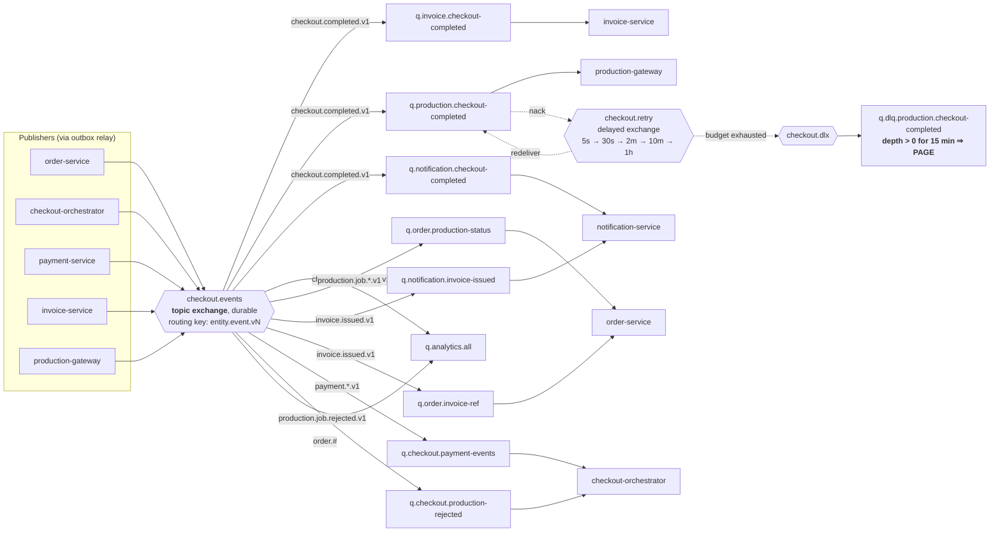

# Event Contracts & Messaging Topology

> The transport-level guarantees behind these events (outbox, inbox, retry ladder) are in [DATA-INTEGRITY](DATA-INTEGRITY.md). Which events drive which step of a checkout is in [CHECKOUT-SAGA](CHECKOUT-SAGA.md).

---

## 1. Why events carry the post-payment obligations

The three things that must happen after a successful payment — invoice, Production push, confirmation email — are all **obligations we have taken on by accepting money**, and they all depend on systems we do not control. If they were synchronous HTTP calls inside the checkout request, a slow accounting API would make checkout slow, a Production outage would make checkout *fail after the card was charged*, and an email provider blip would either block the response or be silently swallowed.

Making them events fixes all three at once: checkout returns as soon as money is captured, each obligation retries independently on its own schedule, and — because the event is written in the same database transaction as the payment — it is impossible for money to be captured without the obligations existing somewhere durable.

That last point is the whole argument. The correctness of this system rests on one atomic write, described in [DATA-INTEGRITY §3](DATA-INTEGRITY.md#3-the-transactional-outbox).

---

## 2. Design rules for every event

**Events are facts, in the past tense, about something that already happened.** `order.paid`, not `create_invoice`. A publisher states what occurred; it does not instruct consumers. This is what lets us add a fourth consumer of `checkout.completed` — analytics, a Slack notifier, a partner webhook — without touching the orchestrator. If an event were named `SendConfirmationEmail`, the coupling would be back.

**Events carry enough state to be processed alone.** Each event includes the fields its consumers need, not just an id. A consumer that must call back to the publisher to do its job has reintroduced the synchronous coupling we removed, and turns one publisher outage into a stalled queue. The cost is denormalisation and slightly larger messages, which is a trade I take every time. Where a consumer genuinely needs the full aggregate (the production manifest with 400 assets), the event carries a reference and the consumer fetches once, because a 400 KB message is worse.

**Every event is idempotent to consume, because delivery is at-least-once.** There is no exactly-once delivery over a network; there is only at-least-once delivery plus idempotent consumers. Every consumer dedupes on `messageId` via the inbox table before doing work.

**Events must tolerate arriving out of order.** RabbitMQ preserves order per queue, but retries, redeliveries, and multiple consumer instances break it in practice. Every event therefore carries `occurredAt` and an aggregate `version`, and consumers discard anything staler than what they have already applied.

**Versioning lives in the routing key and is never edited in place.** `order.paid.v1` and `order.paid.v2` coexist; consumers bind to what they understand. Additive fields are allowed within a version (consumers ignore unknown fields — asserted in contract tests); anything removed or retyped needs a new version.

**Envelope and payload are separated.** Routing, tracing, and tenancy metadata live in the envelope so infrastructure can act on them without parsing domain content.

### 2.1 The envelope

```ts
// packages/contracts/src/events/envelope.ts
export const EventEnvelope = z.object({
  // --- Identity -----------------------------------------------------------
  messageId: z.string(),          // ULID; unique per publish; THE dedupe key
  eventType: z.string(),          // 'order.paid'
  eventVersion: z.number().int(), // 1
  occurredAt: z.coerce.date(),    // when the FACT happened (not when published)
  publishedAt: z.coerce.date(),   // when the relay pushed it — the gap is outbox lag

  // --- Provenance ---------------------------------------------------------
  producer: z.string(),           // 'order-service@2.4.1' — which build emitted this
  aggregateType: z.string(),      // 'Order'
  aggregateId: z.string(),        // 'ord_01JBQ…'
  aggregateVersion: z.number().int(), // for out-of-order rejection

  // --- Correlation --------------------------------------------------------
  tenantId: z.string(),           // in the envelope so infra can shard/filter on it
  correlationId: z.string(),      // the originating user request; spans the whole flow
  causationId: z.string().nullable(), // the messageId that caused THIS event
  traceparent: z.string(),        // W3C trace context — links async tail to the HTTP span
  actor: z.object({
    type: z.enum(['USER', 'SERVICE', 'SYSTEM']),
    id: z.string(),
  }),

  // --- Payload ------------------------------------------------------------
  payload: z.unknown(),           // narrowed per event type
});
```

`correlationId` and `causationId` together are what make a distributed system debuggable. Correlation answers "what user action caused this?" — one id spanning the HTTP request, the payment, the invoice, the production push, and the email. Causation answers "what immediately caused this?", giving an exact parent-child chain: `checkout.completed` → `invoice.issued` → `notification.sent`. Without both, a production incident becomes archaeology.

---

## 3. Topology



### 3.1 Why a topic exchange with a queue per consumer

Each consumer gets its **own** durable queue bound to the exchange. This is the detail that makes independent failure possible: if invoice-service is down, messages pile up in `q.invoice.checkout-completed` while production-gateway and notification-service continue working normally from their own queues. A shared queue would mean one slow consumer starving the others, and one poison message blocking everyone.

Routing keys are hierarchical (`entity.event.version`), so a new consumer that wants every order event binds `order.#` without any publisher change. `q.analytics.all` is exactly that: a queue drained by the analytics sink planned for phase 4 ([DELIVERY-PLAN §6](DELIVERY-PLAN.md#6-phase-4-continuous-ongoing)), added with no change to any publisher. `ops-alerting` in the catalogue below is likewise not a service — it is the alerting pipeline in [OBSERVABILITY §4](OBSERVABILITY.md#4-the-four-alert-families-that-matter) consuming the same exchange.

```js
// Declared idempotently at service boot by @platform/kernel.
await ch.assertExchange('checkout.events', 'topic',  { durable: true });
await ch.assertExchange('checkout.retry',  'x-delayed-message',
  { durable: true, arguments: { 'x-delayed-type': 'topic' } });
await ch.assertExchange('checkout.dlx',    'topic',  { durable: true });

await ch.assertQueue('q.production.checkout-completed', {
  durable: true,
  arguments: {
    'x-dead-letter-exchange': 'checkout.dlx',
    'x-dead-letter-routing-key': 'dlq.production.checkout-completed',
    'x-queue-type': 'quorum',   // replicated: survives a broker node loss.
                                // Classic mirrored queues are deprecated and
                                // can lose messages on failover — unacceptable
                                // when the message IS a paid customer's job.
    'x-delivery-limit': 6,      // hard backstop even if app-level counting breaks
  },
});
await ch.bindQueue('q.production.checkout-completed', 'checkout.events', 'checkout.completed.v1');

// Prefetch is per-consumer and tuned to work shape, not copy-pasted. A single
// global value would be wrong for all three:
//   notification  → 64 (fast, network-bound)
//   invoice       → 16 (PDF generation is CPU-heavy)
//   production    →  8 (large manifests, slow upstream — protects THEM from US)
// defineConsumer() sets it per channel from the consumer's own declaration;
// RABBITMQ_PREFETCH is only the fallback default for consumers that omit it.
await ch.prefetch(consumer.prefetch ?? Number(process.env.RABBITMQ_PREFETCH ?? 32));
```

Queues are **quorum** type deliberately. Classic mirrored queues can silently lose messages during a failover, and in this system a lost message is a customer who paid and whose work never started.

---

## 4. Event catalogue

| Routing key | Publisher | Consumers | Purpose |
|---|---|---|---|
| `order.created.v1` | order-service | analytics | Order drafted |
| `order.ready_for_checkout.v1` | order-service | analytics | Quote accepted, checkout enabled |
| `order.reserved.v1` | order-service | analytics | Reservation acquired |
| `order.released.v1` | order-service | analytics | Reservation released (fail/abandon/timeout) |
| **`order.paid.v1`** | order-service | analytics | Order transitioned to `PAID_AWAITING_PRODUCTION` |
| `order.status_changed.v1` | order-service | analytics | Generic lifecycle move |
| `payment.captured.v1` | payment-service | checkout-orchestrator, analytics | Funds taken — **the commit point** |
| `payment.failed.v1` | payment-service | checkout-orchestrator, analytics | Declined or provider error |
| `payment.refunded.v1` | payment-service | checkout-orchestrator, invoice, notification | Compensation completed |
| `payment.disputed.v1` | payment-service | ops-alerting, invoice | Chargeback opened |
| **`checkout.completed.v1`** | checkout-orchestrator | **invoice, production-gateway, notification**, analytics | **The fan-out that carries all three obligations** |
| `checkout.failed.v1` | checkout-orchestrator | notification (**in-app only**), analytics | Pre-capture failure. An in-app notice is raised for the Art Director; no email is sent, because nothing was charged |
| `checkout.compensated.v1` | checkout-orchestrator | notification, analytics | Post-capture rollback finished |
| **`invoice.issued.v1`** | invoice-service | notification, order-service, analytics | Invoice created with its number |
| `invoice.sync_failed.v1` | invoice-service | ops-alerting | Accounting ledger rejected it |
| `credit_note.issued.v1` | invoice-service | notification, analytics | Refund documented |
| **`production.job.accepted.v1`** | production-gateway | **order-service**, notification, analytics | Production took the job → `IN_PRODUCTION` |
| `production.job.progressed.v1` | production-gateway | order-service | Progress callback |
| `production.job.completed.v1` | production-gateway | order-service, notification | Retouching finished |
| `production.job.rejected.v1` | production-gateway | **checkout-orchestrator**, notification, ops-alerting | **Permanent** rejection → refund saga |
| `production.push.exhausted.v1` | production-gateway | ops-alerting, notification | Retry budget spent → human needed |
| `notification.sent.v1` | notification-service | analytics | Email accepted by provider |
| `notification.bounced.v1` | notification-service | ops-alerting, identity | Hard bounce → suppression list |

The three bolded fan-out points map exactly to the three functional requirements: `checkout.completed.v1` triggers the invoice, the Production push, and the email; `production.job.accepted.v1` is what updates the order state from the internal system.

---

## 5. The key event payloads

### 5.1 `checkout.completed.v1` — the fan-out

This is the most important message in the system: it is what three separate services act on to discharge our obligations. It is deliberately **fat**. Every consumer must be able to do its entire job from this payload alone, because a consumer that has to call back to the orchestrator has reintroduced synchronous coupling and would stall if the orchestrator were down.

```jsonc
{
  "messageId": "msg_01JBQ7X8K3ZP4Y6M2N9V5TWDFH",
  "eventType": "checkout.completed",
  "eventVersion": 1,
  "occurredAt": "2026-08-07T10:31:01.250Z",
  "publishedAt": "2026-08-07T10:31:01.418Z",
  "producer": "checkout-orchestrator@2.4.1",
  "aggregateType": "CheckoutSession",
  "aggregateId": "cko_01JBQ7X8K3ZP4Y6M2N9V5TWDFH",
  "aggregateVersion": 4,
  "tenantId": "ten_01JBQ0000000000000000000",
  "correlationId": "req_01JBQ7X8K3ZP4Y6M2N9V5TWDFH",
  "causationId": "msg_01JBQ6PAYMENTCAPTUREDXYZ",
  "traceparent": "00-4bf92f3577b34da6a3ce929d0e0e4736-00f067aa0ba902b7-01",
  "actor": { "type": "USER", "id": "usr_01JBQ8SOFIAMARIN00000000" },

  "payload": {
    "checkoutSessionId": "cko_01JBQ7X8K3ZP4Y6M2N9V5TWDFH",

    // For production-gateway: build the manifest. For notification: name the order.
    "order": {
      "id": "ord_01JBQ7X8K3ZP4Y6M2N9V5TWDFH",
      "name": "Nike SS26 Apparel — Batch 04",
      "reference": "PO-4471",
      "itemCount": 400,
      "serviceProfiles": ["ghost-mannequin-v2"],
      "priority": "RUSH",
      "slaHours": 24,
      "slaDueAt": "2026-08-08T10:31:01.000Z"
    },

    // For invoice-service: the full line detail. Copied from the order's
    // immutable pricingSnapshot, so the invoice cannot disagree with the charge.
    "pricing": {
      "quoteId": "quo_01JBQ…",
      "priceBookId": "pbk_01JBQ…",
      "priceBookVersion": 7,
      "lines": [
        { "skuCode": "GHOST_MANNEQUIN_V2", "description": "Ghost mannequin (v2)",
          "quantity": 400,
          "unitPrice": { "amount": 320, "currency": "GBP" },
          "lineTotal": { "amount": 128000, "currency": "GBP" },
          "taxCode": "GB-VAT-STD", "taxRate": 0.20,
          "taxAmount": { "amount": 25600, "currency": "GBP" } },
        { "skuCode": "RUSH_24H", "description": "24-hour turnaround surcharge",
          "quantity": 1,
          "unitPrice": { "amount": 15000, "currency": "GBP" },
          "lineTotal": { "amount": 15000, "currency": "GBP" },
          "taxCode": "GB-VAT-STD", "taxRate": 0.20,
          "taxAmount": { "amount": 3000, "currency": "GBP" } },
        { "skuCode": "VOLUME_DISCOUNT", "description": "Volume discount (≥400 units)",
          "quantity": 1,
          "unitPrice": { "amount": -7150, "currency": "GBP" },
          "lineTotal": { "amount": -7150, "currency": "GBP" },
          "taxCode": "GB-VAT-STD", "taxRate": 0.20,
          "taxAmount": { "amount": -1430, "currency": "GBP" } }
      ],
      "subtotal": { "amount": 135850, "currency": "GBP" },
      "tax":      { "amount": 27170,  "currency": "GBP" },
      "total":    { "amount": 163020, "currency": "GBP" },
      "integrityHash": "sha256:9f2a…"
    },

    // For invoice-service: who to bill. Copied, so a later rename doesn't
    // retroactively alter a legal document.
    "billing": {
      "tenantId": "ten_01JBQ0000000000000000000",
      "legalName": "Nike Studio UK Ltd",
      "vatNumber": "GB556677889",
      "address": { "line1": "18 Hanbury Street", "city": "London",
                   "postalCode": "E1 6QR", "country": "GB" },
      "apEmail": "ap@nikestudio.example",
      "purchaseOrderRef": "PO-4471"
    },

    // For invoice-service: mark paid immediately. For notification: show the card.
    "payment": {
      "paymentId": "pay_01JBQ…",
      "provider": "mock",
      "providerIntentId": "pi_mock_3Kd8…",
      "amountCaptured": { "amount": 163020, "currency": "GBP" },
      "method": { "brand": "visa", "last4": "4242" },
      "capturedAt": "2026-08-07T10:31:01.204Z"
    },

    // For notification-service: who to email, in what language.
    "recipients": [
      { "role": "to", "email": "sofia@nikestudio.example", "name": "Sofia Marin",
        "locale": "en-GB", "timezone": "Europe/London" },
      { "role": "cc", "email": "ap@nikestudio.example", "name": "Nike Studio AP",
        "locale": "en-GB", "timezone": "Europe/London" }
    ]
  }
}
```

**Assets are referenced, not embedded.** The 400-asset manifest would make this message roughly 400 KB, which is bad for the broker and pointless for the two consumers that do not need it. production-gateway makes exactly one call to order-service to fetch the item list when building its manifest — a deliberate exception to the self-contained rule, justified because it is one consumer, one call, and it is retryable within that consumer's own retry ladder rather than on the checkout critical path.

### 5.2 `payment.captured.v1` — the commit point

Written to payment-service's outbox in the **same MongoDB transaction** as the `payment_intents` update and the `payment_transactions` insert. That atomicity is the guarantee that money never moves without a durable record of the obligations it created.

```jsonc
{
  "messageId": "msg_01JBQ6PAYMENTCAPTUREDXYZ",
  "eventType": "payment.captured",
  "eventVersion": 1,
  "occurredAt": "2026-08-07T10:31:01.204Z",
  "aggregateType": "PaymentIntent",
  "aggregateId": "pay_01JBQ…",
  "aggregateVersion": 3,
  "tenantId": "ten_01JBQ…",
  "correlationId": "req_01JBQ…",
  "causationId": null,
  "payload": {
    "paymentId": "pay_01JBQ…",
    "checkoutSessionId": "cko_01JBQ…",
    "orderId": "ord_01JBQ…",
    "amountCaptured": { "amount": 163020, "currency": "GBP" },
    "provider": "mock",
    "providerIntentId": "pi_mock_3Kd8…",
    "providerTransactionId": "ch_mock_1Nf…",
    "method": { "ref": "pm_01JBQ…", "brand": "visa", "last4": "4242", "country": "GB" },
    "sca": { "required": false, "status": "NOT_REQUIRED", "exemption": "low_risk_tra" },
    "capturedAt": "2026-08-07T10:31:01.204Z",
    "idempotencyKey": "cko_01JBQ…:CAPTURE_PAYMENT"
  }
}
```

### 5.3 `production.job.accepted.v1` — satisfying the state-update requirement

> *Functional requirement: "If the order is checked out successfully, we need to call our internal system (Production system) to update the state of the order in the internal system."*

The Production system is called by production-gateway-service; when it accepts, this event moves our order to `IN_PRODUCTION`, so state is synchronised in both directions and neither side has to poll.

```jsonc
{
  "messageId": "msg_01JBQ9PRODACCEPTED00000",
  "eventType": "production.job.accepted",
  "eventVersion": 1,
  "occurredAt": "2026-08-07T10:31:09.551Z",
  "aggregateType": "ProductionJob",
  "aggregateId": "prj_01JBQ…",
  "aggregateVersion": 2,
  "tenantId": "ten_01JBQ…",
  "correlationId": "req_01JBQ…",
  "causationId": "msg_01JBQ7X8K3ZP4Y6M2N9V5TWDFH",
  "payload": {
    "productionJobId": "prj_01JBQ…",
    "orderId": "ord_01JBQ…",
    "externalJobId": "prd_88213",
    "externalStatus": "queued",
    "assetCount": 400,
    "priority": "RUSH",
    "slaDueAt": "2026-08-08T10:31:01.000Z",
    "estimatedCompletionAt": "2026-08-08T06:00:00.000Z",
    "attemptCount": 1,
    "acceptedAt": "2026-08-07T10:31:09.551Z"
  }
}
```

`attemptCount` is carried on purpose, even when it is 1. It surfaces in dashboards as a leading indicator of Production-system health — a rising average attempt count is the earliest signal that the render farm is struggling, well before pushes start failing outright.

### 5.4 `production.job.rejected.v1` — the only automatic refund trigger

Emitted **only** for permanent rejections, as classified by the anti-corruption layer ([API §3.3](API.md#33-production-gateway-service-and-the-production-mock)). A transient failure never produces this event; it retries. Conflating the two would mean refunding customers because the render farm was briefly busy.

```jsonc
{
  "messageId": "msg_01JBQAPRODREJECTED0000",
  "eventType": "production.job.rejected",
  "eventVersion": 1,
  "occurredAt": "2026-08-07T10:31:12.004Z",
  "tenantId": "ten_01JBQ…",
  "correlationId": "req_01JBQ…",
  "causationId": "msg_01JBQ7X8K3ZP4Y6M2N9V5TWDFH",
  "payload": {
    "productionJobId": "prj_01JBQ…",
    "orderId": "ord_01JBQ…",
    "checkoutSessionId": "cko_01JBQ…",
    "classification": "PERMANENT",
    "reasonCode": "UNSUPPORTED_ASSET_FORMAT",
    "reasonDetail": "1 asset is CMYK TIFF; only RGB TIFF/PSD are supported",
    "rejectedAssetIds": ["oit_01JBQ…"],
    "requiresRefund": true,
    "refundAmount": { "amount": 163020, "currency": "GBP" },
    "clientMessage": "We couldn't process one of your files. You have not been charged."
  }
}
```

`clientMessage` is written by the ACL rather than the notification template, because only the ACL knows the real cause and can phrase it truthfully. `requiresRefund` is an explicit flag rather than an inference, so the orchestrator's decision to move money is never implicit.

### 5.5 `invoice.issued.v1`

```jsonc
{
  "messageId": "msg_01JBQBINVOICEISSUED000",
  "eventType": "invoice.issued",
  "eventVersion": 1,
  "occurredAt": "2026-08-07T10:31:14.002Z",
  "tenantId": "ten_01JBQ…",
  "correlationId": "req_01JBQ…",
  "causationId": "msg_01JBQ7X8K3ZP4Y6M2N9V5TWDFH",
  "payload": {
    "invoiceId": "inv_01JBQ…",
    "orderId": "ord_01JBQ…",
    "number": "INV-2026-004471",
    "status": "PAID",
    "total": { "amount": 163020, "currency": "GBP" },
    "tax":   { "amount": 27170,  "currency": "GBP" },
    "issuedAt": "2026-08-07T10:31:14.002Z",
    "pdfKey": "invoices/ten_01JBQ…/INV-2026-004471.pdf",
    "accountingSync": { "status": "PENDING" }
  }
}
```

---

## 6. Consumer implementation pattern

Every consumer in every service is written the same way, using one helper from `@platform/kernel`. Uniformity here is a correctness feature, not a style preference — it means no individual team can forget the dedupe step.

```ts
// services/notification-service/src/interface/consumers/checkout-completed.consumer.ts
export const checkoutCompletedConsumer = defineConsumer({
  queue: 'q.notification.checkout-completed',
  bindings: ['checkout.completed.v1'],
  consumerGroup: 'notification-service.checkout-completed',
  schema: CheckoutCompletedV1,          // zod; a malformed message goes STRAIGHT to DLQ,
                                        // never into the retry ladder — retrying a
                                        // message that can never parse is pure waste
  prefetch: 64,
  // Six attempts: 5 s → 30 s → 2 min → 10 min → 1 h ≈ 75 min of patience.
  // Matches x-delivery-limit on the queue, so app-level and broker-level
  // budgets cannot disagree (§7).
  retry: { attempts: 6, backoff: 'exponential-jitter', base: 5_000, max: 3_600_000 },

  async handle({ payload, envelope, ctx }) {
    // 1. Idempotency. A unique insert IS the check — no read-then-write race.
    //    A redelivery returns the ORIGINAL result rather than re-sending an email.
    const seen = await ctx.inbox.claim(envelope.messageId);
    if (seen) return ctx.ack(`duplicate; original result ${seen.resultRef}`);

    // 2. Business rule: the requirement ties the email to PAYMENT success, so we
    //    send on this event and do NOT wait for the Production push. If the
    //    invoice number has landed by now we include it; if not we send without
    //    it. Blocking the client's confirmation on an accounting sync would be
    //    the wrong trade.
    const invoice = await ctx.invoiceRefs.findByOrderId(payload.order.id); // local copy

    // One notification row PER RECIPIENT, each with its own dedupe key, so a
    // partial failure retries only the address that failed.
    const sent = await ctx.withTransaction(async (session) => {
      const rows = [];
      for (const recipient of payload.recipients) {
        rows.push(await ctx.useCases.sendCheckoutConfirmation.execute({
          session,
          tenantId: envelope.tenantId,
          // Deterministic: the same (event, template, recipient) can never send
          // twice, even across a DLQ replay days later.
          dedupeKey: `checkout.confirmation:${payload.checkoutSessionId}:${recipient.email}`,
          recipient,
          context: {
            orderName: payload.order.name,
            itemCount: payload.order.itemCount,
            total: formatMoney(payload.pricing.total, recipient.locale),
            cardLast4: payload.payment.method.last4,
            slaDueAt: payload.order.slaDueAt,
            invoiceNumber: invoice?.number ?? null,   // enrich if present, don't block
            invoiceUrl: invoice ? portalUrl(`/invoices/${invoice.id}`) : null,
          },
        }));
      }
      // 3. Commit the inbox record IN THE SAME TRANSACTION as the domain write,
      //    so "we did the work" and "we recorded that we did it" cannot diverge.
      //    Passing the session is what makes that true — completing the inbox
      //    after the commit would leave a window where a redelivery re-sends.
      await ctx.inbox.complete(session, envelope.messageId, { resultRef: rows[0].id });
      return rows;
    });

    return ctx.ack(`sent ${sent.length} notification(s)`);
  },

  // Permanent failures skip the retry ladder entirely and are dead-lettered with
  // a reason, because retrying a suppressed address 5 times helps nobody.
  classifyError: (err) =>
    err instanceof SuppressedRecipientError ? 'PERMANENT' :
    err instanceof TemplateNotFoundError    ? 'PERMANENT' :
    'TRANSIENT',
});
```

Three details carry most of the weight. Claiming the inbox record *before* doing work, with a unique index, makes concurrent redelivery safe without a distributed lock. Committing the inbox record and the domain write in one transaction closes the window where an email is sent but not recorded (which on redelivery would send it twice). And classifying errors means the retry ladder is spent only on failures that retrying can actually fix.

---

## 7. Ordering, retries, and dead letters

**Ordering.** We do not rely on global ordering, because nothing in this design needs it. Per-order ordering is what matters, and it is achieved semantically rather than by transport guarantees: `aggregateVersion` lets a consumer reject anything older than what it has applied, and state transitions are guarded by legal-transition rules, so an out-of-order `production.job.progressed` simply cannot corrupt an order. Where strict per-entity ordering is genuinely required, we use a consistent-hash exchange keyed on `orderId` so all events for one order land on one queue — but the default is to make consumers order-insensitive, which is far more robust than depending on a broker.

**The retry ladder** is exponential with full jitter: 5 s → 30 s → 2 min → 10 min → 1 h, six attempts, roughly 75 minutes of total patience. Full jitter matters because synchronised retries after a dependency recovers create a thundering herd that knocks it straight back down. Retries use the `x-delayed-message` plugin rather than per-message TTL queues, because TTL-based delay queues suffer head-of-line blocking: a message with a 1 h TTL at the front of the queue blocks a 5 s message behind it.

**Dead letters are an operational contract, not a graveyard.** Each queue has a matching DLQ; a message arriving there carries the original envelope, the full error chain, attempt timestamps, and the consumer build version. Severity is per queue, and only the first one pages: `q.dlq.production.*` is **P1 and pages** after 15 minutes because a paid customer's job is not moving; `q.dlq.invoice.*` is **P2, ticket only** after 30 minutes because revenue recognition is delayed but the customer is unaffected; `q.dlq.notification.*` is **P3, ticket only**. The exact alert rules are in [OBSERVABILITY §4](OBSERVABILITY.md#4-the-four-alert-families-that-matter). Replay is a first-class, audited operation (`POST /api/v1/ops/dlq/replay`) and it is safe precisely because every consumer is idempotent — replaying a message that already succeeded is a no-op. The runbook is in [CHECKOUT-SAGA §7](CHECKOUT-SAGA.md#7-operational-runbooks).

**Poison messages bypass the ladder.** A message that fails zod validation can never succeed, so it is dead-lettered on the first attempt with a `SCHEMA_VALIDATION_FAILED` reason. Spending 75 minutes of retries on a message that is structurally unparseable is pure waste and delays the real messages behind it.

---

## 8. AsyncAPI as the published contract

Events are documented in AsyncAPI 3, generated from the same zod schemas that validate them at runtime — so the published contract cannot drift from the code, and a consumer team can generate typed handlers rather than reading prose.

```yaml
asyncapi: 3.0.0
info:
  title: Checkout Platform Events
  version: 1.4.0
servers:
  production:
    host: rabbitmq.internal:5672
    protocol: amqp
channels:
  checkoutCompleted:
    address: checkout.completed.v1
    messages:
      CheckoutCompletedV1:
        $ref: '#/components/messages/CheckoutCompletedV1'
operations:
  invoiceOnCheckoutCompleted:
    action: receive
    channel: { $ref: '#/channels/checkoutCompleted' }
    summary: invoice-service issues an invoice for the paid order
  productionOnCheckoutCompleted:
    action: receive
    channel: { $ref: '#/channels/checkoutCompleted' }
    summary: production-gateway pushes the job to the internal Production system
  notifyOnCheckoutCompleted:
    action: receive
    channel: { $ref: '#/channels/checkoutCompleted' }
    summary: notification-service emails the client confirming payment
```

CI publishes the rendered AsyncAPI documentation alongside the OpenAPI specs, and a schema-compatibility check fails any pull request that makes a breaking change to an existing event version without introducing a new one.
